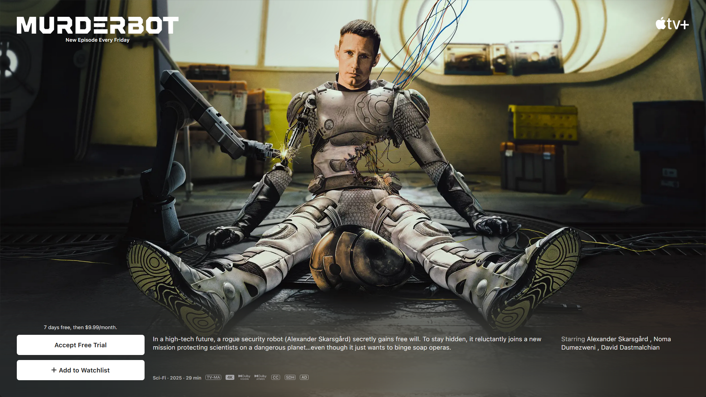

import Accordion from "@components/Accordion/Accordion"
import QuoteBlock from "@components/QuoteBlock.astro"

# Spoiler-Free Synopsis

A one-off sci-fi story told from the perspective of a lowly security android ("Murderbot") who hacked itself into autonomy, but can't be bothered to do much with that freedom and just wants to be left alone to watch soap operas.\
Their otherwise-standard mission gets spicy, and Murderbot takes on a bit more than they bargained for and is forced to consider its motivations.

# Full Review

## Rating

- 5/5 Writing Style
- 2/5 Overall Plot
- 3/5 Characters
- 4/5 World-building

**3.5 / 5 Overall**

### Style

This book is absolutely dripping with style. Easily the most unique and engaging aspect of the story was how it was told. This book took me just over an hour to read start to finish, and I think Wells leveraged that kind of brevity with excellent witty, pithy dialogue and characterization.

<QuoteBlock serif={false}>
I could have become a mass murderer after I hacked my governor module, but then I realized I could access the combined feed of entertainment channels carried on the company satellites. It had been well over 35,000 hours or so since then, with still not much murdering, but probably, I don't know, a little under 35,000 hours of movies, serials, books, plays, and music consumed. As a heartless killing machine, I was a terrible failure.

All Systems Red
</QuoteBlock>
_This is the opening paragraph, and in 3 mega-efficient sentences, Wells establishes: Murderbot's personality, world-building, and characterization plot foreshadowing. Crazy impressive._

### Plot

The weakest part of the book if only because it is a very formulaic sci-fi story, as well as predictable, but it is certainly not a "bad" plot. I want to emphasize that the strength of this book is Wells' style, and how fun the first-person Murderbot perspective is.

<Accordion client:idle>
Further Details (Spoilers)

When it comes down to it, this is a standard "robot finds an affinity for humanity" story, and there really aren't any surprises. The book opens up with three very telling, heavy-handed foreshadow hints:
- Murderbot's overall arc will center around its perceived hatred of humanity, but deep-down appreciation/love for humans
- Its current mission involves guarding a bunch of amiable scientist nerds, who will surely be both awkward and intelligent in ways that serve as foils for its own character development
- This is a "hyper-capitalism corporate sci-fi" universe, and the plot will in some way orbit around ruthless capitalist greed/penny-pinching

As it goes, this evolves into a story where the mission goes wrong, foul play is suspected then confirmed, and Murderbot has to help its ragtag scientist team outsmart the baddies and get out alive.

</Accordion>

It's a genuinely fun story, and I can't emphasize this enough, _extremely_ stylistically delightful...but as a sci-fi nerd, I can't help but be personally bored by the lack of true intrigue or suspense.

## Recommendation

Despite a 'just above-average' rating, this is still an easy recommendation for most anyone, just because of its style and length. It's not a huge time or emotional investment, and is genuinely really fun.

### TV Show...?

There's apparently a [Murderbot TV show](https://tv.apple.com/us/show/murderbot/umc.cmc.5owrzntj9v1gpg31wshflud03) on Apple TV. I haven't seen it, nor talked to anyone who has, but from the trailer alone I feel like it's probably a solid adaptation, and I think I'd enjoy it.\
Usually taking a beloved book to TV is kind of a 😬 thing but I feel like _All Systems Red_ is kind of a perfect setup for a TV show. It's somewhat open-ended just by how relatively short it is, and the things it leans most heavily into (style and Murderbot's personality) can translate very well into a show like this. Neat!