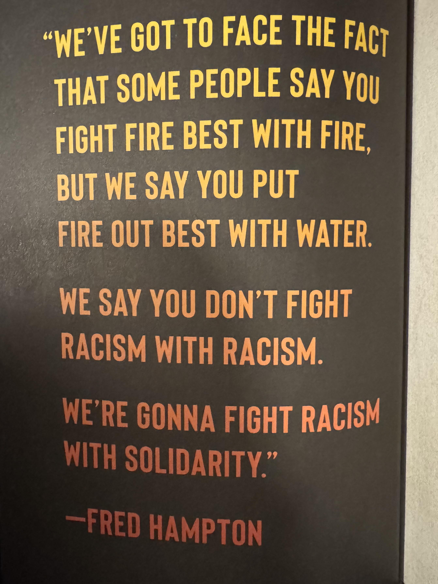
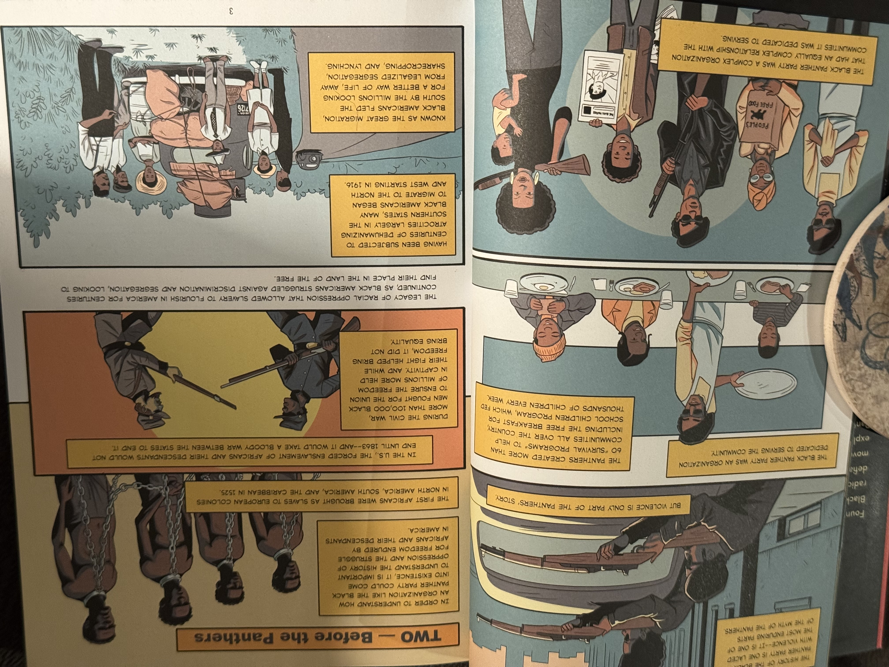
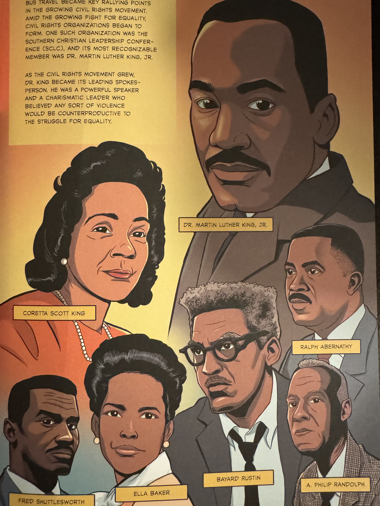
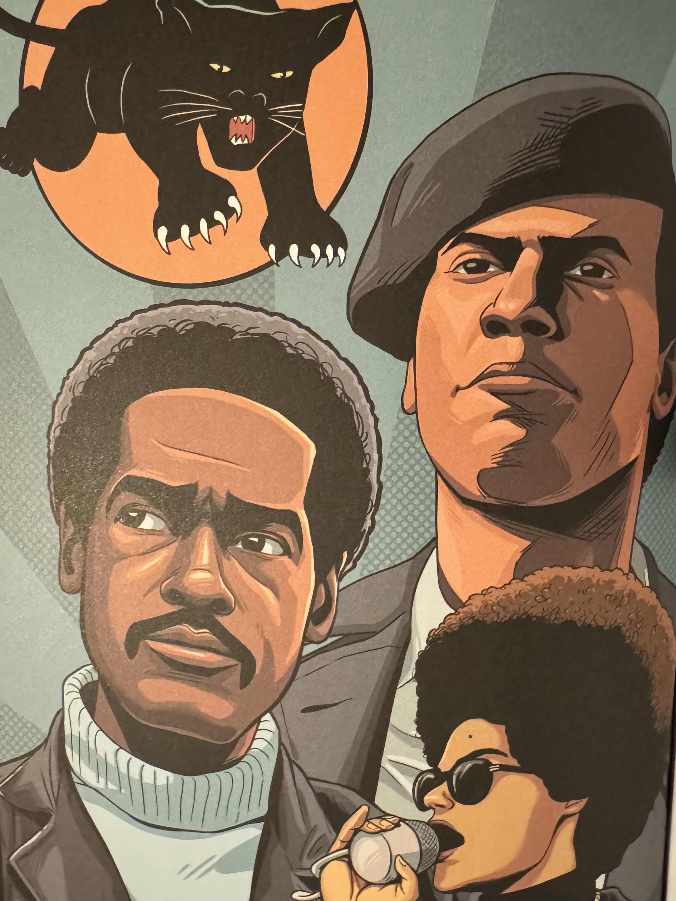
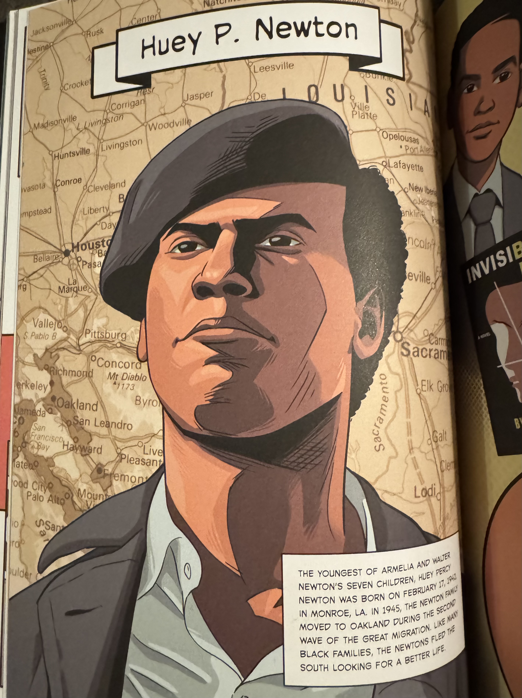
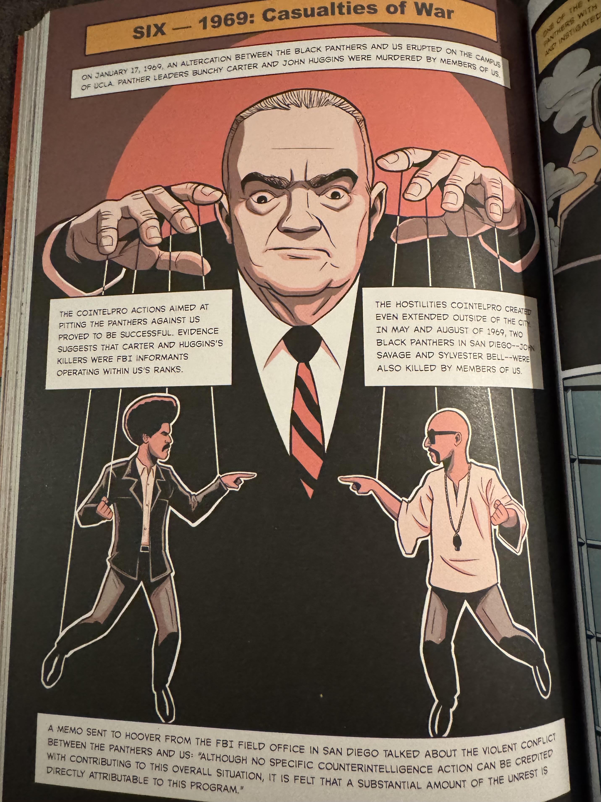
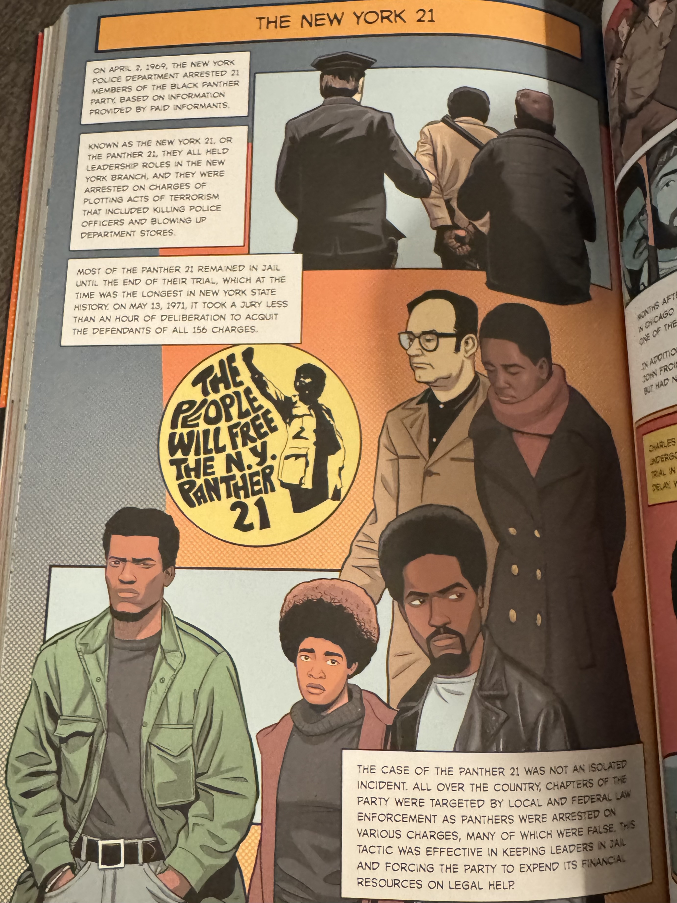
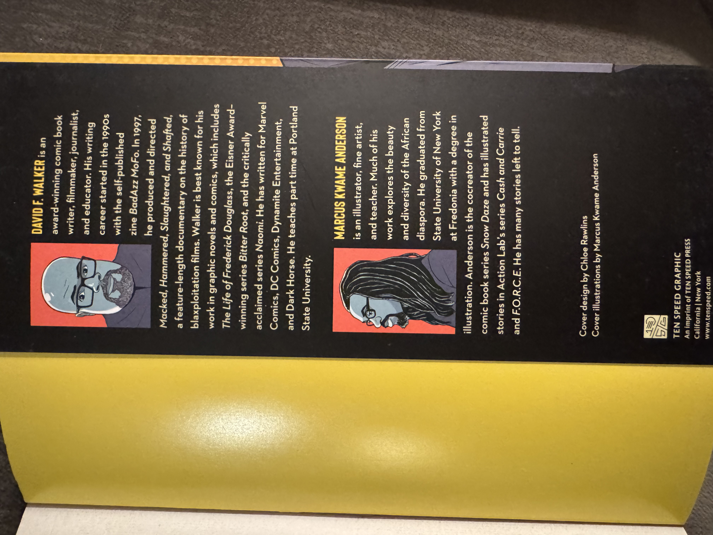

import InlineArgentEmoji from '@components/ImageComponents/InlineArgentEmoji.astro'
import QuoteBlock from "@components/QuoteBlock.astro"

# Synopsis

Via the medium of graphic novel, Walker[^1] and Anderson[^2] deliver a thorough-yet-abbreviated history of the American Black Panthers Party, from rise to fall. The book mostly follows the Party chronologically, but takes tasteful diversions to focus on key individuals and their contributions to the cause along with relevant personal context.

# Full Review

## Rating 

- 5/5 Writing Style
- 4/5 Depth of Knowledge
- 5/5 Accessibility/Readability
- 5/5 Art Style, Skill

**4.5 / 5 Overall**

An incredible work, extremely successful in its mission with respectful-but-impactful artistic depictions of incredible freedom fighters. My only wish was for more details within the various anecdotes and biographies, which are largely supplied by other works (e.g. the incredible *Assata* and *Blood in my Eye* by Assata Shakur and George Jackson, respectively), but as this is a personal rating, I feel it's fair to say that my only complaint is that I wanted more.

The strength of this book is its combination of style and breadth of historical coverage. If, like me, you have an American-capitalist-education-sized gap in your Black Panther Party knowledge, this book is perfectly suited to springboard your education with historical anecdotes paired with memorable art. 

_Kicking the book off, this Hampton quote sets the stage by summarizing the purpose and ideals of the party_

## Book Structure

First, the book contextualizes the Black Panther movement by addressing the myth of the movement (i.e. the over-emphasis on the acts of violence involving the party), and then the social and political background preceding the movement (slavery and post-slavery Jim Crow racism). This is the shortest section of the book.\
Following is a detailed, mostly-chronological telling of the Black Panther Party's history itself. It goes into depth of significant events, and how prominent Panthers were affected by such events.

### Civil Rights History

_Something about these two pages just elicits such a feeling of hope and admiration_

Following is a respectably thorough spotlight of the Civil Rights movement, and Black activists who played key roles in it. As well as multiple pages of art eulogizing the senseless deaths of Black folks at the hands of the  Imperialist machine during these years.

As a preamble to the inception of the Black Panther Party, it's an incredibly emotive, pithy sequence offering historical context, but also setting the appropriate mood: a grievously unfair struggle pitting peaceful Black civil rights advocates against unfettered murderous systemic racism.

<QuoteBlock>

I don't favor violence. If we could bring about recognition and respect of our people by peaceful means, well and good. Everybody would like to reach his objectives peacefully.

But I'm also a realist. The only people in this country who are asked to be nonviolent are black people.

Malcolm X
</QuoteBlock>

### Black Panther Party

As this is the meat and bones of the book, there is no reason for me to to waste time poorly paraphrasing what Walker and Anderson depicted so beautifully through paint and prose. Instead I'll briefly share examples of some pages and style that stood out to me as representative of the book content overall.

#### Biographies

_Every single Hero page like this is gorgeous_

Cleanly integrated into the Party's story are hero spotlights like this, lionizing Party leaders, and summarizing their past and their relevant motivation before leading into their involvement in the party's chronology.

I love how thoughtful the framing, and posing is designed to compliment each individual's specific role within the party, as well as their temperament.\
Newton here was ostensibly the founder and leader of the party, and as such he looks brave, determined, and forward-looking with a smart military beret complimenting his brazen leadership role within the Party's violent altercations with police.

Other Panthers are depicted giving passionate speeches, quietly writing/drawing in focus, among other activities; the Panthers' fight was much deeper than just shows of armed resistance, and every Panther had their strength. 

#### Historical Context

While the Panthers' story is told rather matter-of-fact with no-nonsense stylization (an effort to avoid hagiography-like bias, I assume), the authors add relevant historical context vignettes to expand on the overall political pressures affecting the party and its direction.

_This spread in particular always gets me with its hard-shift onto deep reds and dark colors to depict the shadows of the LA riots and Vietnam War_

This becomes especially prominent once the Imperialist machine truly spins into action against the organized Panthers with things like cointelpro. And I feel that the authors' over-the-top puppetry image here, depicting the FBI manipulation leading to Panther infighting, hits pretty hard.

_Infinite appreciation for this ghoulish depiction of Hoover_

#### Panther Events, Activities

The majority of the book is pages like this one, simply describing important events or actions the Panthers took, when they took them, how it went, and contextual information surrounding the decision and the motives of the Panthers involved.

_From a purely graphic design perspective, I'm just a big fan of these pages' layouts. Thoughtfully minimizing the "burden" of reading a lot of text at once in a graphic novel._

It's the least-flashy part of the book, but as a historical piece of non-fiction, it's easily the most important. I personally feel that the slow-rolling of these anecdotes helped me really internalize the events and how they apply to my own understanding of both that historical period, but also how our present political climate could learn from them.

Not to say that these aren't engaging or even exciting pages in the book. They very often are, but also eventually you've gotta read a block of text to understand "what happened", and that will always feel slower than a flashy one-sentence event.

# Recommendation

_Even the authors' bios are cool as hell_

Incredibly easy recommendation to nearly anyone, but especially fellow white Americans.[^3]\
I bought this book explicitly for both self-knowledge, and to vet it as a potential recommendation to aspiring Leftist/Communist peers who need an accessible look into the history of America's most successful radical party to-date. <InlineArgentEmoji emoji='triumph' /> It's a great read, and it's incredibly easy to hand off to folks, even temporarily.

Communist or otherwise, you live in a world beset by great evil and powerful people keeping it that way. The Panthers were a response to that, sometimes violent, more often though not. Through and through they were a movement advocating for, and in defense of, marginalized communities. And it was only through the full weight of capitalism's system of racist suppression that the United States' most successful radical political party fell apart.\
I feel that it's beyond question that we all should learn from the Panthers, and build movements of solidarity as they once did. And to that end, I'm grateful that such an accessible and beautifully illustrated reference such as this exists.

[^1]: David Walker's website: https://davidfwalker.com/
[^2]: Marcus Kwame Anderson's website: https://www.marcuskwame.com/
[^3]: Amazon link from Walker's website: https://www.amazon.com/stores/David-F.-Walker/author/B0053UBDXA