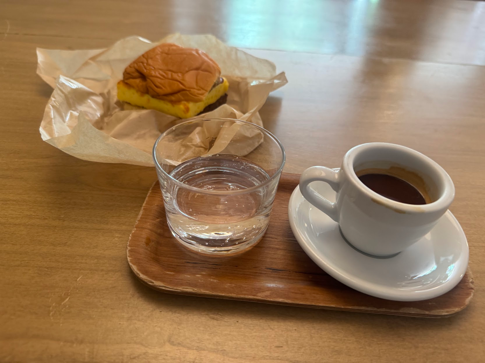
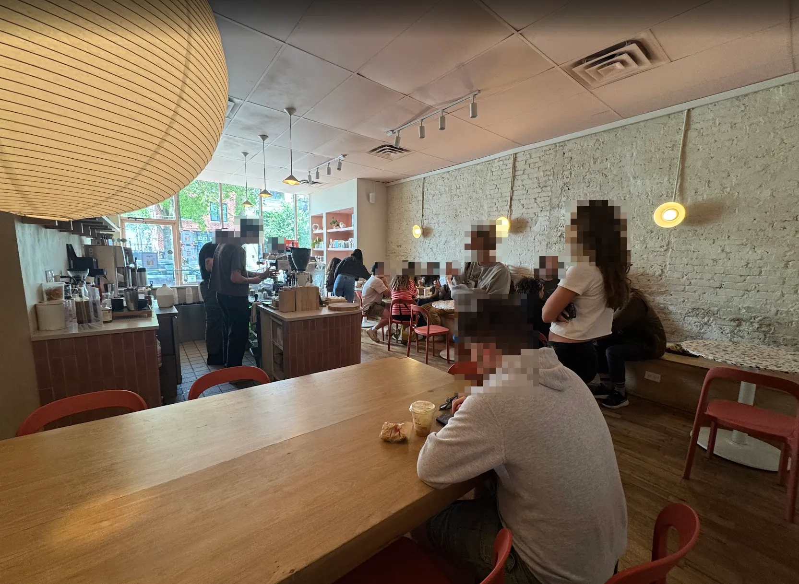
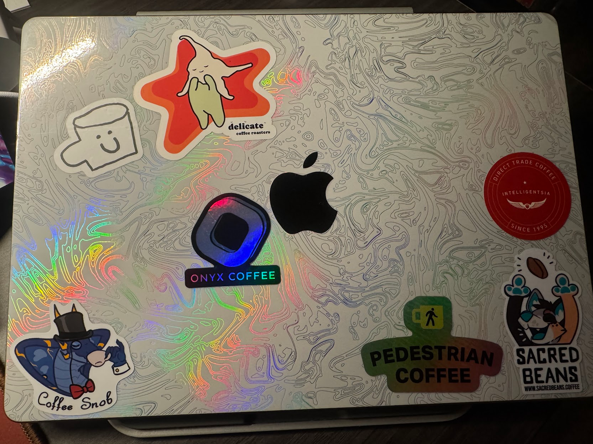

import AccordionPhotoTemplate from '@components/Accordion/AccordionPhotoTemplate.astro'
import InlineEmoji from '@components/ImageComponents/InlineEmoji.astro'
import InlineArgentEmoji from "@components/ImageComponents/InlineArgentEmoji.astro"
import EmojiBlockquote from '@components/EmojiBlockquote.astro'

## Coffee

Allez consistently has some of the best coffee in the city. They offer an extremely pleasant, high-quality "normal" espresso (usually a fancier blend), and then a killer single-origin espresso for only a dollar extra.

When they're not too busy (or changing up recipes), they also offer between 2 and 3 pour-over coffees as well! And technique-wise, I haven't had a bad coffee yet from Allez <InlineArgentEmoji emoji="triumph" />

They've also got incredible food, prepared in the attached bakery next door. I normally just get coffee but they have outstanding sandwiches and baked goods. Worth a try!

## Cafe

The cafe is very cute, but very small. Seating wise they have 5 tables set up against a wall bench, each can sit 2 comfortably, but often have 3 people. And then a very large shared table in the other half of the cafe.\
Predictably, the more private tables are taken up far more quickly than the large one.

## Price

For what they're offering, the prices on the coffee is an absolute steal. $4 for great espresso, but $5 for mind-blowing specialty single-origin espresso? Crazy good value.

Hopefully I can remember to take a photo of the menu next time--I don't remember the other prices, but I do recall thinking "oh those are fair".

## Productivity

This is a cafe suffering from its success. It is nearly always absolutely packed to the brim, often with line spilling out the door. On top of that, they close pretty early at 2pm every day. So from a "getting work/art done" perspective, this isn't the top of my list.

I will say I've always managed to find a seat at the big communal table, but even so it's often crowded and loud until about 12:30 or so each time and until then it's just tough to focus.

## Vibes

Fantastic vibes. Feels like a very beloved local cafe, and the decor is warm and comfortable. I should also note they have some of the *best* restrooms I've ever seen in a cafe. 

If you can find space, it's a great place to take a friend. Or make some! 

_I've got my own collection of coffee stickers going now!_

I met my friend Mitch here--he and his girlfriend were just chilling at the big table one day while I was there. I noticed all the hyper-specific coffee stickers he had on his water bottle--asked if he was a coffee nerd and then we just chatted!\
If that's not great vibes then I don't know what is :3

