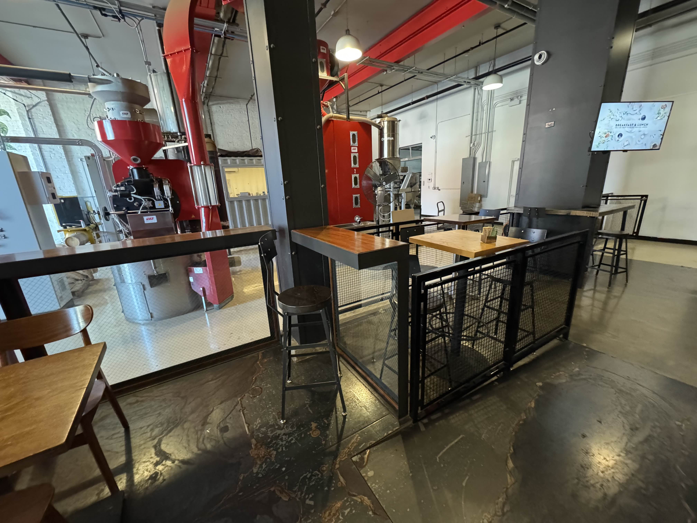
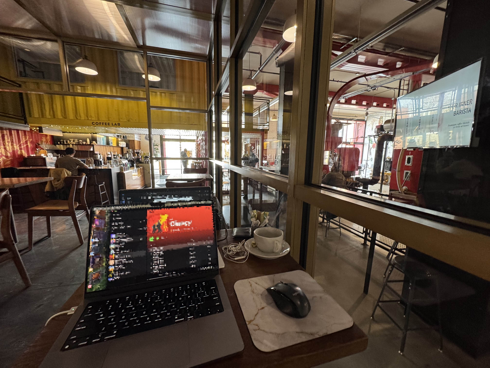
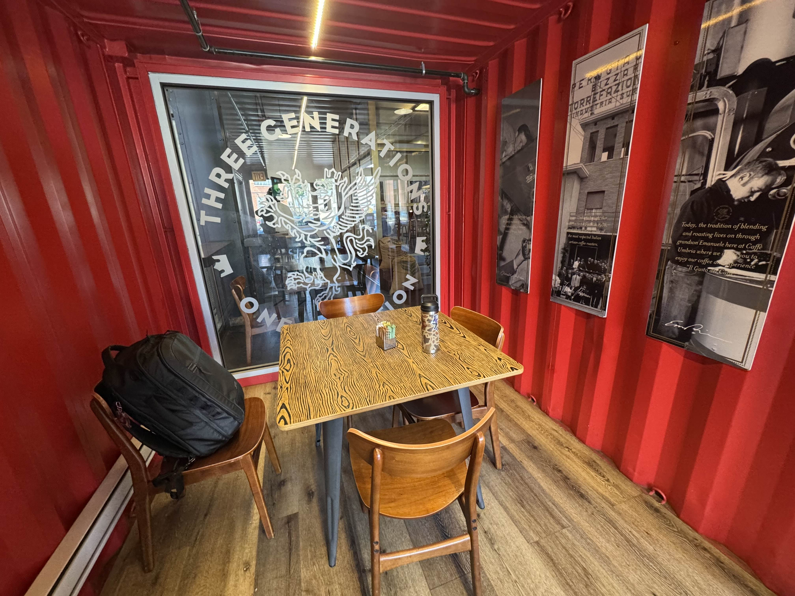

import Accordion from "@components/Accordion/Accordion"
import InlineEmoji from '@components/ImageComponents/InlineEmoji.astro'
import hot from "@assets/mutantEmoji/hot.png"

## Coffee

Mediocre at best, generally pretty sub-par. I've had their light roast as drip and really enjoyed it, but it isn't consistent. Their espresso is typical Italian-style dark roast without much complexity to it. However the chocolate they use in their mochas (and that they give as squares with your drink) are among my favorite types of dark chocolate, and ultimately works pretty well.

They roast their coffee there in the cafe, and the fact that their roasting equipment is just open to the air of the cafe, including the often-busy entrance door wafting in whatever temperature air is outside is certainly a choice coffee-quality wise but it is undeniably cool from an aesthetic point of view.

<Accordion client:idle>
<InlineEmoji emoji={hot}/> Open-air coffee roastery rant

**Disclaimer:** I am not a coffee professional. This is info I've picked up from talking *to* coffee professionals (3rd-wave roasters and baristas)

Coffee is chemistry; the final product of "drinkable bean juice" is an amalgamation of all of the thermodynamic factors that go into its growth, collection, processing, roasting, grinding, and brewing. With non-specialty coffee you have a lot of wiggle-room for all of these factors. That coffee only has so much potential to begin with.\
Even still, any decent roaster or coffee shop should make attempts to isolate those variables from things outside their control (like the weather) as much as possible!

Where am I going with this? Well, most quality roasteries are built with temperature isolation in mind. Building glass or plexiglass barriers around your roasting equipment still gives it the "roasting in the cafe" mystique but also allows you to fully temperature-control your process.\
How do you expect to produce consistent batches of roasted coffee if your roasting temperature is dependent on how cold it outside or whether the door was propped open by the weekly sanitation-mat cleaning service replacing your cafe's mats? (I watched this happen on a roast day lol)

I could go on because this *also* applies to daily espresso-machine dialing in but another time...suffice to say, Umbria is cool and I love seeing their equipment but it's not a great sign to me that they don't seem to value isolating their equipment.

</Accordion>

## Cafe

Super cool. Easily one of the coolest cafe spaces in the city. The majority of the space is their roastery set alongside the cafe area, and during the week they *will* be roasting there, so be prepared for loud noise and probably a hotter cafe.\
The coffee bar itself is big and beautiful, their displays look fantastic, and the seating variety is crazy solid. They have 1 big table for 4 people, and then many other 2-person tables, some bar seating at the coffee bar, and some high-stool seating on the fence area by the roasting area. And they have a couple of comfier armchairs in the back.\
As a small note they have a nice unisex restroom with a door code (it's usually the street number) and an 'occupied' slider.

Aside from the roasting equipment, the star of the show here is what I call "The Fishbowl", a glass cube (not a bowl) on an upraised stage type of deal in the center of the cafe area. It has a few lamps, and then about 10 or so 2-person cafe tables and a bunch of outlets spread around it.

_Super cool working in this area...IF the roastery isn't running haha_

## Price

About-average pricing. Expect to pay between $5-6 for a 12oz latte or other espresso milk drink.\
They have a square-pay rewards system enabled for frequent visitors.

## Productivity

_If people are talking in here, it gets loud. But otherwise I love the fishbowl!_

It's generally very solid, but hinges on a few things:
- Are they roasting right now?
- How many people in the fishbowl are having conversations?
- Is there a table available?

Generally you're gonna get a table. You will nearly never get the sole 4-person table, so don't plan on that.\
The coffee bar seating is usually unused, so I trend towards chilling there. But overall this cafe sets a pretty high bar on seating variety and is generally pretty solid for outlet access.

_They really have the full gamut of cafe seating variety here. Just missing a big couch I suppose_

## Vibes

Hard to peg. It's not a community-forward space, though I have seen a "employee talent show" type of event advertised on a flier for the community before.\
It feels like...a posh, professional space that has let its hair down a bit and is chilling in a quieter neighborhood. You're not going to feel *comfy* cozy here but I'd still say that it can get cozy, especially in the winter.

_Kind of a cool, if odd scene to greet you upon walking inside. The glass and photos on the wall are very neat though._