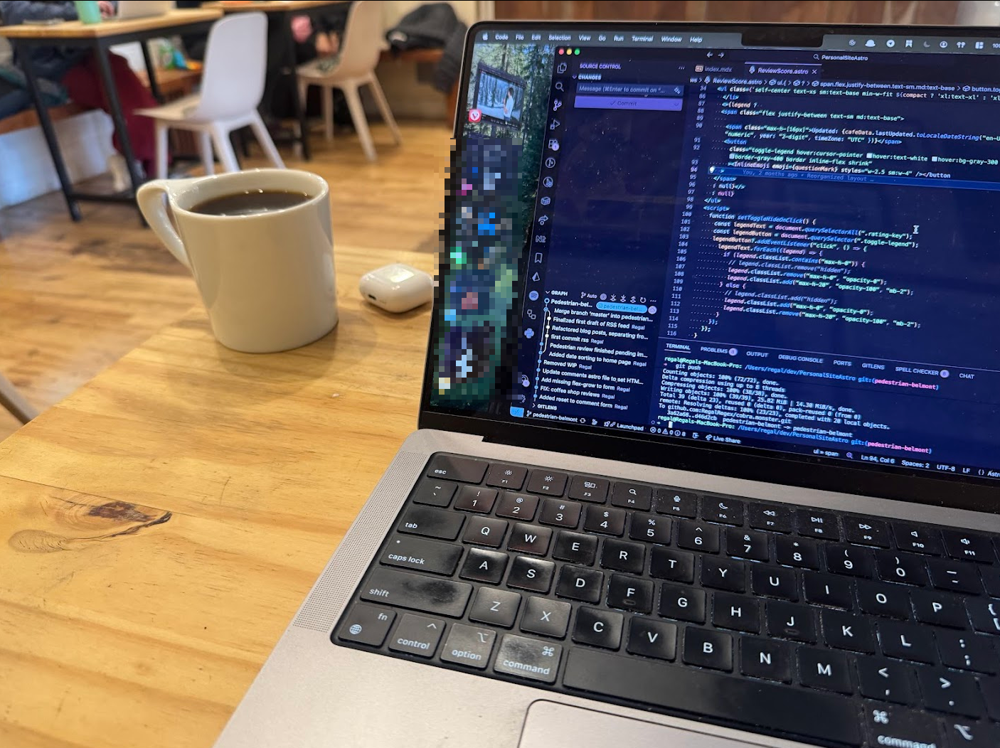
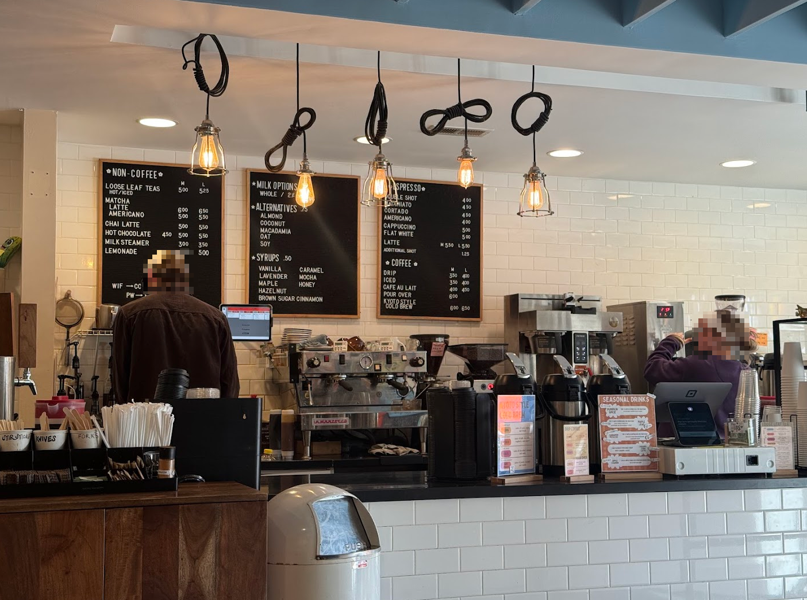

import Accordion from '@components/Accordion/Accordion'
import AccordionPhotoTemplate from '@components/Accordion/AccordionPhotoTemplate.astro'
import InlineEmoji from '@components/ImageComponents/InlineEmoji.astro'
import EmojiBlockquote from '@components/EmojiBlockquote.astro'
import Argent_think from "@assets/mutantEmoji/argent/thinking.png"
import Skull from "@assets/mutantEmoji/expressions/skull.png"

## Coffee

_An unassuming diner mug containing the most INSANELY aromatic pour-over I've had in ages_

I call the coffee here "hit or miss, but mostly hits", which is an inelegant way to say "it's pretty dang good". They roast in-house, and offer a wide array of options ranging from normal espresso stuff, to pour-overs, to "Kyoto Style" cold brew.

I nearly always get pour-overs here. Pictured above is an anaerobic Peach ferment single-origin and I cannot express enough how *instantly* I smelled peaches when it was delivered to my table.\
Unfortunately the taste didn't quite live up to the smell, but the smell was really just *that* good that the very very good coffee just couldn't possibly hold up haha.

I've had drip and lattes here, and they've been quite good. Nothing to write home about though. 

8/10 because insane pour-overs but I've had some consistency issues where it's just been disappointing often enough to not chalk it up to "just a bad day".

## Cafe

_Not exaggerating when I say that this is at least 80% of the public space this shop offers_

Having lived in Seattle for a time, I'm pretty familiar with tiny coffee shops. In Chicago however, this is much less common.

Coffee Lab is easily the smallest coffee shop that I frequent. They have a grand total of 5 indoor tables, and 4 high bar-seats at the window.\
They also have some outdoor seating which, until recently was the cheapest, worst patio furniture I've ever seen but thankfully they've upgraded and they're quite serviceable!

But suffice to say the 3 is purely due to the size of this shop. Today I was able to get a table, but the last 3 times I've stopped by I peeked in and left because there was nothing.

<EmojiBlockquote size='emoji' emoji={Argent_think}>
Rating system conundrum! If a cafe is too small, does the "cafe" score lose points (like I did here) or is that a "productivity" loss? Sound off in the comments (lmao)! But I reasoned that if "cafe" is an overall 'how good is the cafe space' score, then "not scoring a table more often than not" means the cafe is less enjoyable.

/Shrug
</EmojiBlockquote>

### Syrups

**Offerings:** Vanilla, caramel, lavender, mocha, maple, honey, hazelnut, brown sugar cinnamon.\
**Made in-house:** No

## Price

Better than most, I'd say! My pour-over today was $9.95 <InlineEmoji emoji={Skull} /> but it was insane and very cool so I'm ok with that.

| Drink Type ("M") | Price (USD) |
| -------- | --------- |
| Drip     | $3.50     |
| Latte    | $5.50     |
| Americano| $4.00     |
| Mocha    | $6.00  (flat +$0.50 for any syrup)|
| Pour Over| $6.00 (unless it's rare)|
| Loose Leaf Tea | $5.00|
| Kyoto Cold Brew | $6.00|
_As of November 10, 2025_

## Productivity

Nearly full-marks here. The small size of the shop means that temperature varies quite a bit, which can get uncomfortable, but not a huge deal.

The few tables are very generous, the seats are comfortable enough, and they consciously provide plenty of extension cords for laptops to plug into.\
Wifi is solidly "average". Had some issues in the past, but very rarely.

Hours are really good–open later than most cafes.

## Vibes

The strongest positive vibe here is the workers themselves: there are always at least 2, but often 3 or more here in this little shop.\
They're always in a good mood, chatting and having fun with one another. They also seem consistently, comfortably busy doing things and when there aren't customers to serve, are trying coffee things and mixed drinks with each other.

But overall the shop seems to be very comfortable with itself and you'll feel this way too. Warm lighting, good use of their small space, and a _separated_ but very present roasting area makes the "Coffee Lab" name feel more believable. 

The cafe itself is clearly an updated residential space and I think they did an excellent job keeping "homey" vibes while also making this an effective service space. 

Finally, they always have local art on the walls for sale. Speaks well of their priorities and their connection to the local art community. A+!