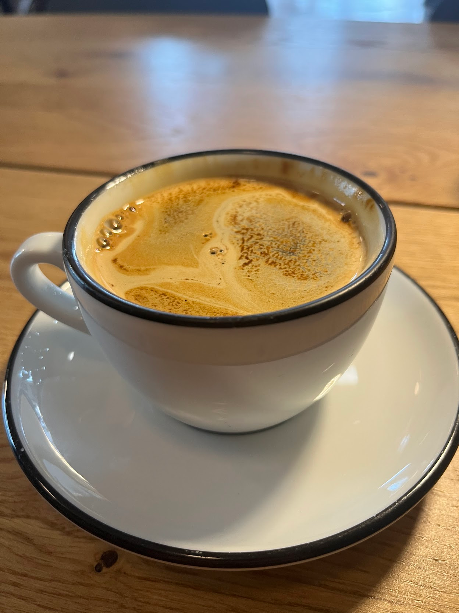

import Accordion from '@components/Accordion/Accordion'
import AccordionPhotoTemplate from '@components/Accordion/AccordionPhotoTemplate.astro'
import InlineEmoji from '@components/ImageComponents/InlineEmoji.astro'
import EmojiBlockquote from '@components/EmojiBlockquote.astro'

This is one of the first cafes I became a regular at upon moving to Chicago. I believe since then the coffee quality has dropped a bit, but it's still quite good, and I thoroughly enjoy the cafe experience here.

## Coffee

_The fact that my favorite drink here is a simple Americano feels so appropriate for the vibes here_

At one point I called Gaslight the "Best espresso in town". No longer true, partially due to other shops upping their game, and also I think a quality drop at Gaslight.

That being said, I need to emphasize that the coffee is still _solid_ and it's varied enough to make subsequent visits interesting beyond the comfort of a repeated experience.

In my opinion, the best things here are the espresso and the drip coffee. They have a fancy drip machine (that I can't find my photo of) and very solid espresso fundamentals.

## Cafe

_It's in a flatiron building! Feels cool walking in and the room growing as you go forwards_

Might not be for everyone but I _love_ this cafe space. It's just "simple" enough to feel cozy, but is professionally maintained and well-furnished.

Counter seating, 2-person cafe tables, and a large communal table at the back. Great variety!

    

    
    _I don't know where they source their pastries from but I always enjoy their donuts_
    

    

    
    _They used to sell some pretty classy looking mugs...alas. Should've gotten one when I had the chance_
    

Good pastry and merch setup. Understated and high quality!

Two non-gendered restrooms with "occupied" deadbolt locks and cool nerdy Fermilab art lol.

## Price

_Honestly one of the best, clean menu designs I've ever seen_

| Drink Type (12oz) | Price (USD) |
| -------- | --------- |
| Drip     | $3.30     |
| Latte    | $4.80     |
| Cortado  | $4.00     |
| Americano| $3.60     |
| Mocha    | $5.10  (flat +$0.30 for any syrup)|
| Black Tea | $4.25 |
_As of November 21, 2025_

Extremely low prices for this coffee, especially considering the quality. Very "no-frills" but what they _do_ offer is fantastic, and approachable from any level.

### Syrups

**Offerings:** Vanilla, lavender, mocha.\
**Made in-house:** Yes

## Productivity

Top-tier productivity here. You'll always find a table, and very often one with an outlet. It's quiet, chill, and has solid wifi.\
Great people-watching out the windows without being too distracting. And while they do have their roasting equipment in the back it's never loud (since it's in another room!!).

## Vibes

Very subjective, even for a "vibes" rating here on **cobra.monster** but I don't know I just really love everything going on here.\
It's cozy, active, comfortable...and with prices like that it feels just friendly and inviting.

Plus...

C'mon. C'mon!! That's crazy!! They bought Among Us coffee!!

I asked the owner and he told me he just thought it was so funny. I guess this green coffee bean supplier just decided to offer one of their lots with custom Among Us art for ??? reasons and Gaslight thought it was funny.

And!!!

_Uncommon knowledge: Wrex is a **huge** Among Us fan_

They let me take one home!!! Forreal!!\
~~I still haven't figured out how to properly mount it to be hung tho~~

Folks. Call me biased but I love this place. Check them out if you're in the area :3

_amogus...with friends :3 Art by [Courtney!](https://bsky.app/profile/court00ns.bsky.social)_