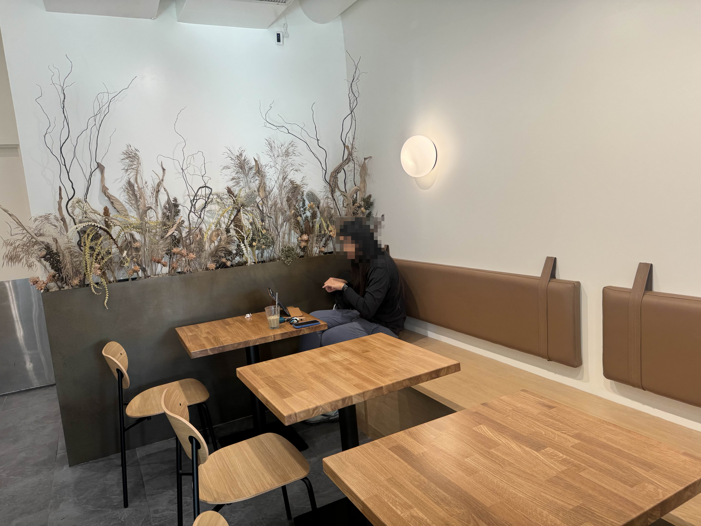
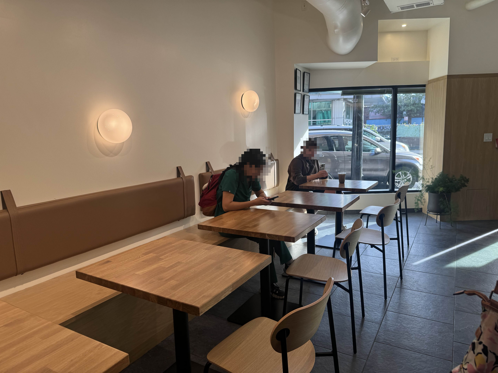

## Coffee

Pretty interesting. They offer a single-origin decaf, which is a rarity--and I think that's their strongest strength here so far. I enjoyed mine...which was way above average for decaf.\
Their primary single-origin coffee was only available in drip, and while it was pretty good, I feel that it had untapped potential (i.e. wasn't perfectly dialed in). Though that may have also been due to getting it in a paper + plastic to-go cup instead of my requested ceramic, so that'll always affect the flavor of black coffee.

My girlfriend says:

> The [iced latte] I got was pretty good. Towards the end, it became too bitter to drink. It wasn't amazing, but it was still pretty good. Just not the best iced latte I've ever had.

## Cafe

It's a pretty small space, but overall I think used fairly well. The only seating is a row of 6 tables with chairs and booth seating. Maybe taking up about 1/3rd of the cafe area. The rest is dedicated to the service counter, and an empty standing area for the queue and merch.

The layout + shape of this cafe makes movement very awkward. When you walk in, it's not clear where to stand if you're waiting in line, as the register faces the front-right corner...in our short time there, people alternatively queued to the left and right.

The aesthetic and theming is very tight, and feels intentional. Definitely not cozy, but also far from "Spartan". A middle ground of "get in get out" and "sit and work for a bit". Notable lack of wall art, but the negative-space feels well-employed.

## Price

On the pricier side. We paid about $17 after tip + tax for a single-origin drip and a 16oz iced latte.

## Productivity

Good productivity here. No outlet access, but the tables and the "working vibes" of the shop feel comfortable enough. The 2-person tables are on the bigger side, which is nice and the seating is comfortable.

Can get a little loud if someone is having a conversation, but really not bad.

## Vibes

As this shop is brand new as of October 2025, I feel it's still getting its footing, but honestly it came out with a very strong aesthetic and a pretty solid identity too.

I think for the area it's in, it feels a bit out of place but only because the area itself lacks good identity. It's at a 5-way intersection of a lot of chain shops and traffic, but not a lot of foot traffic at this particular stretch.

The shape of the space isn't perfectly utilized in my opinion, and I think it gets a little awkward with people queueing up in strange places, especially when the coffee pickup area is in one of the tightest chokepoint spots of the cafe.

The muted colors and simplicity of their coffee menu are a plus for me though, because again it feels *intentional.*