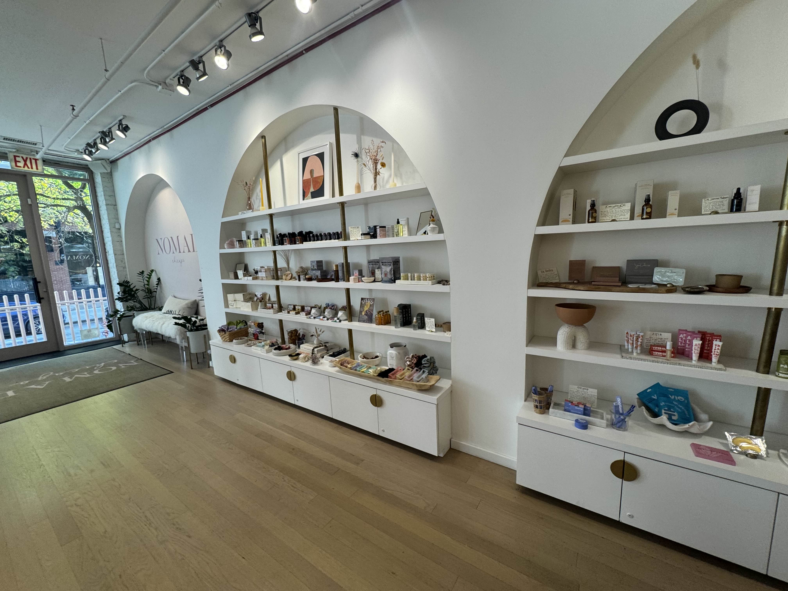
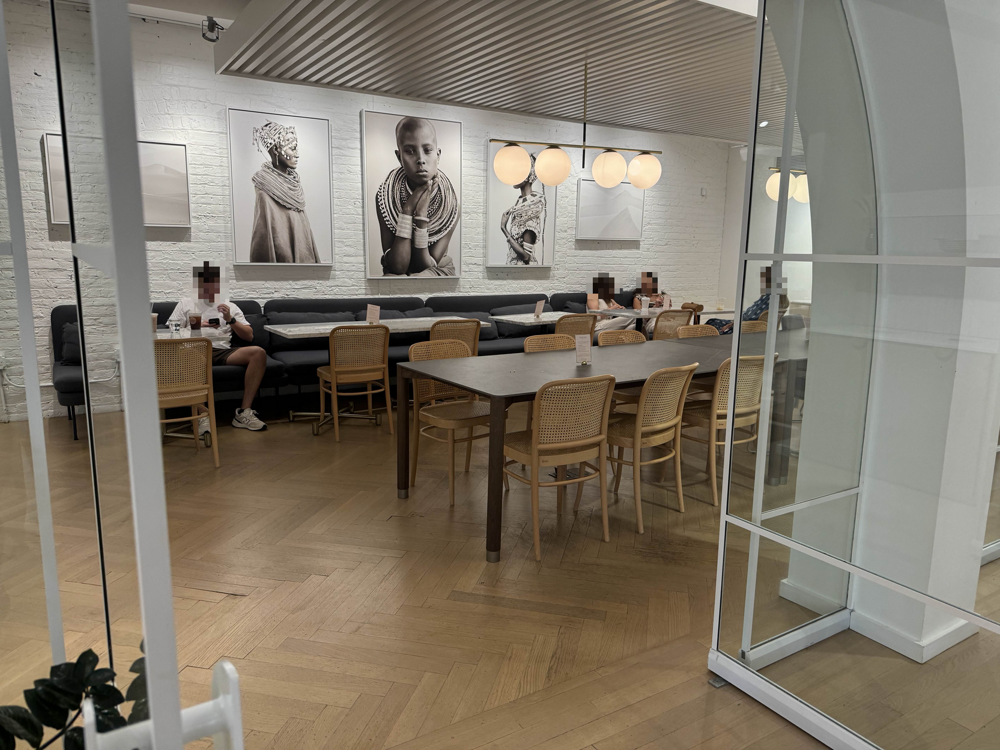

import Accordion from "@components/Accordion/Accordion"
import InlineEmoji from '@components/ImageComponents/InlineEmoji.astro'
import EmojiBlockquote from "@components/EmojiBlockquote.astro"

import hot_drink from "@assets/mutantEmoji/hot_drink.png"
import Argent_yikes from "@assets/argent/stickers/babanasaur/yikes.png"

## Coffee

Not only a full-coffee bar with genuinely interesting custom lattes on offer, but a full 4 pour-over options. The variety is impressive. The coffee quality itself...definitely above average, but perhaps not worth the cost.

They serve Metric Coffee, the best 'large-ish'-scale cafe supplier in the city. I had a Colombian pour-over, and while it was definitely solid, I think it lands solidly in the bottom tier of pour-over quality I can get in Chicago.

<Accordion client:idle>
<InlineEmoji emoji={hot_drink}/> Pour-overs in Chicago

To-date (10.4.25), I have only visited 6 cafes in Chicago that server pour-overs, and I'd rank them like so (drink quality only; ignoring price):

1. Dayglow
2. Side Practice/DRIP (same owners)
3. [THRD](/cafe-reviews/thrd-coffee)
4. Pedestrian Coffee
5. Nomad
6. Avondale Coffee Club

I'll add that there is a _gulf_ of quality between #3 and #4. Pour-overs are rare...as they should be, because they're time and labor intensive.\
You'll be hard-pressed to get a _bad_ pour-over. But in my opinion, they are the pinnacle of 3rd wave coffee preparation, and if you are being offered a truly incredible cup of coffee 9 times out of 10 it will be a pour-over. 

</Accordion>

My girlfriend got a hot "Pumpkin Pie Latte":

> It was really good. Ignoring price, the worst I can say of it was that it might not have been as hot as I'd like it, but the flavor was fantastic. I love that it came with a graham cracker :)

## Cafe

_My first emotion upon walking in was "oh no is this an apothecary" (thankfully no)_

_Absolutely nothing here for me BUT pretty neat looking stuff, and impressive display_

This cafe blew my mind. Walking in I did not expect to be immediately surrounded by necklaces, jewelry, tarot cards, incense, candles, etc.

While certainly not directed towards customers like myself (ostensibly cis dudes), I have to score it high based purely on design direction and cohesion of the vision.\
There are shelves and tables of merchandise everywhere with cafe tables and couches perfectly situated between and around them on the edges. Genuinely impressed by how well the main room felt "used" and not "cluttered".

Ultimately the high score is based on feeling like "yeah I can enjoy a coffee, and maybe even work here without feeling like I _must_ purchase something other than coffee"

_No comment on the sign, but this is a cool use of space. Just really unique._

## Price

The only note I had going in here beforehand was "priciest latte in the city" and oh my god at $17 yeah that's an expensive latte.\
A specialty latte, sure, but good lord son.

Zooming into my own photo here you can see a few other prices:

- $4-5 drip
- $4 espresso
- $5 americano
- $4.25 macchiato
- $4.50 cortado

which hmm. I always raise my eyebrows when an americano is wayyy more expensive than espresso.

<EmojiBlockquote emoji={Argent_yikes} size="sticker">
An americano is literally espresso added to hot water. That's it. Most cafes will price americanos either the same as an espresso, or add $0.25 or maybe $0.50.\
A whole extra dollar is crazy.
</EmojiBlockquote>

## Productivity

Genuinely probably a good place to get things done. There is a wide variety of seating options, ranging from couches and armchairs to singular 2-person cafe tables, and then this room full of tables and couch seating in traditional cafe style.\
Not pictured: a rentable private conference room that actually looked pretty slick.

They have signs asking people to limit their stay to 2-hours, so if that's enforced then that may damper things, but in my experience it usually isn't unless it's *actually* packed.\
More uncomfortable was the unnecessary stipulation that seating is only for paying customers, but I suppose being close to downtown they may feel that's necessary. Not a great vibe though.

Didn't really see any outlets, but that's the only real negative. Otherwise the medium score is due to "vibes" but that's, of course, subjective.

## Vibes

_It's a good sign that they put the coffee source on the board. They know it's good and they should be proud of it._

What can I say, it's pretty neat overall. As a concept of a combinative boutique and coffee shop, it's well-executed. Both halves of the business feel intentional and serious, and the coffee quality doesn't compromise.

I do feel that the boutique side of things eats heavily into the vibes of the cafe side though. Not only on price, but also the softly-enforced "buy things or get out" attitude. But again, the coffee is above average, so I don't mind feeling compelled to buy a coffee--I was gonna do that anyways.

This place at first gave me an "Instagram-bait" feeling, but it feels more genuine than that, and it really grew on me by the end. Still not somewhere I'd call "cozy", nor will I make a big point of coming out here for the vibes. But they're landing around "better than _tolerable_"

In any case it's *definitely* fitting for River North, I'll tell you that.

I also really like that at time of writing (10.4.25) the shop is consistently open from 10am-4pm every day...meaning a 6hr work shift with 1hr open close at either end, potentially. Very very cool from an employee standpoint because you get a consistent schedule and there's just the one shift.\
No idea how they actually do things there, but I love a cafe that makes life easy for its employees.

_Even the strange elevated walkway into the shop is cool. Mega-minus points for no ramp/accessibility though._