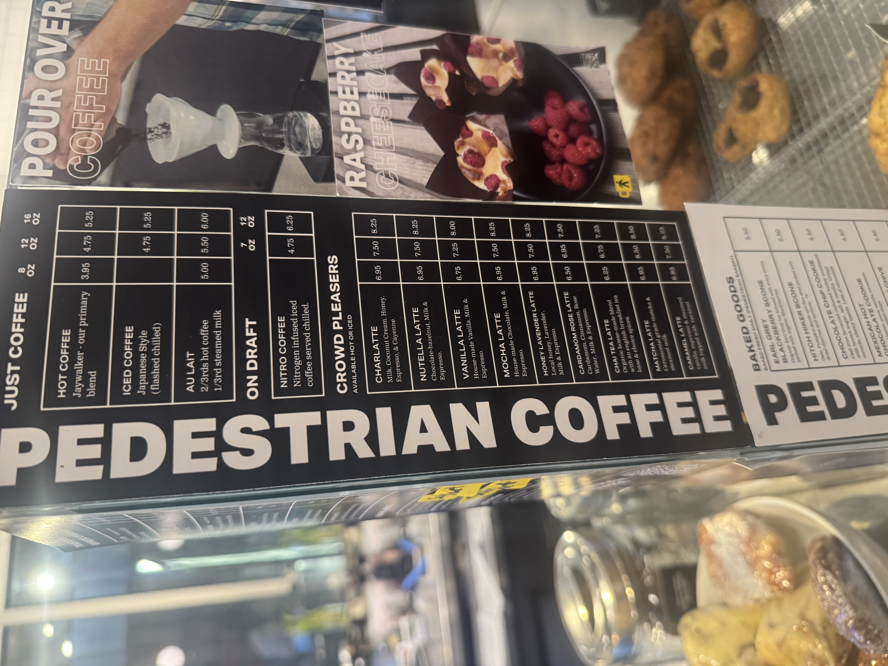
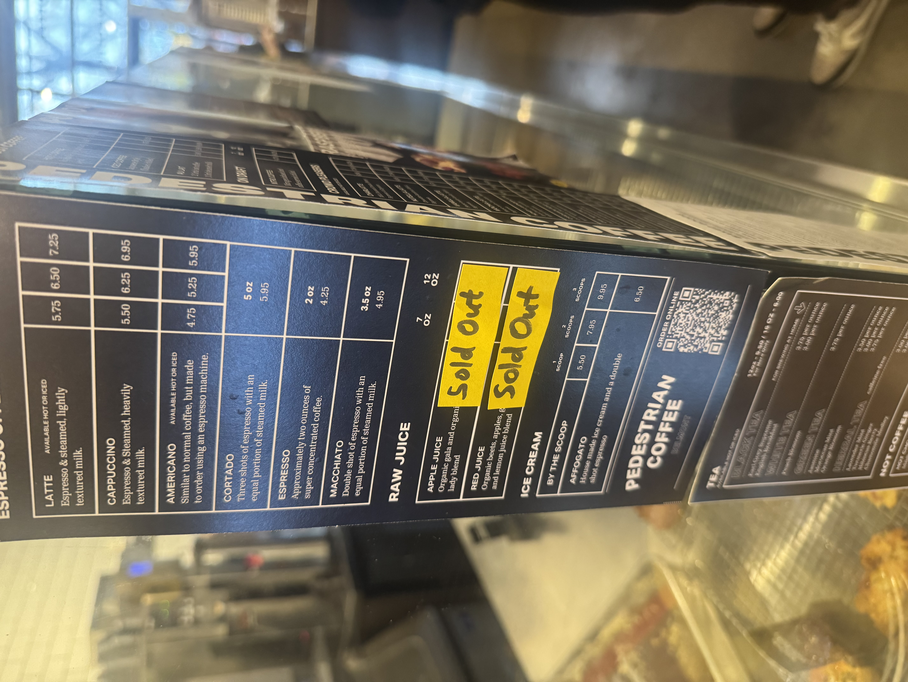
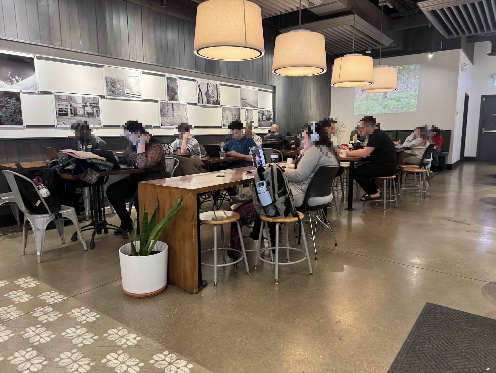
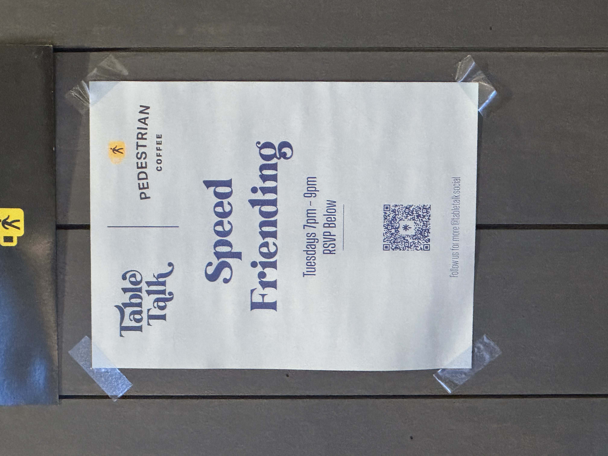
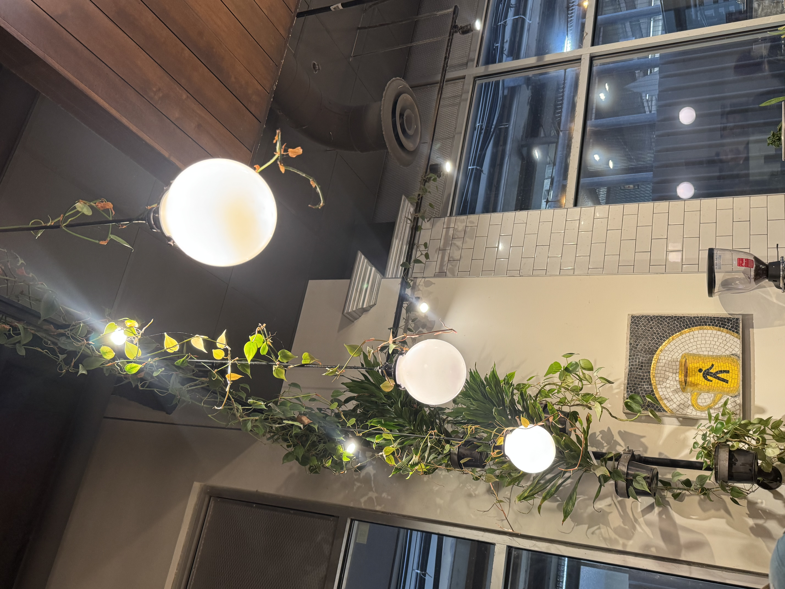

import Accordion from "@components/Accordion/Accordion"
import AccordionPhotoTemplate from "@components/Accordion/AccordionPhotoTemplate.astro"
import InlineEmoji from '@components/ImageComponents/InlineEmoji.astro'
import EmojiBlockquote from "@components/EmojiBlockquote.astro"

import hot_drink from "@assets/mutantEmoji/hot_drink.png"
import purple_heart from "@assets/mutantEmoji/utility/purple_heart.png"
import Argent_uwu from "@assets/argent/stickers/babanasaur/uwu.png"
import Argent_think from "@assets/mutantEmoji/argent/thinking.png"
import Argent_eyy from "@assets/argent/stickers/babanasaur/eyy.png"

<EmojiBlockquote size="emoji" emoji={Argent_think}>
**Note:** If there's any cafe in the city in which I'm a "regular", it's this one. I've been frequenting here since I moved to Chicago in 2022, and have even been invited to employee parties as a guest.\
I have a lot of thoughts, most of them very positive about this shop! But do know that I am absolutely getting special treatment in terms of service here, coloring my review...but also offering some insider-insight since I'm friends with folks outside of the cafe environment :3
</EmojiBlockquote>

## Coffee

_Their logo is so simple and good!_

Absolutely top-tier coffee. Not quite a 10 because they don't tend to have the crazy funky stuff that I only find in the most niche, insane-specialty shops, but don't get it twisted, this is GREAT coffee.

Pedestrian roasts all their own coffee and they're pretty damn good at it. Large enough batches that if you like a brew, you'll have access to it for a good while. The owner, Tim, is a stickler for quality and consistency, and I think that plays to tremendous strength here.

### Espresso

Their default espresso blend is called *The Jaywalker* (very cute) and it's a perfectly inoffensive carry-all espresso. Great as an americano, great in milk drinks, and honestly even worth getting as straight espresso.\
Their *single-origin* (offered as a $2 up-charge) is something altogether different though. Crazy tasty. Crazy good. The only weakness it has is that it's ordered infrequently enough that its quality that day is dependent on the barista on bar at that moment, and whether they have the time (or interest) in ensuring it's dialed in perfectly.

<EmojiBlockquote size="sticker" emoji={Argent_uwu}>
First "special treatment" note: every time I've ordered a premium espresso (i.e. the $2 single-origin or the decaf espresso), the baristas on staff have made a point to pull test shots until it's perfected.\
I know they do this for others, but I'm fairly certain they take extra care for me <InlineEmoji emoji={purple_heart}/>
</EmojiBlockquote>

On top of solid espresso, they have rockin' syrups and latte drinks. A favorite order of mine is a *12oz decaf Cardamom Rose latte*. The syrups are just insane, but the baristas are also genuinely very good at steaming and preparing the milk, so it's always a great experience.

### Pour-over

This is what really drew me to Pedestrian in the first place: they're one of the rare Chicago coffee shops offering pour-overs! And damned good ones.\
They're V60 pour-overs prepped on the bar seating area that I love to sit and work at, so you get a bit of a show (and chance to socialize) while they brew :3

Tim, the owner, is anal about training baristas for pour-overs, and it seems to be one of the last tasks they're allowed to perform upon hire, and I appreciate the dedication to recipe (and skill expression) consistency.

The pour-over offerings rotate on a 4-6 month cycle, generally offering 3 types of coffee:

1. A classic, nutty-profile South American coffee
2. A fruity African coffee
3. Decaf Colombia

Pretty good spread! One time they offered a $9 pour-over of a Mexico Chiapas-region *Gesha* coffee and it fucking ruled. I still miss it.

### Lattes

I'm not much of a latte guy, but it must be said that they make *all* of their syrups in-house. Including caramel! I'm an especially big fan of their cardamom rose lattes. I often get these with their solid decaf espresso when I want "coffee" but probably shouldn't have more caffeine.

### Drip

Keeping it short and sweet: also awesome. I just prefer espresso and americanos, but awesome!

## Cafe

_I pretty much always sit at one of the 4 seats at this front-bar here_

Possibly the best cafe space I've yet found in Chicago. Subjective, sure...but here are some facts to prove my point:

- literally next-door to the Belmont red/brown/purple L station
- connected to *Devil Dawgs* (shared bathroom)
- varied seating: short bar, high bar, shared tables, cafe tables, chair seating, couch seating, and even a solo corner 'study desk'
- climber plants all over the lights and ceiling (Danny is the GOAT for maintaining those beauties!)
- baking done in shop, so you get fresh coffee and fresh pastry smell
- outlets built into all bars and shared tables

I'll get into more detail in the *Productivity* section, but the cafe gets a 5/5 because it's large enough and varied enough to suit nearly any visit circumstance (social, working, casual, etc.)

## Price

<AccordionPhotoTemplate numImages={2} numCaptions={1}>
    

        
    

    

        
    

    Current as of November 2025
</AccordionPhotoTemplate>

It's late 2025 and the price of everything is whack, so I'm not sure how fair these prices are but they feel on the slightly more expensive side of average.\
Menu pictures above, but in brief:

| Drink Type (8oz) | Price (USD) |
| -------- | --------- |
| Drip     | $3.95     |
| Latte    | $5.75     |
| Americano| $4.75     |
| Mocha    | $6.95     |

## Productivity

_The lighting in this photo is kinda bad, but I promise it's mostly a very attractive soft, warm light here._

Pedestrian is peak here. Because this is my *home base* coffee shop, I'll break it down a little more than usual.

### Drawing

For me, drawing at a coffee shop depends on three things:

1. Table height (drawing comfort)
2. "Traffic flow" (i.e. how often are folks walking by me while I'm drawing)
3. Noise/distraction level

Pedestrian hits a sweet spot on all 3 of these, personally. Especially for table height. The shared tables are the perfect drawing height, and the high-bars are ideal for both seated and standing drawing!

### Socializing

Just so solid overall. Invite someone or a group to hang with you here and not only will folks 100% guaranteed find something they want on the menu, but there's nearly always ample space for groups of 4 or smaller.\
Volume is chill enough that you can comfortably hold conversations...just good!

_Concurrently a little cringe and pretty cute. We need more things like this, imo_

They also host a "speed-friending" event here pretty often, which is cute. I haven't been, but a barista bud assures me it's pretty successful!

### Laptop work

A+. Great wifi, outlets on the walls and built into the tables, and pretty privacy options for folks who want to be in corners or with their screen to a wall.\
Moreover, it's very comfortably a cafe where you can either work on a laptop in silence, or socialize with friends, and no matter what you won't feel like the only one at the cafe doing so.

## Vibes

_Shoutout to Danny for taking care of these because in the 3 years I've been coming here these plants have gone bonkers crazy!_

### The Good

This cafe is comfy, fun, chill, overall just a great experience. So long as you have a valid non-cash payment method available, you're 99/100 times going to feel safe, comfy, and have a great cafe experience here.\
The lighting it perfect, the trains are present but not loud, the staff are always kind and attentive, the cafe is clean, and conversations here are near-constant but at a very reasonable volume.

### The Bad

Due to its location on a busy street beside a very busy L station, the shop gets an outsized amount of "interesting characters" coming into the shop. And while I'm sympathetic to the realities of running a business in a hellish capitalist society where the government of the "richest country on earth" can't be bothered to provide resources to the poor and houseless, there are a few points of awkwardness that I feel makes Pedestrian drop in vibes-quality overall:

1. Bathroom codes - not unique, and again I _understand_ but it's awkward seeing people ask to use the restroom and being told "no"
2. No free drinks - imo, if someone in rough shape comes into your coffee shop and you feel you must usher them out, I feel that you could at least offer them a free, small coffee. Or even a free day-old pastry.
3. No cash accepted - sucks for tips and sucks for the folks who don't have credit cards. This is pretty unfortunately common at a lot of coffee shops, but causes more friction here than I've experienced at other cashless shops.

<EmojiBlockquote size="sticker" emoji={Argent_eyy}>
I can't overstate enough how much I love this shop, and hope for its continued success. I can't help but make this review stand out in some unfair ways compared to others on my site, but something something "see how the sausage gets made". But I want to be clear that I'm both _not_ being compensated in any way for this review (genuinely surprised if anyone doubts that) and an extremely big fan of this place and their coffee.\
It's not an exaggeration to say that Pedestrian has given me what I wanted so badly out of my big move to Chicago in '22...a local cafe to really fall in love with.
</EmojiBlockquote>