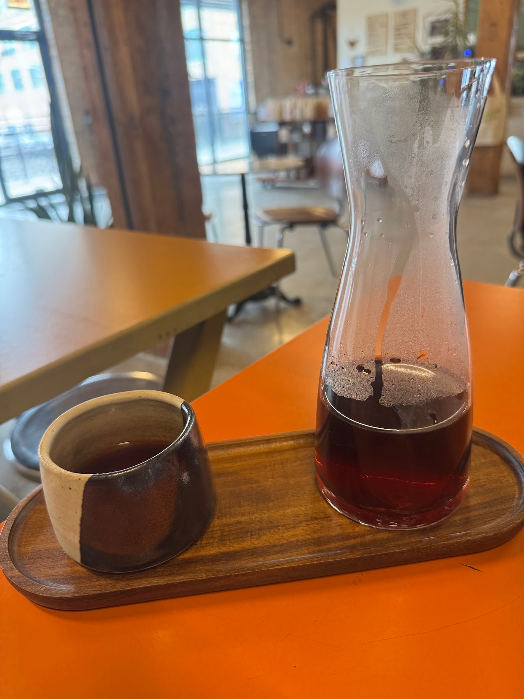

import Accordion from '@components/Accordion/Accordion'
import AccordionPhotoTemplate from '@components/Accordion/AccordionPhotoTemplate.astro'
import InlineEmoji from '@components/ImageComponents/InlineEmoji.astro'
import EmojiBlockquote from '@components/EmojiBlockquote.astro'

## Coffee

## Cafe

## Price

## Productivity

## Vibes