import AccordionPhotoTemplate from "@components/Accordion/AccordionPhotoTemplate.astro"
import InlineArgentEmoji from "@components/ImageComponents/InlineArgentEmoji.astro"
import InlineEmoji from "@components/ImageComponents/InlineEmoji.astro"
import EmojiBlockquote from "@components/EmojiBlockquote.astro"
import Accordion from "@components/Accordion/Accordion"
import { Image } from "astro:assets";

import iceCream from "@assets/mutantEmoji/ice_cream.png"
import eyes from "@assets/mutantEmoji/utility/eyes.png"
import purpleHeart from "@assets/mutantEmoji/utility/purple_heart.png"
import argentUwu from "@assets/argent/stickers/babanasaur/uwu.png"
import argentYikes from "@assets/argent/stickers/babanasaur/yikes.png"
import argentEyy from "@assets/argent/stickers/babanasaur/eyy.png"

# Some Background

I'm obviously a pretty big [coffee nerd](/about/coffee), and if you follow me online you know I talk a lot about the cafes I like to visit. I hadn't been in Chicago long before I'd scoped out all the best shops...judging from a purely "where's the best Coffee" perspective.

<EmojiBlockquote emoji={argentEyy} size={'sticker'}>
["Best Coffee" list here, btw! :3](/about/coffee#best-chicago-coffee-shops)
</EmojiBlockquote>

But there's more to cafes than just the coffee, and I think it's high time I put more effort into appreciating them. A good cafe is the avenue into the heart of its neighborhood...so today I chose a neighborhood (well, a few) and scoped out the cafes beforehand.\
The goal was simple exploration, but the added hope was finding new places good to meet friends at--especially for drawing or doing work together :3

## The Map

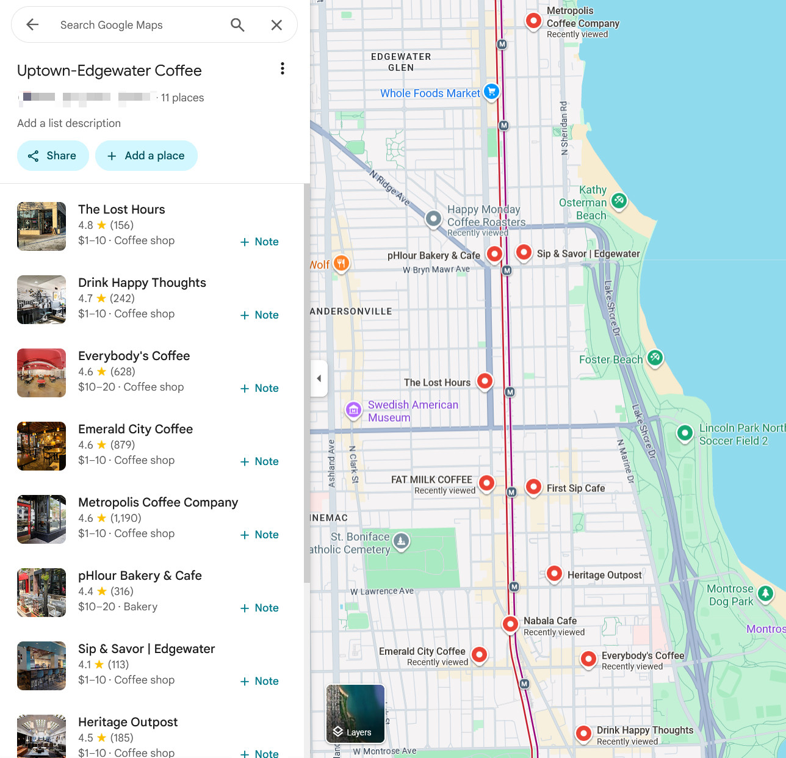
_Posted to [Bluesky](https://bsky.app/profile/coffee.cobra.monster/post/3ly5fqhepn22u "Thank god I don't care enough to embed the map or something wacky") the night before_

I started out just googling around on Maps. Fortunately with the 4 new Red Line CTA stations open, it was going to be super easy to use them to get around pretty quick. And turns out there were a lot of cafes near the stations!

## Rating System

Going to keep this simple and rate things out of 5! Quick explanation:
- **Coffee** = coffee quality _relative_ to just this trip only! (Spoilers but none of these shops served as high quality coffee as my regular haunts)
- **Cafe** = the physical space itself, size/layout and especially seating options
- **Price** = rated based on quality of what was served. 5/5 means you're getting a steal of a price for what they're offering
- **Community** = how much the cafe feels like it's a unique part of its neighborhood, as opposed to 'just another coffee shop'
- **Vibes** = subjective overall "how likely am I to return and possibly bring friends here"

# The Outing

I decided to start at _pHlour Bakery,_ and then figured I'd hop from place to place, getting a cup of coffee from each, taking a few pictures, then choosing where to go next. Trying to hit up as many places as I reasonably could.

I also invited two friends to come with me. After an info mixup ("Meet me at *Berwyn* station" was mixed up with *Bryn Mawr*), we got started!

## pHlour Bakery

While not a cafe, pHlour fits into the scene by being a very prolific pastry supplier *to* cafes across the city. The fact that their main bakery happened to be next to the Bryn Mawr station just made it a really convenient starting place for my little trip.

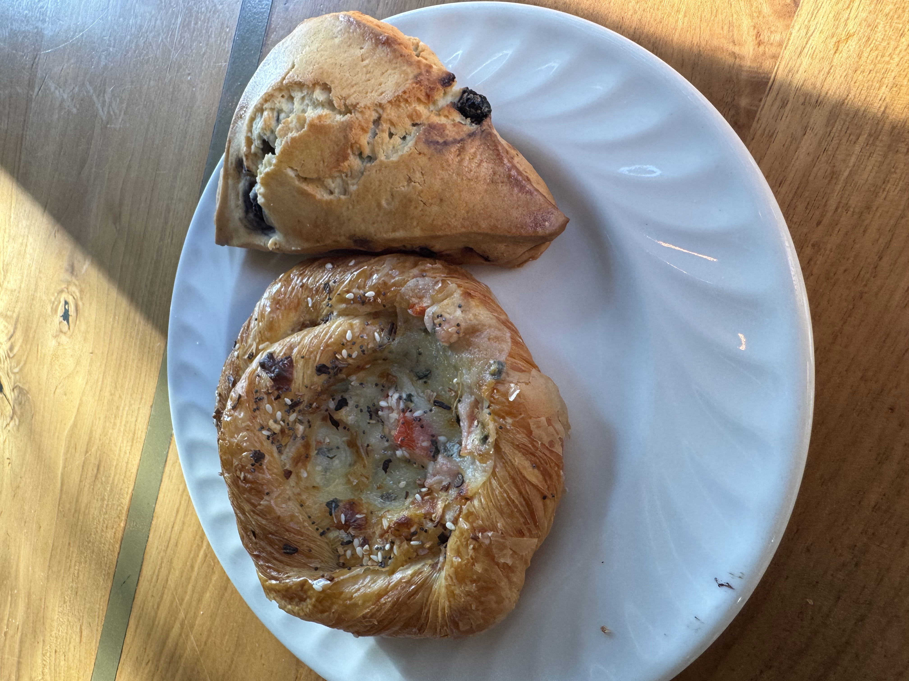
_mmm scone_

I got there at opening, so I had the pick of the litter. I got myself a tomato-basil danish, and a blueberry scone. The Danish was really savory and nice, and the scone was incredible. I love scones, and this is easily in the top 3 I've ever had! <InlineArgentEmoji emoji="smile"/>

> **Coffee: N/A** Only ordered food\
**Cafe: 2/5** Simple, but clean and pleasant enough\
**Price: 3/5** Pretty much exactly what you'd expect\
**Community: 1/5** As they are mostly a supplier to other cafes, inside dining is minimal\
**Vibes: 2/5** Totally fine, just not really a hangout place. Get your stuff and walk next door to the train

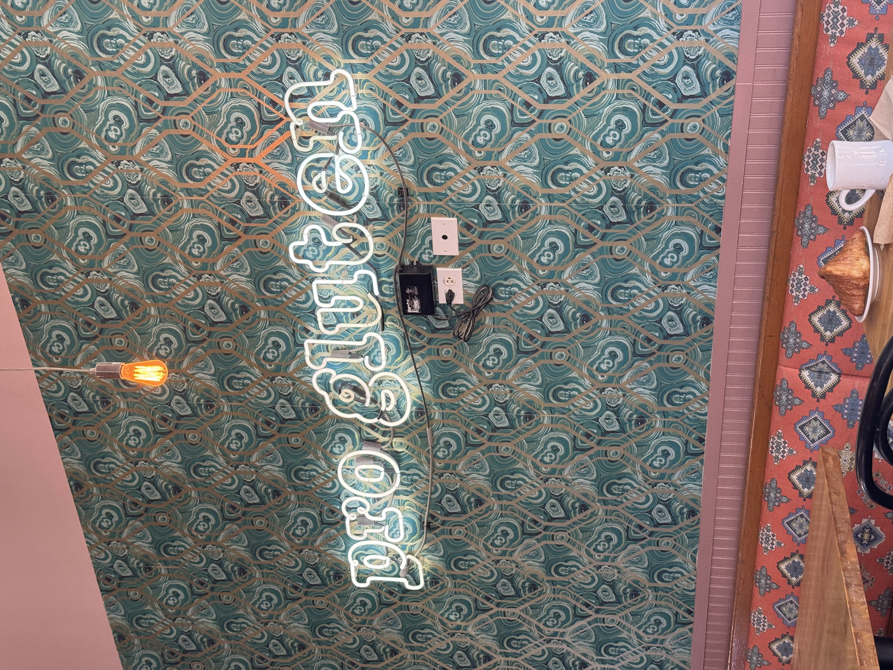
_Sent this to my gluten-free parents and they got a real kick out of it_

## Sip & Savor

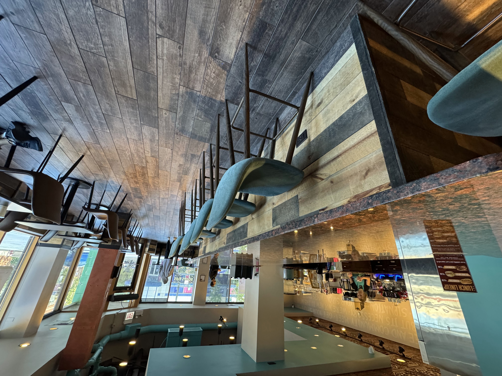
_I'm trying to figure out what this space might've been before a cafe, but I can't quite nail the vibe_

What's the opposite of "starting things off with a bang"? Maybe "tripping at the starting line?" In any case, **Sip & Savor** is all that and more (less?).

I'm being dramatic, but it wasn't a good start when I asked the barista for a macchiato and he said:

"Uh hmm...I don't think we have a **button** for that."

A button!! That means...they use a super-automatic coffee machine! Aaaa....dang. Now I know I'm a coffee snob at heart, but I'm chill and polite, so I asked the barista for his suggestion, and got an americano. He told me it'd be a medium-dark roast, and that they couldn't do my preferred 8oz size so...yeah. (It was really bad)

<EmojiBlockquote emoji={argentUwu} size={'sticker'}>
Super-automatic espresso machines are awesome, by the way. Especially for home, but I don't disagree with them in some commercial settings! There's a lot to be said about having a programmable "press one button and get a specific type of latte/cappuccino" machine, especially in a high-volume environment. They're just not for me :3
</EmojiBlockquote>

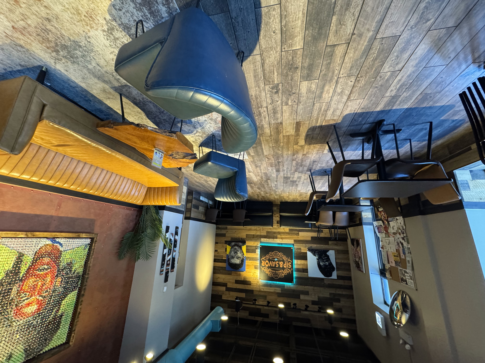
_The back of the cafe is pretty nice at least._

The cafe itself was overall solid though. A lot of space, and good seating options. They even had some couches (a rarity at my usual coffee shop locations), but I wasn't impressed by the comfort, honestly.

They do have a tv running a loop of Animal Crossing videos though...!

_I genuinely like this, though it felt kind of out of place_

> **Coffee: 1/5** Burnt and unremarkable americano with too much water\
**Cafe: 3/5** Good variety of seating, but the space feels too big for what's being offered\
**Price: 3/5** Pretty much exactly what you'd expect\
**Community: 3/5** The signboards were cute and had personality, and the space felt reasonably tailored to the area\
**Vibes: 2/5** Just like, fine! Nothing special or really notable

## The Lost Hours

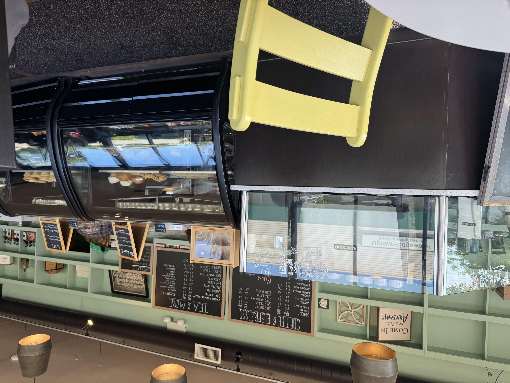

I had high expectations for this place, based purely on [their website](https://www.the-lost-hours.com/), which has some of my favorite design decisions I've ever seen on an otherwise-polished site:

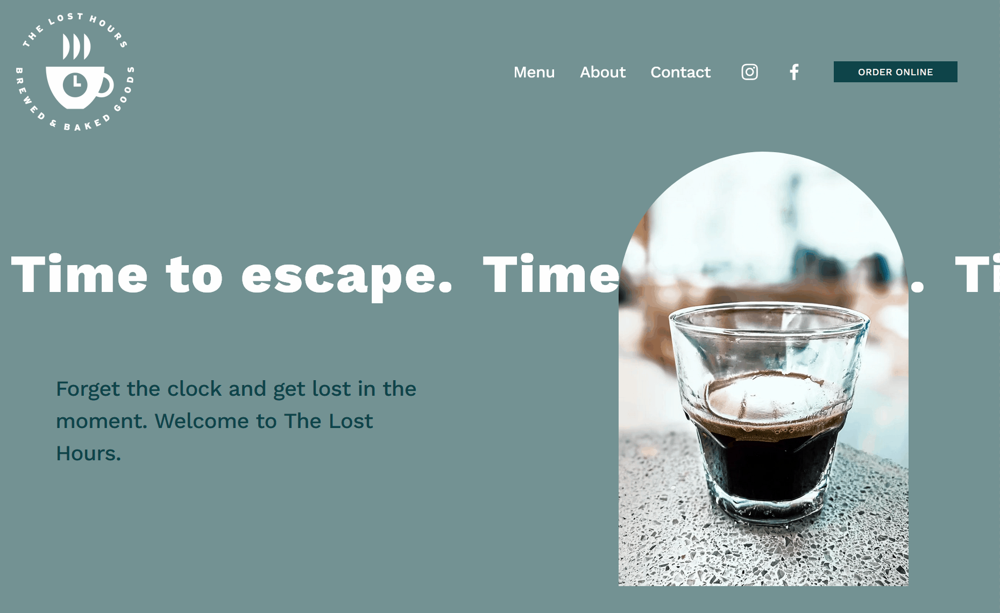

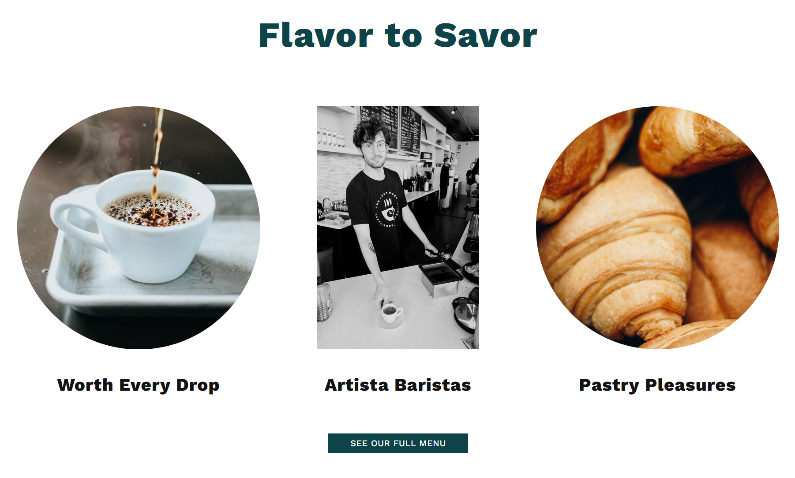
_Just fantastic._

I'll cut to the chase: the coffee was pretty bad, but the cafe itself hit every other mark possible.

So you walk in, and the cafe immediately feels like a community space. It was comfortably busy, and super cozy. The cafe has that kind of variety of comfy-cozy seating that tells you that not only did the cafe prioritize comfort over aesthetic, but that they likely engaged with the community to source the furniture in the first place.

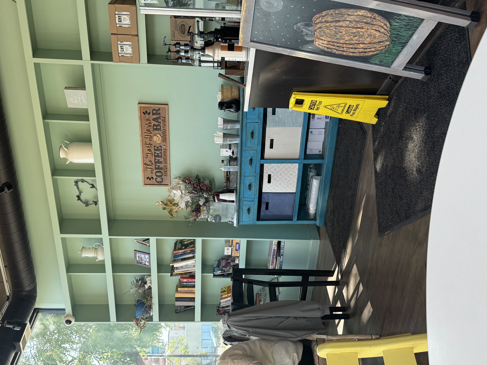
_I didn't get better pictures than this, but there are many more tables and couches!_

Very cool. As for drink, I took my barista's recommendation and ordered a sweet latte drink...it was *$7.00* and consisted of espresso, chai, and various syrups. It was an overwhelming sweet mess, and demonstrations the classic Cafe Syrup Issue.

<Accordion client:idle>
<InlineEmoji emoji={iceCream} />Cafes and Coffee Syrups

The **Cafe Syrup Issue** is what I call it when I find a cafe that has tons of flavor syrups *and* specifically leans heavily into them as a standout feature of their coffee quality.

This is from a cafe I visited during a road trip:

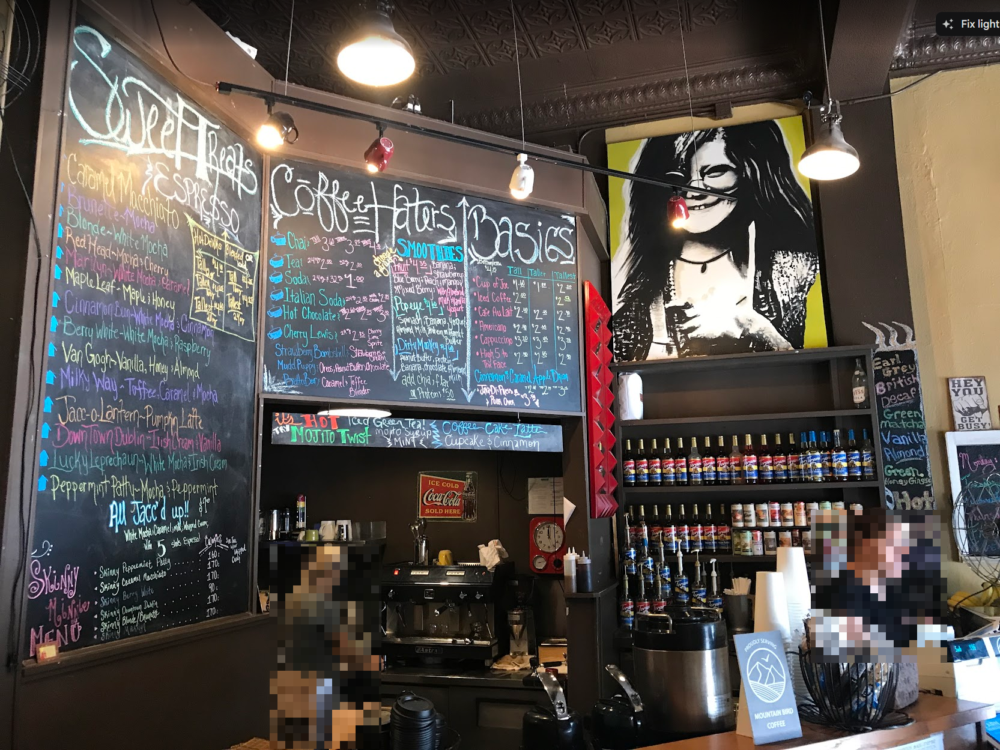
_The chalkboards are just lists of syrup combinations..._

I understand that people can find these kinds of drinks tasty, but to me it just isn't coffee anymore. It's a sugar drink with coffee as a convenient caffeine source. Nothing special, and with very few exceptions, no artistry involved.

And to be clear, neither *The Lost Hours* nor any of the cafes on this list today are *THAT* bad. There's an element of this issue, but it's much much worse elsewhere I assure you.

</Accordion>

Apparently they source their coffee from local roaster, [Happy Monday Coffee](https://happymondaycoffee.com/), which popped up in my initial search but I quickly moved past mostly due to the fact that they only sell coffee blends and no single-origin coffees.

Now judging by a syrupy drink alone feels disingenuous, so I also ordered a straight espresso and it was under-extracted and undrinkable. Not sure if it was an issue with dialing in that day or what, but not impressed.\
Score is below, but just wanted to note that aside from the coffee itself, I *really* like everything else going on here! It's a lovely cafe, with friendly staff and clearly a successful outreach towards the local community. Super cozy and the seating is comfy as heck. Maybe the tea is good too! It's really only the coffee not doing it for me.

> **Coffee: 1/5** Syrup hell and crazy under-extracted espresso. Not impressed\
**Cafe: 5/5** Great seating variety, big space, good acoustics. Pretty perfect. Only negative I'd say is it has big, east-facing windows with no shades, so it was very  bright and hot\
**Price: 1/5** Too much money for too mediocre of coffee. But especially not a fan of $7 for just syrups\
**Community: 5/5** Great space, friendly staff, good location, and all of it summed up by a very earnest website\
**Vibes: 4/5** Totally subjective, but the vibes were great but even ignoring coffee, it's just not quite my perfect type of space. Very very good though!

## Everybody's Coffee

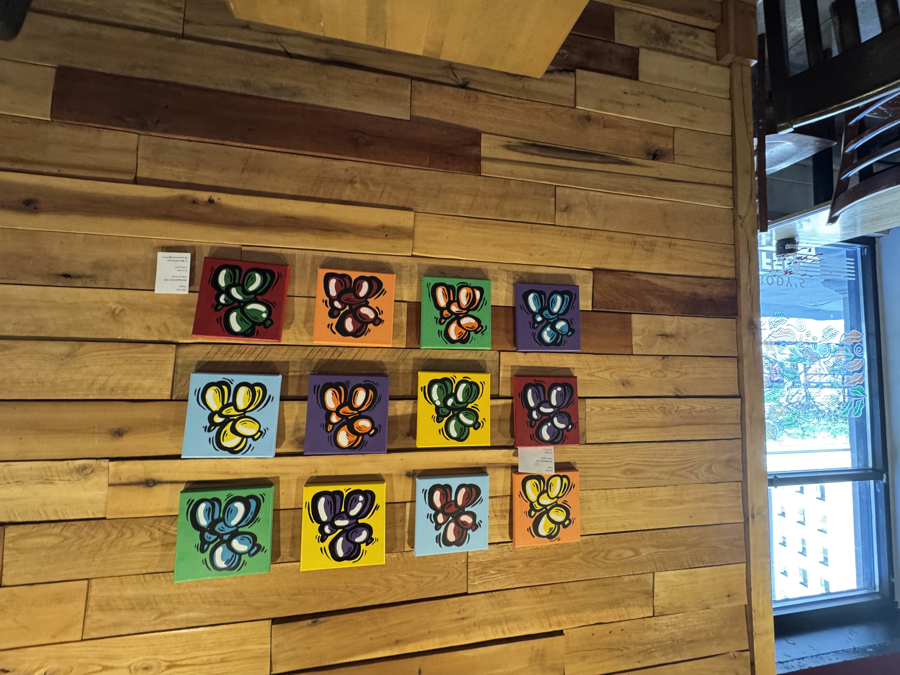
_Rotating art displays! Always a good sign :3_

I wasn't sure what to think of this place...with a name like "Everybody's Coffee" I leaned towards 'casual about coffee'. However as I traveled there, I checked their website and was delighted to find they listed a ton of single-origin roasts! <InlineEmoji emoji={purpleHeart} />

And I'll cut to the chase: it was indeed very good!! For *$2.77* I got an 8oz drip coffee with a single-origin natural-process Colombian (medium-light roast) and it was fantastic <InlineArgentEmoji emoji="triumph" />. 100% easy-drinking "could enjoy this all day" kind of drink. Lovely lovely.

_And what a nice space_

Took a seat in the back and marveled at the lovely cafe space. No couches, but every other type of seating was there! High tables, low 2-person tables. Outdoor seating (completely filled that day), and the building seems to be a larger community center type of space, so perhaps there was more!\
A few negative points for acoustics which I don't hold against them. The building just has a lot of echoey exposed ducts etc. and I feel like they did a pretty reasonable job filling the space with furniture, so aside from maybe some panels or something it's as good as it gets. 

But overall the vibe was a great mix of cozy and productive-comfortable. The high-table I sat at had special cabling routed through it to make sure that patrons could access power outlets! Like this place wants to be a comfortable cafe space, but they put some good priority into making it a great *workspace*. Oh and it's open late!! Huge bonus.

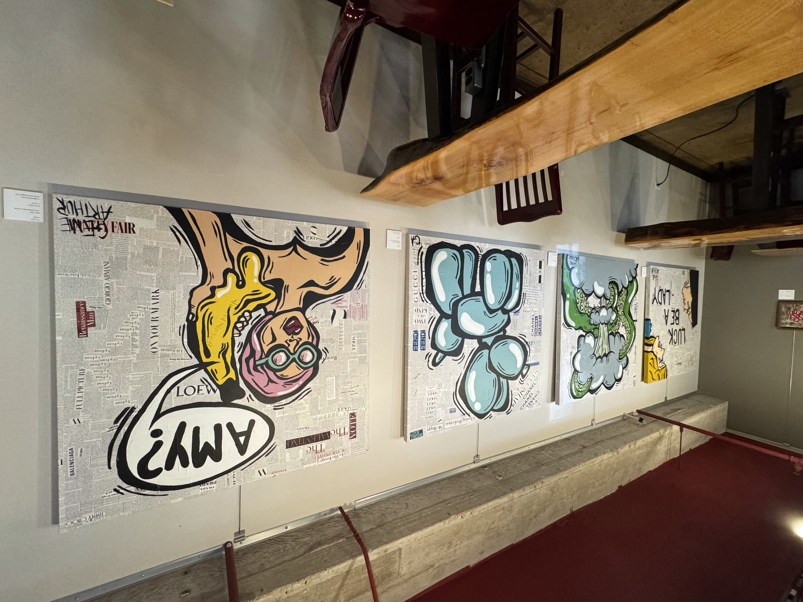

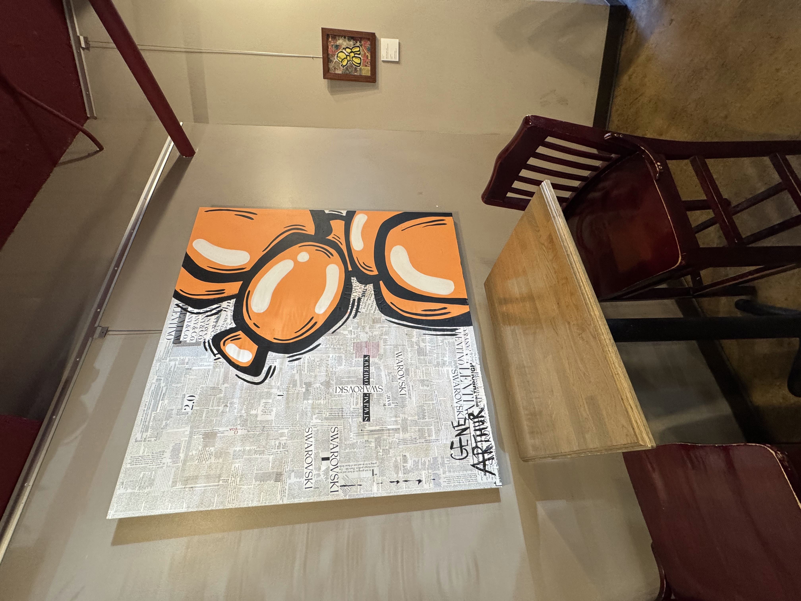
_Art is by local artist: [Gene Arthur](https://www.thisisgenearthur.com/)!_

Local artist displays are always a great sign! Love this art, and it helped me feel cozy and welcome here :3

> **Coffee: 5/5** Beautiful single-origin! Clean and well-brewed\
**Cafe: 4/5** Docked a single point due to lack of couches (not a cafe I'd sit and read in for a long time) but definitely a great space for groups, or solo productive work\
**Price: 5/5** Unbeatable price. Only tried drip though! No idea what other coffee costs there whoops\
**Community: 4/5** Solid community space, especially with the art\
**Vibes: 5/5** Perfect vibes for me, especially since Wilson Ave really calms down by this point and it feels "active but quiet" outside and around it

## Nabala Cafe

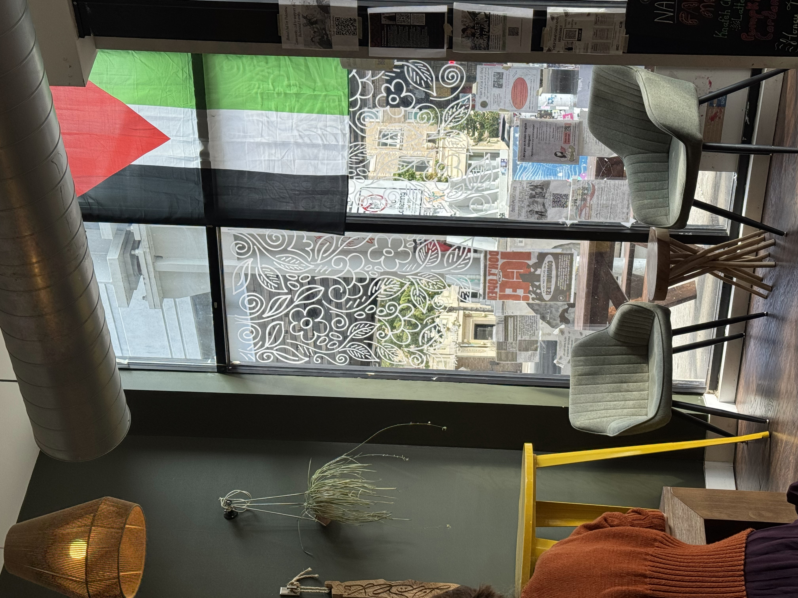
_Free Palestine!! <InlineArgentEmoji emoji="triumph" />_

Immediate incredible vibes from this shop! And not just because of Palestinian solidarity! Beautiful shop with variety of seating options, lovely decor, Palestine flags just *everywhere* which you love to see, and tons of community amenities. **And they serve Middle Eastern coffee and food** like!! What more could I possibly ask for?!

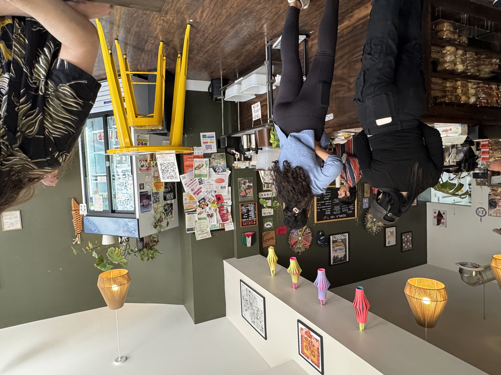

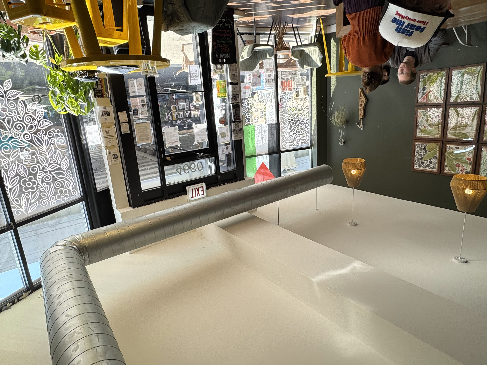

This cafe blew me away. Now I know my background means I'll more heavily weight places with Turkish coffee, hummus, and za'atar but just look at this place. It screams intentionality, community, and a strong fucking identity.

The cafe has a solid variety of seating, ranging from comfy armchairs, more casual sitting-room style chairs, cafe tables, high tables, and two large group tables with bench seating. Pretty much everything you could ask for, save a full couch.\
The lighting is incredibly welcoming and they make great use of it with so many plants.

Around the shop they have community resources, including a sizeable community book exchange, and this great little shelf full of board games, community art supplies, and even a gourd seed bank for folks to propagate some gourds of their own. I've never seen a community art supply thing like this before, how nice :3

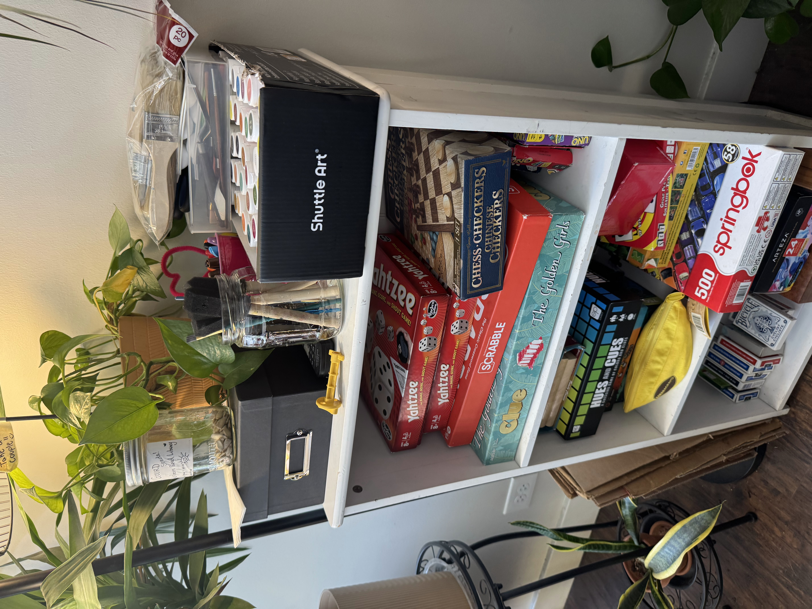

As for the coffee, I ordered a Turkish coffee and treated myself to a hummus plate. Delighted to find that the hummus came with oil and za'atar as well! A little disappointed that the coffee came in a to-go cup...but then delighted again that it was prepared with cardamom *by default* (the Palestinian way!), which made me feel so at home you can't even imagine.

Oh and it was good! Very very good Turkish coffee. I think a step below Oromo Cafe elsewhere in the city, but that might just be due to the plastic lining of those to-go cups. Not a fan.\
Hummus was incredible! Za'atar was solid and the oil was good (not amazing). No Turkish delight with my coffee by default but that's fine, I wouldn't mind paying for it next time.

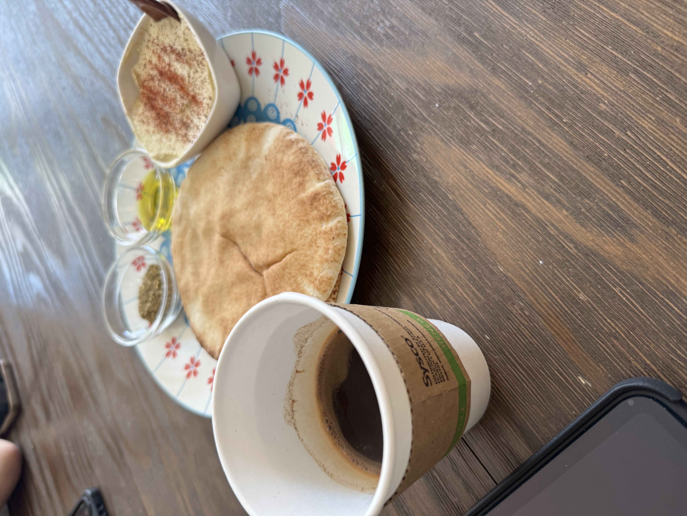
_If the coffee came in a more traditional demitasse cup or something this would be a top 10 photos of the year contender_

I could go on for ages, but I've been wanting to come here for a while. They opened a bit over a year ago, and I've walked past when they were doing community outreach events and Palestine fundraisers...so it's high time I started getting involved myself!

> **Coffee: 5/5** Only had the Turkish which was very good, but 5/5 for also having incredible food :3 Though I will note that even I can't drink Turkish coffee all day long so I'd need other options if I were to stay longer haha\
**Cafe: 5/5** Incomprehensibly perfect. Can't gush enough about it\
**Price: 3/5** Honestly I was too excited and didn't notice the price. I think it was like, average?? Normal?\
**Community: 5/5** Unbeatable. Obvious reasons.\
**Vibes: 5/5** For me at least, perfect. Not super ideal for a bigger group, but solo or with one friend? Absolutely ideal.

## Heritage Outpost

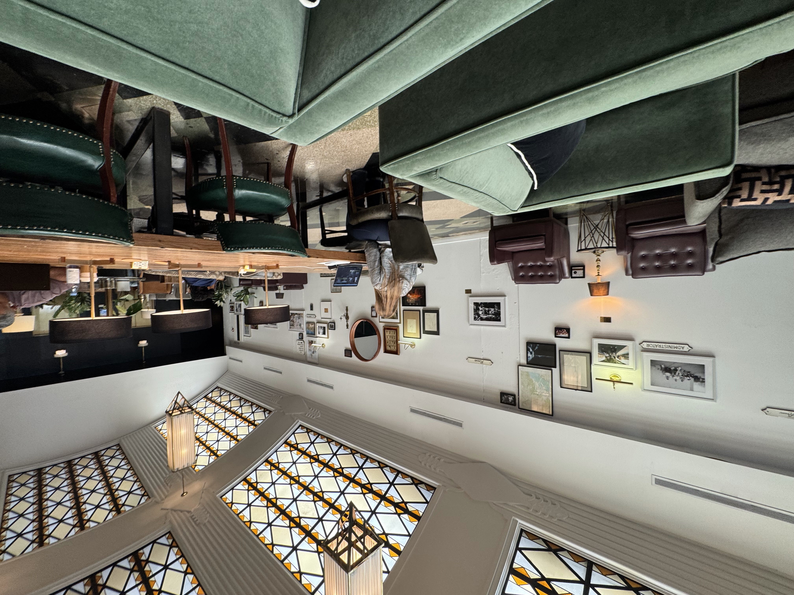
_Hard to judge the vibes of an old-lobby-turned-bougie-apartments because it was genuinely nice chilling there_

This one won't take too long because the last coffee shop of the day is actually an offshoot of one of my long-established faves in Lincoln Park: **Heritage Bikes & Coffee**. This one made the list because of the unique space it's in, but the coffee itself I don't have a ton to say about, so I'll get that over with quickly:

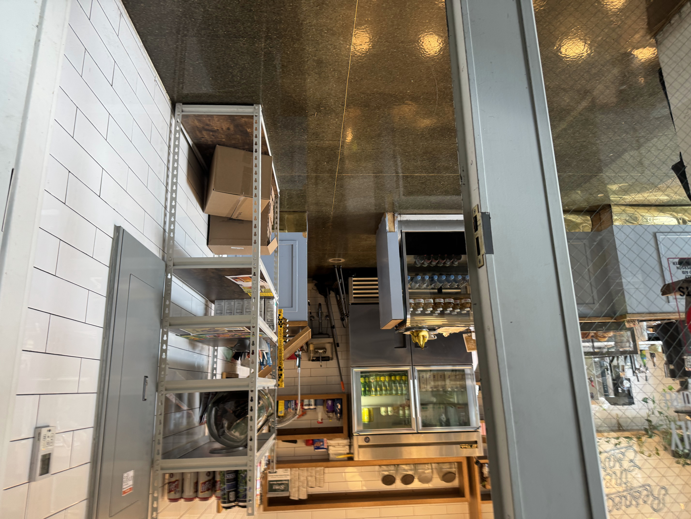
_The actual cafe is pretty small. You're really supposed to grab-n-go_

They serve [Onyx Coffee](https://onyxcoffeelab.com/), a reputable 3rd-wave roaster out of Arkansas. Heritage serves their quality blends in espresso and drip (no pour-overs), and they serve pastries from pHlour (I believe).\
I love their Lincoln Park location, and go there for the space, the bike shop it's attached to, and the kind staff. The coffee isn't incredible, it's just "above average" enough that I can enjoy being there. And that quality was replicated here at this "Outpost". I got a small decaf americano and it was very nice. Easy drinking. Nothing to write home about.

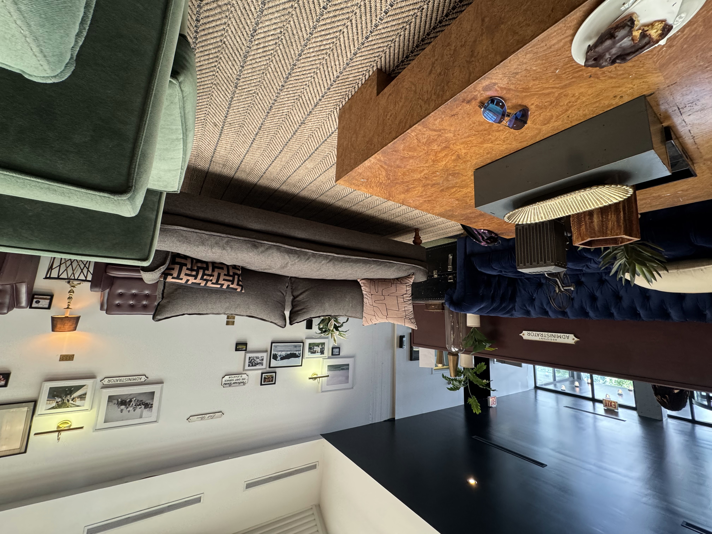
_Impressive variety of couches, honestly_

The big draw was this lobby space. You walk in, and there's a front desk with an attendant who receives visitors and deliveries for the residents who live here. The cafe is to the left. A bit to the right is a hallway leading to a restaurant-bar. The back center is all public-seating, with a 3-elevator bank in the very back for residents.

Going in I thought I was going to be uncomfortable in this space, in the same way that you're never really comfortable in a hotel lobby, but honestly it wasn't bad!

Good variety of seating, and the steady stream of residents moving in and out of the building wasn't too disruptive. The few other people there with coffee were treating the space like a library and quietly working at laptops.

Overall not bad, though I don't think I'll go out of my way to come here on my own. More of a "if I'm in the neighborhood, I guess". Especially since I'm already familiar with the coffee and enjoy their main location much more.

> **Coffee: 3/5** Totally fine, nothing spectacular\
**Cafe: 2/5** Cafe itself non-existent, but the lobby space was totally fine. Just kind of odd\
**Price: 3/5** Average\
**Community: 1/5** Any "community" felt fake in that luxury-apartment "community" kind of way. Not hostile, but definitely not what I'd call a welcoming space\
**Vibes: 2/5** Fine, but odd

# Concluding Thoughts

This post has taken me 6 full days to write, so I'm going to cut myself off a bit and not rehash the rest of the post <InlineArgentEmoji emoji="weary" />. 

Obviously *Nabala Cafe* and *Everybody's Coffee* were my two faves of the excursion, and I kind of expected that result. The main drive of this activity was to explore two neighborhoods I've barely visited, and to compare different cafe & community vibes in quick succession ~~also an excuse to check out the new red line stations~~.

Aside from the Outpost, every cafe had something going for it...or at least a vision that I could appreciate, and that's really neat! I have aspirations to open my own coffee shop in Chicago someday, and much less "competition" I'm looking for inspiration and building an internal library of ideas for what works and what doesn't...

But also I just want more places to take friends to. Because dangit all the good coffee is on the West Side for some reason and it can be tricky getting over there quickly.

## Future Outings

The biggest takeaway was that this was *so much fun* and I've gotta do it again. Combining neighborhood exploration with transit rides and meeting friends AND new cafes...yeah I mean what a mix! I have my eyes on the **Pilsen** neighborhood next, as I've already gotten some strong cafe recommendations from friends there <InlineEmoji emoji={eyes}/>

I've also got to do this format again for my visits to other cities. I did this a bit when I visited Pittsburgh for Anthrocon this summer, and man even just the 3 shops I went to were awesome! This is a fun format, I've gotta expand it!

Thank you for reading my coffee ramble <InlineEmoji emoji={purpleHeart} /> if you have any comments or ideas for how I could make this better or more fun, please [hit me up online](/links/#socials)! And hey you should go out and visit your local shops! Nearly every city in the world has a coffee scene, and even if the coffee isn't crazy special, the community and cafe just might be :3

