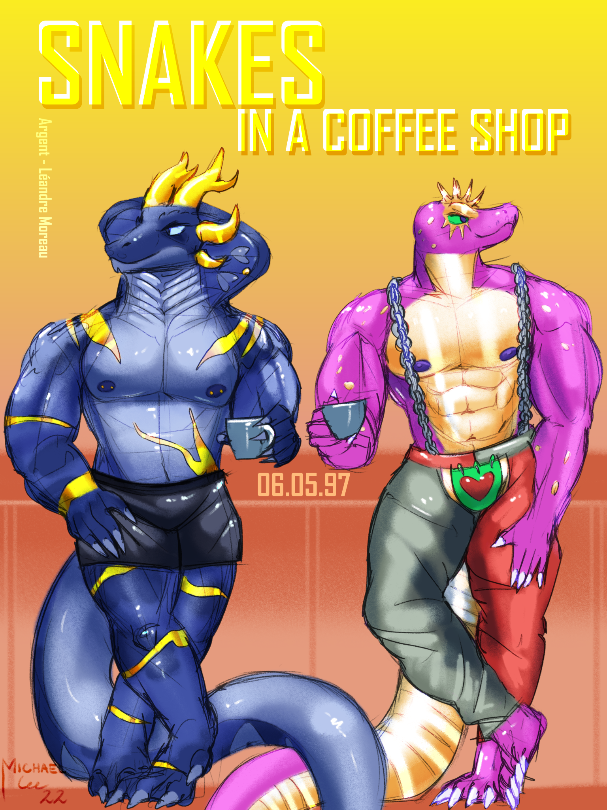

import EmojiBlockquote from "@components/EmojiBlockquote.astro"
import smirk from "@assets/mutantEmoji/argent/smirk.png"
import triumph from "@assets/mutantEmoji/argent/triumph.png"
import Accordion from '@components/Accordion/Accordion'
import relief from "@assets/argent/stickers/babanasaur/relief.png"
import uwu from "@assets/argent/stickers/babanasaur/uwu.png"

This is my first New Years with a blog, so I think it's only fair to make a corny "year of [goal]" post! I'm going to lay out my broad-strokes goals for the year, and then check in on them later this year :3

# Cooking More

Very simple but the very first thing I want to focus on this year is cooking more AND eating out less. I already eat pretty healthy, even when I eat out at least half the time is at someplace nominally "healthy".

<EmojiBlockquote emoji={relief} size="sticker">
[Slop bowls](https://www.expedite.news/p/is-slop-bowl-fair-analysis)...So many delicious [slop bowls](https://www.atlasobscura.com/articles/all-hail-the-slop-bowl)...
</EmojiBlockquote>

So far I'm trawling through my messy "recipes" discord chat channel in my junky private server where I throw recipe links and videos, and honestly that's been working out pretty well.\
So far I've made three truly novel things this year, and I'm only excited to get a bit more ambitious as I go along!

- Hummus
- _Chocolate_ Hummus
- Baked oat cake

_Definitely room for improvement but pretty good for a first try!_

## Intentionality

I don't consider myself a doomscroller, but I fall prey to a lot of \*shrug* types of time-commitments. Mostly a lot of YouTube*, but also playing non-multiplayer infinitely-replayable games (i.e. roguelikes) just for the sake of passing time. This eats into a lot of my precious free time, and ultimately feels like I'm squandering the hard work I've put into building myself some stability.

<EmojiBlockquote emoji={uwu} size="sticker">
\* I know I essentially just described doomscrolling behavior anyways, but I'm not sure if it really counts when 90%+ of the YouTube I watch is educational...nerdy-ass engineering videos and lately a lot of cooking.\
(The other 10% is Dead by Daylight videos)
</EmojiBlockquote>

# Website Content

Unsurprisingly I intend to spend time this year working on this site! More specifically though I'd just like to add content to it in the form of reviews, blog posts, etc.

This site went live in **Spring 2025** and since then I've added a bunch of neat things that I'm quite proud of! But I haven't quite added as much of my personal thoughts as I'd prefer to, so I'd really like to do that :3

# Make Art!

I have GOT to draw more this year oh my gosh. Last year I pretty much only drew during July during [ArtFight](/blog/2025-08-09_art-fight-2025)...and while I made some incredibly neat pieces, it really was all I did until the end of the year and that's kind of disappointing.

## New Tools

To that effect, I made a point of getting a few new supplies...

_The real sleeper is that white pen. That thing is a crazy cool 4-way pen + mechanical pencil :o_

I love my coffee shop visiting habit, so what if I lowered the "empty canvas" anxiety with some casual traditional sketching? With added bonus of...doing traditional art again! :3

# Coffee (is anyone surprised)

Social media followers may have already heard, but I've been hosting a few coffee cupping events at home for my friends! It's been really neat. A fun activity for everyone involved, and a great opportunity for myself to delve deeper into coffee knowledge & education.

_8 coffees was probably too many...but I couldn't help myself! There were so many to share!_

## Home Espresso

First off I really want to get back into making espresso. I have a great, capable machine that has every tool I need to pull excellent espresso. But my day-to-day I'm just brewing V60 pour-overs because ultimately if I want an easy but consistent cup of tasty coffee, the pour-over is just the way to go.\
V60 for the coffee, espresso for the hobby. And I'd like 2026 to be the year I get back into the hobby in earnest.

Part of my inspiration has been watching a lot of [Lance Hedrick](https://www.youtube.com/@LanceHedrick) lately. He's a very down-to-earth coffee ~~nerd~~ expert who can really get me excited about trying harder with espresso by cutting out a lot of the chaff and noise of espresso "culture" externalities.

<EmojiBlockquote emoji={triumph} size="emoji">
You do not, in fact, need hundreds of dollars worth of equipment or even any fancy tools to brew great espresso.
</EmojiBlockquote>

I love all of the crazy cool coffees I buy, and I think I need to be okay with the financial "risk" of using up those beans trying to dial-in great espresso! After all, it's fun!

## Furry Con Coffee Panel

I have GOT to talk to the furries about good coffee. And not only good coffee but good cafes and what makes it so integral to the Urban, Gay, Furry lifestyle!!

This year at **Midwest Furfest** here in Chicago\* there was a coffee panel and it just wasn't enough for me! It didn't go deep enough, or get people *excited* about coffee.

> \* "Rosemont" is NOT Chicago but whatever

So I'm gonna do it! I've already got ideas on how to format it to be interesting and deep without it being alienating or overly-dense.\
And I've already got an idea to get around the lack of sample-able coffee due to food and drink restrictions at these things. Behold:

_Get a load of THIS fuckin' thing_

Tasting coffee would be best, but 2nd best is a clean and safe way to pass around coffee *smells*, and this is gonna be how I do it. Everything else is pending but I'm gonna give this a shot!

Look for me at **Anthrocon 2026** for the inaugural panel :3

## Opening a Shop

_The future... Credit [@MichaelLee](https://artfight.net/attack/3300949.snakes-in-a-coffee-shop)_

This is a loftier goal, but I want to make the first steps towards coffee shop ownership! I really really want to open my own shop here in Chicago. I want to find a place, make it my own, brew amazing coffee, and create a community space I can be proud of! :3

I'm gonna take it slow, but steady, and I think this year is the year I do the business research I need to build a solid foundation for the future when I actually have the resources to get something like this going.

# Weightlifting & Bulk Diet

After January I'm officially ending my 1.5-year long cut!! That is WAY too long for a cut diet, but I had things get in the way, taking me a while to get back on track. But I'm back, baybee! And man I am so proud of my progress.

<EmojiBlockquote emoji={smirk} size="emoji">
You can check out the latest physique photos I've shared on my Weightlifting page [here](/about/weightlifting/#current-physique)!
</EmojiBlockquote>

It's been cool getting to really cut down and see how muscular I've become over the years, and now I'm hyper-motivated to switch to a controlled bulk and put on as much muscle as I possibly can! This year is going to be about sticking to my guns, not making excuses, and staying consistent both with workouts and diet.

_I HAVE to become as hot and buff as my fursona it's so important! Credit [@NonCoralArt](https://bsky.app/profile/noncoralart.bsky.social)_

# Commie Book Club

Finally, the big thing I HAVE to get back into creating(?) is lively communist discussions with peers!

_When you're yelling at communists online, this is who you're yelling at..._

I've already laid the ground work in my [Fitness Discord](https://discord.gg/zHVnKRb) and I'm hyped to get some long time friends into cool theory discussions. Especially as the Imperialist nations of the world get more and more openly fascist...theory without practice isn't enough, but it is absolutely something valuable you can do to feel involved and *active* in resistance.

Overall this is a pretty open looking year, so I'm excited to give it my all, and practice good self love by engaging with these things I care so much about.