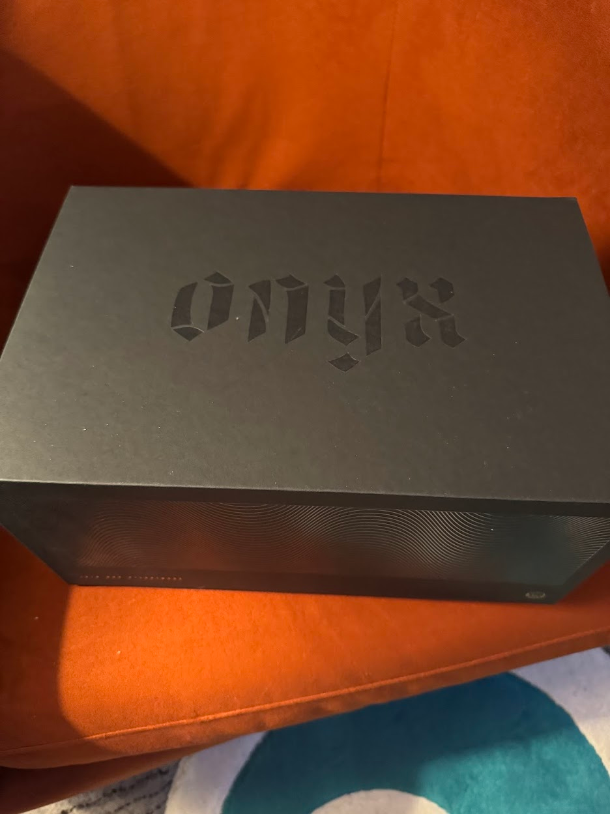

import EmojiBlockquote from "@components/EmojiBlockquote.astro"
import ReviewGrid from "@components/ReviewGrid/ReviewGrid.astro"
import AccordionPhotoTemplate from "@components/Accordion/AccordionPhotoTemplate.astro"
import smirk from "@assets/mutantEmoji/argent/smirk.png"
import smile from "@assets/mutantEmoji/argent/smile.png"
import triumph from "@assets/mutantEmoji/argent/triumph.png"
import Accordion from '@components/Accordion/Accordion'
import relief from "@assets/argent/stickers/babanasaur/relief.png"
import uwu from "@assets/argent/stickers/babanasaur/uwu.png"
import frustrated from "@assets/argent/stickers/maxadisasta/frustrated.png"
import shrug from "@assets/argent/stickers/maxadisasta/shrug.png"

[Onyx Coffee](https://onyxcoffeelab.com/), a 3rd-wave roaster HQ'd in Arkansas, has always had the best packaging and presentation in the game. I was never too impressed by their coffee offerings, however. But I think that may have changed.

<EmojiBlockquote emoji={smile} size="emoji">

This blog post is first just me praising how pretty and cool Onyx's presentation is, but the meat and potatoes is going to be my ratings of all the coffee :3

I took off-the-cuff notes every day that I tried one of the coffees, and in honor of their honesty and out of respect of current-me's time, I'm just going to reproduce them here verbatim.

</EmojiBlockquote>

# What is Coffee Advent?

Other roasters and providers have done this before, but it seems as though Onyx is the most recognized (or perhaps the best at marketing it).\
In brief, Coffee Advent is 24 different coffees for each of the 24 days of December preceding Christmas. Each bag is 2oz of coffee, and the idea is that every day you brew a completely unique coffee from the day before.

It's a neat, simple idea. I think what really won me over was the combination of presentation and supporting media.

<AccordionPhotoTemplate numImages={2} numCaptions={1}>
    
  

    
  

    Finally, cool snake motifs with my coffee...bless
</AccordionPhotoTemplate>

Obviously the packaging is fantastic, but what really sold me was the playing cards and videos that came with it. Two decks of playing cards, one a full normal playing deck with custom coffee motifs. The other a 25-card deck hosting 1 card per coffee offering with the coffee info, a description, and a QR code to the website and accompanying videos.

_They're high-quality too! Genuine Bicycle playing cards!_

They had a special website for this event and I have some _opinions_ on how it's coded. Thematically very cool. And neat that the cards match the physical cards I actually got with the package. Neat! The coffee nerd in me just wishes that throughout the event I'd had easier access to the \*information* itself

But I digress.  

_Figures that it took til I recorded this in January 2026 for the site to actually work w/o a hitch_

<EmojiBlockquote emoji={frustrated} size="sticker">
I don't digress actually what the fuck. I couldn't reliably open this on firefox, or safari. I had to open it on a chromium browser just to get it to fucking work.

It's a wobbly reactive app with a spread of cards for each day and I hate it. Trying to swipe between cards on mobile just made safari freak out and change tabs and stuff. Sucks.
 
Like my guy, this is cool design but if it doesn't WORK then I hate it. Bad UX kills cool UI.
</EmojiBlockquote>

# The Coffee Review

Reminder!! My original notes were very rough and taken off-the-cuff while brewing and drinking coffee each day...These are my casual, un-edited, first-impressions

I've refined their presentation below, but the contents are still rough (aka please be nice).

_I'm actually proud of how I arranged this, but the contents are still pretty rough lol_

<ReviewGrid />

<EmojiBlockquote emoji={shrug} size="sticker">
At this point even I'm wondering why I'm making the effort to share this. 24 different coffees, and even if I put maximal effort into describing them...what's the point of doing so with just text like this?

I think I just want to share a bit of the process for its own sake, because it's \*my* process. I love coffee, but I have some imposter syndrome about the hobby, and certainly about really \*knowing* the industry. I'm trying very hard to be more intentional about my continuing education, especially if I'm really ever going to [open my own cafe](/blog/2026-01-11_year-of-creation/#opening-a-shop) someday.
</EmojiBlockquote>

## Onyx Advent Final Thoughts

The "review" thoughts I've shared are all over the place, but I assure you I had tons of fun with every coffee. The highlight, of course, was using 6 of them for the [home coffee cupping](/blog/2026-01-11_year-of-creation/#coffee-is-anyone-surprised) with a bunch of friends :3

But no, aside from the website issues, I really loved this. I'm still working my way through the remaining coffee and I'm 100% keeping this beautiful box and these cards.

I think the real standout though is a combination of the videos and the well-deserved attention going to the producers and procurers of the coffee.

Great coffee is good on its own, but *truly ethical* coffee tastes all the sweeter.

