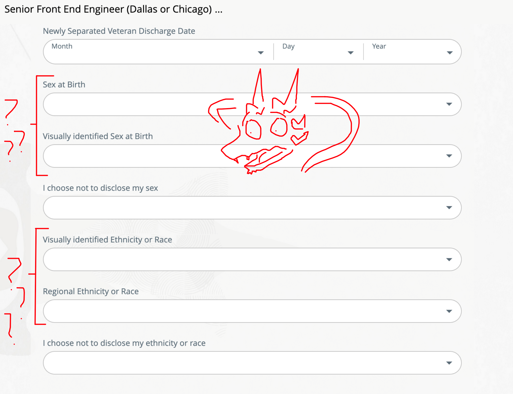

import EmojiBlockquote from "@components/EmojiBlockquote.astro"
import ReviewGrid from "@components/ReviewGrid/ReviewGrid.astro"
import AccordionPhotoTemplate from "@components/Accordion/AccordionPhotoTemplate.astro"
import smirk from "@assets/mutantEmoji/argent/smirk.png"
import smile from "@assets/mutantEmoji/argent/smile.png"
import weary from "@assets/mutantEmoji/argent/weary.png"
import triumph from "@assets/mutantEmoji/argent/triumph.png"
import Accordion from '@components/Accordion/Accordion'
import relief from "@assets/argent/stickers/babanasaur/relief.png"
import uwu from "@assets/argent/stickers/babanasaur/uwu.png"
import yikes from "@assets/argent/stickers/babanasaur/yikes.png"
import frustrated from "@assets/argent/stickers/maxadisasta/frustrated.png"
import flustered from "@assets/argent/stickers/maxadisasta/flustered.png"
import shrug from "@assets/argent/stickers/maxadisasta/shrug.png"
import snake from "@assets/mutantEmoji/snake.png"
import InlineEmoji from "@components/ImageComponents/InlineEmoji.astro"
import InlineArgentEmoji from "@components/ImageComponents/InlineArgentEmoji.astro"
import QuoteBlock from "@components/QuoteBlock.astro"
import CrtGreen from "@assets/mutantEmoji/crt_green_lines.png"

import { YouTube } from "astro-embed";

>This turned into a behemoth of a blog post, so please feel free to skip ahead with the Contents links there if you just want specific info about my actual interviews, etc!

I've been on and off the job hunt since April 2025. I'm currently employed, and looking because
1. I don't trust that that will continue to last
2. I've hit 4 years at my company, and I've always been told that "Software developers don't get promotions, they get new jobs"

In any case, I've decided to log my experiences thus far as both a personal journaling exercise and to hopefully help out my fellow software devs who might be eyeing their own job search.

<EmojiBlockquote emoji={uwu} size="sticker">

As a small note, I'm going to try and keep this accessible to non-software dev nerds. So when you see me spell out what an "API is" that's why

</EmojiBlockquote>

<hr />
I'll start with a quick "who is Regal? *professional edition*" summary to contextualize the types of jobs I'm looking for. Then I'll give a quick broad-view status update of my search results. Finally I'll follow up with a list of the companies I've had interactions with so far, and how that has gone.

# My Particular Flavor of Software Dev


_Yep it's a lazy screenshot of my resume. Never do extra work, ever. lol._

In short, a Senior Frontend developer. In long, a C#-certified contractor who has never once written C# for work, and has pretty much only ever written Java, SQL, and HTML, CSS, Javascript/Typescript, and mostly works with React but sometimes NodeJS back-end stuff, and rarely sometimes in Angular.

<EmojiBlockquote emoji={smirk} size="emoji">

Ironically this cobra hates writing Python <InlineEmoji emoji={snake}/>

</EmojiBlockquote>

For my job searches I usually search "senior frontend engineer" or something like that. Sometimes "React" or "React developer" because I make myself sad when I find a great job posting but for *Angular* and I have to remind myself that I haven't touched Angular in almost 4 years.

## What I do

The long and short is I look at pre-prepared webapp mockups, build User Interfaces (UIs) with Javascript frameworks, and hook them up to APIs (aka servers and services).

My particular interests are in custom component libraries and accessibility. I'm not *amazing* at accessibility but I try hard to get it right! And some clients are *very* picky about this (as they should be!).

My day-to-day is building out pages from the mockup documents, talking to designers and testers about features in the webapp, and dealing with bugs and bug fixes. I myself am amazed that my work can actually eat up a full 8hr workday so quickly but it really is just like solving puzzles of various levels of frustration all day with lunch and random usually-pointless meetings in the middle.

<YouTube id="https://www.youtube.com/shorts/r6JXc4zfWw4" title={"It's really just this, to be honest"}/>
<br />

# The State of the Search


_My email organization has become my personal failure tracker :3_

This section is about the bullshit. The ways in which searching for a job as an experienced software developer in 2026 particularly sucks. It's hard for everybody out there right now, but on top of fake jobs, getting ghosted, and every other plague of modern job hunting, I've consistently found 4 types of "oh hell no" throughout my search:

1. Dubious startups
2. AI and/or Crypto bullshit
3. Egregious interview or application processes
4. Insane applications

## Startups -- Are they for suckers?

It's not just the uncertainty of working for a startup, it's the *vibes.*


_The previous page had 3 buttons, "Let's Go ↓", "Process ↓", and "Skip the line →". The last of which takes you to this page you see here._

These are the places that promise you heaven and earth if you work for them. Pay ranges from ~$60k to ~$250k "depending on experience", they don't seem to offer equity, they have ""unlimited pto"", and of course they have a \*cool office in West Loop*.

<EmojiBlockquote emoji={frustrated} size="sticker">

"West Loop" is a Chicago neighborhood and it sucks bigtime. One or two cool coffeeshops but it's the pinnacle of gentrified tech-startup yuppie nightclub nonsense. Every single startup seems to have their office there, and "is the office in West Loop" is one of my actual litmus tests for instant rejection.

</EmojiBlockquote>

Some of them offer tons of money, a rare few offer equity, many are just kinda cagey about \*what* they're even offering. But none of them seem to offer any explanation for why the thing they're doing is better than any of the handful of legacy companies that already do whatever they're offering.


_Ooh wow consulting...but with AI! Wow how novel_

I've never worked for a startup. I'm wary of them, but I don't rule them out completely. At the very least I'm super curious what they're like...and I'll detail below how some of those interviews have gone.\
But as someone seeking job _stability_, startups aren't very high on my list.

### AI and Crypto Nonsense

This one is hard to separate from the startups since every single startup anymore is selling some "AI-powered solution" or whatever. But there are certainly some that go HARD on the AI, and if they even have anything to do with crypto I know it's a dead-end immediately.

At some point in my job search I ended up on [Wellfound.com](https://wellfound.com/), a startup-specific job board, and the deluge of "AI powered-[noun]" companies flooding that site was all I needed to know that this side of the industry was a dead-end.


_They all just have a weird vibe, y'know?_

<EmojiBlockquote emoji={yikes} size="sticker">

Call me cynical but I don't believe in these \*AI-powered companies*. Every single one of these ideas boils down to "Pay us $100s a month to use a crappy React app that prompts ChatGPT for you" which is fucking stupid on its own but obviously has a major issue: the entire company is fully dependent on OpenAI etc. both not fucking up and continuing to offer their AI services at disrupter "blitzscaling" prices.

Maybe the long game is that they host their own instances of the models and hope to be the only game in town once the bubble pops, but is that sustainable...? I don't fucking think so.

</EmojiBlockquote>

## “Take a proctored test before we look at your application”


_Honestly this one was kinda fun. I'd set it as the upper limit of what I'd do before even getting to the screening interview_

AKA "Do some egregious bullshit in your spare time before we even deign to add your resume to our pile". This specific example refers to my experience applying to a big bank (which I only even considered b/c a peer works there). I submitted an application and they immediately sent an email telling me I'd need to take a *proctored* test before they'd consider my application.

That's crazy. And they certainly weren't justifying it with their below-market salary offerings. Fuck off.

The image above is an example of one, but I didn't mind it. I was in a good, curious mood and it was kinda fun. Simple, accessible, no bullshit. OK!\
But most of what I'm talking about is just so much worse. I see Glassdoor reviews of places complain that they're just trying to get "free labor" out of applicants, which definitely isn't true. But I get the sentiment.

Ultimately I think that this can be OK but in the age of LLMs in coding (I do not use this outside of work), how can you really trust that someone actually \*did* that little fiddle challenge?

## Can you legally fucking ask that


_Regional Ethnicity or Race is a dropdown with two options btw: "North African" or "Arab"_


I don't know what to even say lol what do you do with an application like this.

I love that they're always at the end too. You'll put in your resume, giving all your personal information, and then whoops! This is a job for fascists whoopsie guess I need to "withdraw" the application after uploading all my info.

<EmojiBlockquote emoji={shrug} size="sticker">

In the grand scheme of things it doesn't really matter, right because you just skip these. But job searching already sucks I don't need the added "suddenly eugenics" pressure, thank you. Fuck off.

</EmojiBlockquote>

And I know it's standard practice in the US but I still laugh when I choose the "I don't want to tell you" option and it reads like this:


_Yeeehaw_

### Honorable Mentions, I guess

This is the only mostly-positive standout I've seen so far:


_"We'd like to make sure we treat you right!" as we ignore your application and subsequently ghost you_ 

These ones just make me tilt my head like "what weird tax loophole are we exploiting here. Do I want to be a part of this?"


_Hot new NY Times CONNECTIONS game where you find the strange labor law connection between Delaware, Hawaii, Iowa, and Wyoming_

# Detailing My Specific Experiences Thus Far

These are 5 places where I successfully began the interviewing process to some degree or another. I don't harbor any particularly ill-will against any of these, and they were all learning experiences to some degree.\
I'm honestly not even sure if it's "useful" to share what I experienced here...but it might be fun! <InlineArgentEmoji emoji="smile"/>

# #1: Sketchy Startup Eager to Sell Out


_Fucking lol at those ratings_

Genuinely surprised to get a callback at this place, but as my literal first call-back of the job search I was willing to give it a shot.\
It's a middleman commerce company and I guess the idea is OK, but I definitely got the impression of "surely they already have a way of handling this since this industry has been around for literally 100s of years"

So basically I wasn't sold on the idea and I think that the interviewers read it on my face whoops.

## Vibe Check

Even selling me at its best, it just sounded like an OK startup with an office in the Loop (not being in West Loop is a plus!). I didn't get any special impressions of the company culture or benefits etc. It all just sounded OK at best.

## Interview

I got past the screening, of course, but failed after the first interview with an engineer. It wasn't a technical interview, just an HR-style one. But in it, he revealed that the near goal of the company was to find a buyer soon. I suppose I made the mistake of asking more about that because uhhh what happens to a new hire at the plucky startup that gets acquired?

They didn't call me back after that and I did not lose sleep over it.

<EmojiBlockquote emoji={weary} size={"emoji"}>
Side-note: why does no one in the tech world have a decent microphone setup? Was I the only software dev to use their "remote/hybrid subsidy" or whatever to buy decent sound equipment?

This interview and every single one since then was so frustrating. Low quality webcams and mics...an added hurdle for no reason at all.
</EmojiBlockquote>

# #2: Old Company Loves Outdated Tests


_The video was genuinely endearing, especially since it only had audio on the left channel lol_

This was a random "eh why not" application and I was very surprised to get a callback here.

## Vibe Check

Honestly the video was totally fine, and so low-quality for how established this company is that it actually kind of grabbed my attention.\
Ultimately I realized that should have been treated as a red flag. I called the included recruiter phone number there at one point and had a very frustrating experience with the rep on the other end who provided no information and seemed almost confused that I would even call at all.

So, kind of confusing, maybe low-tech? Definitely not a very empathetic feeling place.

## Interview

I did not get an actual interview because "next steps" was actually an aptitude test, and I guess I failed??

They sent me a link to a 15-minute maximum aptitude test: "Criteria Cognitive Apptitude Test (aka CCAT)" (I just realized that the files.com email misspelled "aptitude" so that's a great sign). 15 minutes is totally fine, and I actually enjoyed it. It had some fun puzzles.

Genuinely I thought I aced it. But alas. No idea why it was so impactful though, this proved nothing at all about my skill as a software dev.\
Though, I didn't get the score so maybe I totally beefed it.

> Thank you for taking the time to complete the assessment(s) for our Front End Engineer (Remote) position at [company]. After review, unfortunately we have decided not to proceed with your candidacy for this position.

I called the recruiting team number to ask for more info, but after sounding almost confused that I even found the number in the first place (that they emailed to me, remember) they just stonewalled me so \*shrug*.

# #3: Over-Eager Local Startup Does Personality Astrology Test

This is a local Chicago startup. I'm still not 100% what their product is, but it was interesting enough that I went through the process, made it all the way through a gauntlet of in-person interviews before being cut right at the end.

## The Job

- **Role:** Senior Software Engineer
- **Pay:** Somewhere between 140k-160k/yr
- **Office:** Hybrid: 2 days in-office (Tues + Thur)
- **Benefits:** Didn't ask/get that far
- **Work Specifics:** Somewhat of a frontend "architect" role, I would have apparently worked closely with a specific higher manager to coordinate frontend design between multiple teams.

My personal enthusiasm was on the low end. I was mostly attracted to the fact that it's a local startup, and that I'd have in-town coworkers for the first time since 2020. The offered pay was honestly disappointing but I was willing to go to the end and see what was offered and what I could negotiate.

## Vibe Check

First off, they're a startup in *Wicker Park*. They're real for that. I found the job listing on LinkedIn, but got sent to a sketchy site upon clicking "Apply", and only after getting a rare "Verify the companies you're applying to!" popup from LinkedIn, so that's great.\
I just applied directly on their site instead. And the application confirmation got sent to my spam folder. Wild.

The CTO emailed me an interview request *8 minutes later*, which goddamn. That felt nice. But a few times throughout the process I did get this feeling of increased urgency which raised a few flags for me.

The introduction interview went very well. I rambled a bit, and actually this was the first time I was flat out asked for an "Elevator Pitch" and I have since then written and practiced one.

<EmojiBlockquote emoji={uwu} size={'sticker'}>
Turns out distilling your entire capitalistic worth down to a 30ish-second pitch is both difficult AND painfully introspective!
</EmojiBlockquote>

I moved onto the "Company Fit" interview with an HR rep.

## The Process

After the initial interview I had the company "fit" interview with HR, which I genuinely enjoyed. I think it went pretty well! The last question was about compensation, and when I asked for my honest ideal range, she said:

<QuoteBlock credit={false}>
That's a fair bit higher than we normally offer for this role...however you have some pretty unique qualifications so I think we can make that work!
</QuoteBlock>

Which in hindsight might have been them just saying whatever to keep the process going, much in the same way I was testing the waters...because the CTO pushed back against this in an awkward way later and I think that might've been a large part of why I wasn't hired.

But anyways, that went well. She said she'd talk with the CTO and have next steps or otherwise for me 2-days later. I got "next steps" a few hours later! :3

### The Personality Test

This was the Next Steps. I had to take a personality test thing and it was really weird...Most of the test was multiple choice where I had 4 statements or adjectives and I had to label one as what I MOST identified with and one I LEAST identified with.\
Some examples:


_Credit: [JobTestPrep.com](https://www.jobtestprep.com/free-caliper-assessment-practice-test) (I forgot to take screenshots of mine)_

And then some of those fun pattern puzzles. I actually like those and I think that's reflected in my highest-scoring section being "Abstract Reasoning Ability". This particular test did not have a time-limit, but this section was similar to the #2 Company's CCAT test, except that one had a short time-limit and made these puzzles a bit more high-stakes.

 and the color is reasoned to be the color of one row forwards in the sequence (in this case white for clouds)")
_Hover-text for answer UwU_

My results:


_Hire me, the Inflexible-but-open-minded Gregarious Reasoning God lol_

Anyways that's pretty weird. Technical tests are one thing but online personality tests? Very strange. I guess I should be thankful I passed because I only got a copy of my results when I went to the in-person interview later.

### In-Person Interview

This was my first (and currently only) in-person interview I've ever had throughout my entire career. Pretty crazy to think about. It's all been zoom and whatnot.

Anyways I made the mistake of biking here on a wet day so my pants got kinda wet. But other than that, it was genuinely exciting getting to bike-commute to potential future-employment. I even had time to stop by [THRD](/cafe-reviews/thrd-coffee) for coffee :3c

The 4-hour process broke down like this:
- Quick office tour
- Technical interview with 2 frontend guys
- Interview with CTO (again)
- Interview with 3 product people
- "Product Design" interview with an engineer and a product manager
- RESCHEDULED interview with PM and CEO because they were both sick

The non-technical and non-product design interviews were very standard. I'll go into more detail about the other two, but the standard interviews were just questions like:

- Describe your experience and what kinds of technology you've built with
- Talk about things you made that you're proud of
- Why are you looking for a new job
- \*Questions related to my thoughts re: working for a startup for the first time*
- Describe a situation where (someone on your team disagreed with you/a problem arose and you found a unique solution/etc)

And then more "fit" types of discussions/questions. I think the fact that I'd never worked at a startup before was a weak point...

<EmojiBlockquote emoji={shrug} size={"sticker"}>
At this point starting to wonder how the heck anyone is supposed to work at a startup, because they're all cagey like this. Are startups for suckers? Is that why I keep bouncing off? Much to consider...
</EmojiBlockquote>

#### Technical Interview

I was sat in a large meeting room for the whole day. For this interview, 2 engineers came in and one of them gave me his Macbook to do the challenge on.

The challenge was to finish wiring up a simple React App without the aid of any AI tools or auto-fill. I was to make a simple search input field that would query an API as the user typed, and then to display results as they appeared below. The API utils were already made for me, I was just implementing it and the stateful logic on the client page.

The trick was that the API data was kind of repetitive, and the API itself was designed to be slow. So further steps were things to improve the UX (minus CSS-related design, this was not required).\
I think I did a good job with this. It was higher-pressure, but I remembered most things, and made light of having to look up things when I needed to (this was explicitly allowed), and one of the engineers helped me remember simple things when I described what I was trying to remember how to do.

The one big miss I had was I forgot what a `return` statement on a `useEffect()` loop did. Because I rarely use this.\
This turned out to be the crucial solution to "what do you do when you've finished typing, the results you want have showed up, but slower API responses come in later anyways and override your results". I totally forgot that the `return` statement would clean up the function and stop the on-going state updates.

---

Overall it was a little awkward, especially using someone's work computer (he used Brave browser and did not close all his tabs...). But mostly awkward because I feel like I forgot a lot of basic shit I should know. A good sign I need to practice interviews!

#### Product Design Interview

This one sucked and I have no idea what they were looking for. 2 people sat down with me, and asked me to write down on paper or whiteboard my plan for a design for an app.

The app I was asked to design was an app for employers to find and sort through potential applicants.

That's kind of it. I didn't get much more detail than that, and I think that was the biggest struggle--I had no idea what my limitations were nor what level of depth to go into...like, did they want me to pick my tech stack?\
I think part of the issue was that this is such a common, simple idea that I didn't really know what to add. Like, this is just Zip Recruiter or one of many other HR products. So I kind of muddled through describing an intake form for potential employees, and an admin console for the employer clients we would sell this product to.

<EmojiBlockquote emoji={frustrated} size={"sticker"}>
Unless I'm missing something, I feel like I was set up to fail. I don't know what they were asking, and I was explicit that I had never done something like this before--my development experience has been turning designs into viable products. As a Frontend Engineer at a big company I've never had the opportunity to choose the tech stack. That's always chosen by the company or client or whomever based on "market factors" and like, price. 
</EmojiBlockquote>

## Verdict

About 5 days later I got a rejection email from the CTO. The heart of the feedback I got back was:

<QuoteBlock credit={false}>
I wanted to let you know that we've decided to move forward with another candidate. 

It wasn't an easy decision, and in the end it came technical fit and overall start-up experience.
</QuoteBlock>

See what I mean about the startup experience thing? I don't get that. And "Technical Fit" does that mean forgetting about the `useEffect() return` statement thing really fucked me or was it that "Product Design" thing...? I guess I'll never know. Good experience though, and I'm glad I went through it.

Also in hindsight that was so many interviews...And I still wasn't done! Two more after that!! Crazy.

# #4: Legacy Company Wants to Pay Me Crazy Well to Drive to the Suburbs

This one is short because this is the first and only instance so far where I seem to have failed the initial screening interview. I had a 30-min call scheduled where I boldly assumed that we'd both have webcams on (she did not), and it was a very standard, nice chat about a role that was a very good fit for me.

I think the only negative is that it's hybrid 2-days in office, but one of those days was going to be an hour drive to the suburbs. The pay range was crazy high in the $200k+ range so I think I would've done it anyways but sheesh.

Anyways I'm not sure what happened but I didn't hear anything for two weeks, I emailed her asking for follow-up and then got a very standard rejection so \*shrug*.

# #5: The Infinite-Ambition 10-month Interview Tech Company

I bombed the first part of the final interview here and it was Bad Bad. Both my mistake, and my mental health afterwards because I had SO much confidence. Truly an ego-shattering moment. But anyways.

This company is a former-startup, now well-established. They do big things and pay Big Money. Their philosophy is that they want to pay San Francisco wages irrespective of where you live, because "why should living somewhere else lower the value of your work?"

<EmojiBlockquote emoji={flustered} size={"sticker"}>
A GREAT fucking question
</EmojiBlockquote>

Fully remote. 2 company vacations. Unlimited PTO. Just...ideal in every single way. This truly felt like the perfect company for me and I tried very very hard here.

## Process

1. Email an application (no resume, just answers to 4 questions)
2. Standard HR screening call
3. Take-home coding assignment (details below). No turn-in deadline, but only maximum of 40hrs work on it allowed.
4. Technical interview
5. Interview with a director
6. 8hr "in person" virtual all-day interview - 2 technical interviews and 2 standard interviews

A real gauntlet.

### Email Application

The company caught my attention because they just asked some fun, interesting questions as their way of accepting applications. They asked:

1. What's your personal website, and if you don't have one, why not?
2. Describe your journey as a software developer and a project you're proud of
3. What is your biggest goal/ambition outside of work?
4. How have you heard about the company + this opportunity?

That's it! I got a call-back email 5 days later.

### HR Screening

Genuinely light and fun. I got to talk about my passion for coffee and wanting to open a coffee shop in town. The company rep lives in Portland, so she was actually familiar with *Proud Mary* roasters (my fave at the time), and that was really neat :3\
I was asked if I was familiar with PHP at all, and I said no. She said "Excellent. 95% of people we hire are not, and we like to see if you can learn on the go with it." <InlineArgentEmoji emoji="thinking"/>

She told me about the rest of the process and was very insistent that the take-home application had no upper time limit for completion.

### Take-Home Project


_I defaulted to green-theming and then went hard on it!_

This beast!! Oh my god.

First off...I received this project in June of 2025. I turned in my finished project at 37hrs total in February 2026. And they approved of it! So this thing was a winner and I'm still quite proud of that.

The task was to build an full-stack app using their testing API. The Frontend was limited to vanilla HTML, CSS, and JS. JQuery was the only library allowed.\
The backend was PHP <InlineArgentEmoji emoji="weary"/>

#### The Task

To be successful, the app had to do a few things:

1. Display a login page that uses a PHP endpoint to actually login (I was given valid login credentials)
2. When logged in, the page should display and load a data-table without any page refreshes (aka a SPA using JQuery to manipulate the DOM)
3. Load the data from the API in as performant way as possible within the limitations
4. Allow the user to add a new record to the table by calling another API and submitting data. It should immediately appear on the table, and persist after a refresh (aka actually submitting to the server)
5. Allow the user to log out
6. Persist login on refresh
7. Provide meaningful errors when login fails or anything else fails.

I'm paraphrasing but the actual instructions were extremely vague and open-ended, and there was a line in the instructions confirming that this was intentional. I was also instructed to keep notes about how much time I spent on the project, and what I did with my time.

#### My Approach (the code)

Unsurprisingly, I had a lot of fun with the visual and UX design elements of the app. To that point, I started with the PHP stuff to get it out of the way. And god I really stumbled through this shit lol. But it more or less worked!

##### PHP 💀


<Accordion client:idle>
<span slot="title"><InlineEmoji emoji={CrtGreen}/> Some of my PHP code</span>
<div slot="content">
```php title="Auth.php"
<?php
session_start();

$headers = [
    'Access-Control-Allow-Origin: *',
    'Access-Control-Allow-Methods: GET, POST',
    'Access-Control-Allow-Headers: X-Requested-With',
    'Content-Type: application/json',
];

$userId = $_POST['userId'];
$password = $_POST['password'];
$url = 'https://www.company.com/api';
$authToken = '';
$configs = include('../config.php');
extract($configs);

$post = 'partnerName=' . $partnerName . '&partnerPassword=' . $partnerPassword . '&partnerUserID=' . $userId . '&partnerUserSecret=' . $password;

$ch = curl_init();
curl_setopt($ch, CURLOPT_URL, "$url?$post");
curl_setopt($ch, CURLOPT_RETURNTRANSFER, 1);
curl_setopt($ch, CURLOPT_POST, 1);
curl_setopt($ch, CURLOPT_HTTPHEADER, $headers);
curl_setopt($ch, CURLOPT_RETURNTRANSFER, true);
curl_setopt($ch, CURLOPT_FAILONERROR, true);
try {
    if (!filter_var($userId, FILTER_VALIDATE_EMAIL)) {
        echo json_encode($userId);
        die(header('HTTP/1.1 401 Wrong username or password.'));
    }
    $response = curl_exec($ch);
    extract(curl_getinfo($ch));
    $data = json_decode($response, true);
    if (isset($data['authToken'])) {
        $authToken = $data['authToken'];
        $_SESSION['auth_token'] = $authToken;
        echo json_encode(true);
    } else {
        die(header('HTTP/1.1 401 Invalid Credentials'));
    }
} catch (Exception $e) {
    die(header('HTTP/1.1 500 Internal Server Error'));
}
```
</div>
</Accordion>

Honestly just getting a local PHP server running on my computer was hard enough, but yeah this was a struggle. I didn't fall in love with PHP. But it was cool and genuinely exciting to learn something new like this.

##### Javascript 😁


I hadn't had to use JQuery in ages but it was like riding a bike, and I just had to look up a few of the functions here and there.

<EmojiBlockquote emoji={uwu} size={"sticker"}>
For those unfamiliar, JQuery is an ancient javascript library that just provides a bunch of shorthand functions to do things that javascript lets us do right out of the box. For instance, in Javascript if you wanted to select an element on the page, you'd do something like this:

`const header = document.getByElementId("header");`

In JQuery, you'd do the same thing with:

`const header = $('#header');`

It's shorthand but only rewards people who already know what they're doing. This company was testing me by limiting me to the simplest webdev tools possible, but they also (correctly) decided that JQuery would offer some ease and relief without compromising the core ideal.
</EmojiBlockquote>

I did some very cool things. I'm particularly proud of the "New Transaction" modal (pictured above), and the clever way I handled the fact that the `GetTransactions` API endpoint returned over 12,000 records over the course of 12 seconds <InlineArgentEmoji emoji="flushed"/>

<Accordion client:idle>
<span slot="title"><InlineEmoji emoji={CrtGreen}/> My Modal's JS Code</span>
<div slot="content">
```javascript title="modal.js"
import { showSection } from "./cssHelpers.js";

$(document).ready(function () {
  $("#new-transaction-btn").click(function () {
    $("#new-transaction-modal").css("display", "flex");
    resetNewTransactionForm();
  });
  $("#reset-new-transaction-form-btn").click(function () {
    resetNewTransactionForm();
  });
  $("#close-new-transaction-modal").click(() => $("#new-transaction-modal").hide());
  $("#cancel-new-transaction-btn").click(() => $("#new-transaction-modal").hide());

  $("#logout-btn").click(() => $("#logout-modal").css("display", "flex"));
  $(".spinner-btn").hide();

  // Only allow numbers in Amt field
  $(".numerical-input").on("input", function () {
    this.value = this.value.replace(/\D/g, "");
  });

  // UX sugar for cents box
  $("#amountCents").on("focusout", function () {
    const val = this.value;
    if (val && val.length === 1) {
      this.value = "0" + val;
    }
  });

  $("#new-transaction-form").submit(function (e) {
    e.preventDefault();
    let hasError = false;
    // Clear validation errors
    $(".errorMsg").remove();

    const createdDate = $("#date").val();
    if (!createdDate) {
      hasError = true;
      $("#date").after('<span class="errorMsg">This field is required</span>');
    }

    const merchant = $("#merchant").val();
    if (merchant.length < 1) {
      hasError = true;
      $("#merchant").after('<span class="errorMsg">This field is required</span>');
    }

    const isExpense = $('input[name="transaction-type"]:checked').val();
    const amountWhole = $("#amount").val();
    const amountCents = $("#amountCents").val();
    // Must have at least one
    if (!amountWhole && !amountCents) {
      hasError = true;
      $("#amt-input").after('<span class="errorMsg">This field is required</span>');
    }
    // Expense is default, so for income, flip to negative.
    const amount = `${isExpense === "expense" ? "" : "-"}${amountWhole ? amountWhole : ""}${amountCents ? amountCents : "00"}`;

    const comment = $("#comment").val();

    var $form = $(this);
    var $inputs = $form.find("input, password, submit, select, button, textarea");
    const values = {
      created: createdDate,
      merchant: encodeURIComponent(merchant),
      amount: amount,
      comment: encodeURIComponent(comment),
    };

    if (!hasError) {
      $.ajax({
        url: "api/createTransaction.php",
        crossDomain: true,
        type: "POST",
        data: values,
        beforeSend: function () {
          // Clear status for new AJAX
          $("#submission-status").text("");
          $("#reload-page").hide();
          // Disable inputs while submitting
          $inputs.prop("disabled", true);
        },
        success: function (data) {
          // Hide Modal
          resetNewTransactionForm(true);
          setSubmissionStatus("Transaction added!", false);
          $("#reload-page").css("display", "flex");
        },
        error: function (error) {
          setSubmissionStatus(error.statusText, true);
        },
        complete: function () {
          $inputs.prop("disabled", false);
        },
      });
    }
  });

  $("#logout-form").submit(function (e) {
    e.preventDefault();
    $.ajax({
      url: "api/logout.php",
      crossDomain: true,
      type: "GET",
      beforeSend: function () {
        $(".messages").text("");
        $(".spinner-btn").show();
      },
      complete: function () {
        $(".spinner-btn").hide();
      },
      success: function () {
        $("#transactionTableBody").empty();
        $("#logout-modal").hide();
        showSection("#login-section");
      },
      error: function (error) {
        $(".messages").text(error.statusText);
      },
    });
  });
});

function setSubmissionStatus(message, isError) {
  $("#submission-status").text(message);
  $("#submission-status").addClass(isError ? "errorMsg" : "successMsg");
  $("#submission-status").removeClass(isError ? "successMsg" : "errorMsg");
}

function resetNewTransactionForm(isSuccess = false) {
  $("#new-transaction-form")[0].reset();
  $(".errorMsg").remove();

  // Reset form on SUCCESS, so that additional transactions can be entered
  if (!isSuccess) {
    $("#submission-status").text("");
  }
}
```
</div>
</Accordion>

I built a form AND implemented some simple-but-useful form validation :3 Not bad for a guy who has only ever done that with a full Angular or React framework!

<Accordion client:idle>
<span slot="title"><InlineEmoji emoji={CrtGreen}/> My Table-Chunking JS Code</span>
<div slot="content">
```javascript title="createTable.js"
import { formatAmount, setNoRecordsFound } from "./dataUtils.js";

/**
 * Create Table
 *
 * @description Rendering 10,000+ records all at once is extremely intensive. This function breaks that up into batches ("chunks").
 * Additionally contains CSS logic for rendering a custom progress bar loader that actually accurately represents page hydration status.
 * ChunkSize is configurable, but 1,000 seems reasonably performant.
 *
 * @param {any} data
 * @returns HTML
 */
export function createTable(data) {
  // Hide API loader
  $("#table-placeholder").hide();
  const tbody = $("#transactionTableBody");
  tbody.empty();
  const chunkSize = 1000;
  let index = 0;

  if (!data.length > 0) {
    $("#loading-bar-container").hide();
    return setNoRecordsFound();
  }

  function renderNextChunk() {
    $("#loading-bar-container").show();

    const end = Math.min(index + chunkSize, data.length);
    const chunk = data.slice(index, end);

    let html = "";
    chunk.forEach((transaction) => {
      const positive = Number(transaction.amount) > 0;
      html += `<tr id=${transaction.transactionID}>
      <td id="${transaction.transactionID}-created">${transaction.created}</td>
      <td id="${transaction.transactionID}-merchant">${transaction.merchant}</td>
      <td id="${transaction.transactionID}-amount" class="rightAlign ${positive ? "positiveValue" : "negativeValue"}">${formatAmount(transaction.amount)}</td>
      <td id="${transaction.transactionID}-comment">${transaction.comment}</td>
      </tr>`;
    });

    tbody.append(html);

    const progress = Math.round((end / data.length) * 100);
    $("#loading-message").text(`Loading table, please wait...${progress}%`);
    $("#loading-bar").css("width", `${progress}%`);
    index = end;

    if (index < data.length) {
      requestAnimationFrame(renderNextChunk);
    } else {
      $("#loading-message").text("Loading...Done!");
      // Let the finished loading bar hang for happy UX
      setTimeout(() => {
        $("#loading-message").text("");
        $("#loading-bar-container").hide();
      }, 1500);
      $(".main-page-btn").prop("disabled", false);
      return;
    }
  }
  renderNextChunk();
}
```
</div>
</Accordion>

I don't know why I kept with the word "Chunk" to describe what is clearly "Batching"...Anyways. Yeah I've never used `requestAnimationFrame()` before! I felt super clever for figuring this out AND I cleverly used this to create an intuitive and honest loading bar (see first screenshot above) :3\
I'm also proud of how I figured out that I could just build the table as large strings first and THEN append them as actual html.

---

There's a lot more I could say, but suffice to say this was a big undertaking. I tried very hard, and happily learned new things along the way. I ultimately got good feedback:

```txt
Good:

-   Good performance optimization: chunking system renders 10,000+ transactions in batches using requestAnimationFrame with real-time progress indicators
-   Well-organized modular code structure with clean separation of concerns across multiple files
-   API credentials properly isolated in configuration file
-   Polished user experience: Modern UI with loading states, form validation, and intuitive modal interfaces
-   Comprehensive documentation: Detailed README and thorough 37-hour time log showing methodical development approach

Observations:

-   Transaction display failure: New transactions require manual page refresh instead of immediate table updates as specified in requirements
-   Authentication implementation: Used PHP sessions instead of required cookie-based authentication (authToken cookie)
-   Missing email validation: Login form accepts any text input without email format verification
-   auth.php - GET-style URL parameters for POST requests (CURLOPT_URL with query string) was used instead of CURLOPT_POSTFIELDS

Overall: While your technical skills and performance optimization are impressive, some requirements were missed that impacted the overall evaluation.
```

I pretty much did great on everything I'd hoped to, had weaknesses in the part that they knew beforehand I'd likely struggle with.

### Technical Interview

This consisted of 2 parts, a 30-min challenge and a series of various technical questions. I was told in my first interview that I really only needed to get 50%+ of the questions right to pass that bit, so the bigger part was the coding challenge.

#### 30-min, JQuery, and a Rotating Square

I was asked to create a Javascript app that would run on the browser, and upon load would generate a grid of squares of dimensions NxN where N was a random number between 10 and 55.\
The centermost square needed to be outlined in black, and it needed to have one side colored red. And if the left or right arrow keys were pressed, the square was to rotate in place, appropriate to the direction that was pressed.

I was allowed to reference my take-home project (which I did to quickly grab some JQuery functions) and I was told a few things:

1. Don't use a CSS Grid, b/c it messes people up
2. Go one step at a time
3. Google (Kagi) whatever you want short of a specific solution to this problem
4. Ask the interviewer for help at any time (this was strongly encouraged)

I managed to get it at the last second...and my word was I sweating. So much nasty dirty Javascript...switches and terribly hoisted variables augh but it worked!

#### Enough Questions to Make Me Feel Stupid

It's been almost 2 months so I don't remember the exact questions, but they ranged from "Describe the difference between == and ===" to "what's the difference between a javascript function and a javascript arrow/anonymous function", as well as some backend questions that I wasn't as prepared for.\
It was fine though and I didn't feel too nervous.

Almost a full week later I finally got the email saying I moved to the next step.

### Director Interview

This was an hour long interview that went over by 20 minutes, which I (correctly) took as a good sign. I spoke with a nice guy who'd been with the company for 8 years.

There isn't a whole lot to say about this, except very notably he only asked two questions:

1. Why did you spend nearly 10 months on your take-home assessment?

and then just

2. Do you have any questions for me?

Insane. 5 minutes into an hour-long interview and it's immediately psychological warfare <InlineArgentEmoji emoji="triumph"/>

Anyways it went fine, and he ended the interview confirming that I'd be moving forward to next, and final steps.

### Final Interview

I took off a whole day of work for this. I expected to be in the GRIND from 9am to 5pm doing this. This was the last hurdle before a life-changing career change...very probably the last job interview of my life! <InlineArgentEmoji emoji="triumph"/><InlineArgentEmoji emoji="triumph"/><InlineArgentEmoji emoji="triumph"/>

#### First Challenge

The task: in 35 minutes, take my NxN grid challenge from the previous interview and turn it into a rudimentary Asteroids game. The tasks are broken down into 4 steps, and I was not expected to complete all of them in the time allotted:

1. The center square is now the spaceship. When pressing the A key, the ship should move in the direction it is facing. If it reaches the end of the grid, it should appear on the other side in classic game fashion.

2. Pressing spacebar should fire a laser. The laser is depicted as yellow squares stretching from the ship to the end of the grid in the direction it is facing.

3. 4 Asteroids also spawn. They're green squares, and one spawns at each side of the grid. They should move towards the opposite side in a straight line one space every time the ship moves one space (one game tick)

4. The laser should be able to shoot an asteroid. A shot asteroid turns red, and on the next game tick is removed from the game.

5. Add a scoring system tracking asteroids destroyed, and a game over system for if the ship runs into an asteroid.

---

I failed to complete task #1.

My nerves got to me and I did something very stupid. I locked in on the first problem: "I need to programmatically track the spaceship, and be able to move it across the grid" and instead of landing on the extremely obvious, easy solution (use X,Y coordinates on this grid), locked onto tracking "Parent" and "Child" relationships between my generated grid rows and grid items.

This didn't work. At all. And using an X,Y coordinate grid would have been infinitely easier.

Maddeningly, my interviewer criticized me in the end for not asking her for help, and also for not googling better for my chosen solution. She said that she had to "push pretty hard" to get me off of this bad track of thinking.

I disagree! I'll own up to the fact that my nerves tunnel-visioned me onto a bad path. But I was not sufficiently informed that my interviewer was supposed to be treated like an actual resource, and I don't think that's on me. This was another vanilla JS and JQuery task, and the impression I got was "you should know how to use this". But whatever.

---

I still had to turn in my code. Which didn't work, remember. And wait 5 minutes for them to "confer" and come back with their verdict. Unsurprisingly it was "We'd have preferred that you'd gotten further in the challenge, so we'll be concluding the interview early here. Thank you, goodbye."


_Me forreal_

Fucking blew it, man. Feels bad. Real bad.

##### Asteroids After

The interviewer suggested to me that I finish the task anyways, just to practice. I gave myself another 30 min and did as much as I could, partly because "sure" but also very much because my mental state was in disarray and this was a great distraction.


_\*sad pew pew sounds*_

I got as far as making the laser. I could probably eke out turning the asteroids red, but I was trying to be extra fair just in case. Idk. I clearly \*can* do it. Just nerves.

<Accordion client:idle>
<span slot="title"><InlineEmoji emoji={CrtGreen}/> My Asteroids Code...Remember, 30 min time limit!!</span>
<div slot="content">
```javascript title="main.js"
$(document).ready(function () {
  const N = Math.floor(Math.random() * (55 - 10) + 10);

  const topAsteroid = [Math.floor(Math.random() * (N - 1) + 0), 0];
  const rightAstroid = [N - 1, Math.floor(Math.random() * (N - 1) + 0)];
  const leftAsteroid = [0, Math.floor(Math.random() * (N - 1) + 0)];
  const bottomAsteroid = [Math.floor(Math.random() * (N - 1) + 0), N - 1];
  const center = (N * N) / 2;

  const asteroids = [topAsteroid, rightAstroid, leftAsteroid, bottomAsteroid];

  // SETUP (runs once)
  //   Sub-containers
  for (let i = 0; i < N; i++) {
    $(".container").append(`<div class="n-container" id=sub-container-${i}></div>`);
    for (let j = 0; j < N; j++) {
      if (i === Math.floor(N / 2) && j === Math.floor(N / 2)) {
        $(`#sub-container-${i}`).append(`<div class="n-box n-center" id="${j}-${i}"></div>`);
      } else {
        $(`#sub-container-${i}`).append(`<div class="n-box" id="${j}-${i}"></div>`);
      }
    }
  }
  // Spawn asteroids
  asteroids.forEach((asteroid, index) => {
    let names = ["down", "left", "right", "up"];
    let asteroidName;
    $(`#${asteroid[0]}-${asteroid[1]}`).addClass(`asteroid ${names[index]}`);
  });

  let currentPos = () => [Math.floor(N / 2), Math.floor(N / 2)];
  document.onkeydown = function (e) {
    // A key = 65
    // Space = 32

    let currentPos = $(".n-center");
    let currentPosCoord = currentPos.attr("id").split("-");
    let currentPosCoordNum = [Number(currentPosCoord[0]), Number(currentPosCoord[1])];
    switch (e.which) {
      case 32:
        fireLaser(currentPosCoordNum, status);
        break;

      case 65:
        currentPos.removeClass("n-center");
        const newPosId = incrementShipLocation(currentPosCoordNum, status);
        incrementAsteroids();
        const newShipLoc = $(`#${newPosId[0]}-${newPosId[1]}`);
        newShipLoc.addClass("n-center");
        break;

      case 37: // left
        if (status === "up") {
          status = "left";
          $(".n-center").css("border-width", "0px 0px 0px 2px");
        } else if (status === "left") {
          status = "down";
          $(".n-center").css("border-width", "0px 0px 2px 0px");
        } else if (status === "down") {
          status = "right";
          $(".n-center").css("border-width", "0px 2px 0px 0px ");
        } else if (status === "right") {
          status = "up";
          $(".n-center").css("border-width", "2px 0px 0px 0px");
        }
        //   top, right, bottom, left

        break;

      case 39: // right
        if (status === "up") {
          status = "right";
          $(".n-center").css("border-width", "0px 2px 0px 0px ");
        } else if (status === "left") {
          status = "up";
          $(".n-center").css("border-width", "2px 0px 0px 0px");
        } else if (status === "down") {
          status = "left";
          $(".n-center").css("border-width", "0px 0px 0px 2px");
        } else if (status === "right") {
          status = "down";
          $(".n-center").css("border-width", "0px 0px 2px 0px");
        }

        break;

      default:
        return; // exit this handler for other keys
    }
    e.preventDefault(); // prevent the default action (scroll / move caret)
  };
  function incrementAsteroids() {
    const topAsteroid = $(".asteroid.down");
    const rightAstroid = $(".asteroid.left");
    const leftAsteroid = $(".asteroid.right");
    const bottomAsteroid = $(".asteroid.up");
    const asteroids = [topAsteroid, rightAstroid, leftAsteroid, bottomAsteroid];
    const directions = ["down", "left", "right", "up"];

    asteroids.forEach((asteroid, index) => {
      const id = asteroid.attr("id");
      let currentPosCoord = id.split("-");
      let currentPosCoordNum = [Number(currentPosCoord[0]), Number(currentPosCoord[1])];
      const newPosId = incrementShipLocation(currentPosCoordNum, directions[index]);
      const newAstLoc = $(`#${newPosId[0]}-${newPosId[1]}`);
      $(asteroid).removeClass("asteroid");
      newAstLoc.addClass(`asteroid`);
      newAstLoc.addClass(`${directions[index]}`);
    });
  }
  function incrementShipLocation(currentPos, direction) {
    $(".n-box").removeClass("laser");
    let newLocation = currentPos;
    if (direction === "up") {
      const change = newLocation[1] - 1;

      if (change < 0) {
        newLocation[1] = N - 1;
      } else {
        newLocation[1]--;
      }
      return newLocation;
    }
    if (direction === "left") {
      const change = newLocation[0] - 1;

      if (change < 0) {
        newLocation[0] = N - 1;
      } else {
        newLocation[0]--;
      }
      return newLocation;
    }
    if (direction === "right") {
      const change = newLocation[0] + 1;

      if (change > N - 1) {
        newLocation[0] = 0;
      } else {
        newLocation[0]++;
      }
      return newLocation;
    }
    if (direction === "down") {
      const change = newLocation[1] + 1;

      if (change > N - 1) {
        newLocation[1] = 0;
      } else {
        newLocation[1]++;
      }
      return newLocation;
    }
  }

  function fireLaser(currentPos, direction) {
    $(".n-box").removeClass("laser");
    if (direction === "up") {
      for (let i = currentPos[1] - 1; i >= 0; i--) {
        $(`#${currentPos[0]}-${i}`).addClass("laser");
      }
    }
    if (direction === "left") {
      for (let i = currentPos[0] - 1; i >= 0; i--) {
        $(`#${i}-${currentPos[1]}`).addClass("laser");
      }
    }
    if (direction === "right") {
      for (let i = currentPos[0] + 1; i < N; i++) {
        $(`#${i}-${currentPos[1]}`).addClass("laser");
      }
    }
    if (direction === "down") {
      for (let i = currentPos[1] + 1; i < N; i++) {
        $(`#${currentPos[0]}-${i}`).addClass("laser");
      }
    }
  }
});
let status = "up";
let trackedPos;

// return Math.random() * (max - min) + min;
```
</div>
</Accordion>

# Final Thoughts/Sobs

Very thankful that I'm not unemployed because this is soul-crushing, man. Not just #5 being the heart-wrenching failure that it was, but all of these other half-starts getting my hopes up, and stringing me along. It's just real rough out there.

Since last Spring (2025) I've submitted over 120 job applications. All of which had to at least pass the bar for my lowest standards, and many of which required extra info or small tasks before finishing the submission. I feel like the 10 call-backs I've gotten so far is actually pretty good, considering. But it still feels so overwhelmingly dismal.

Shout-out to my friends and the cool folks in my Furry Fitness Server for cheering me along and keeping me sane with some of the bullshit. From my casual scroll-throughs of LinkedIn it feels like most job-seekers in my position are going about this in a much lonelier fashion and I feel for them.

In the meantime, it's finally getting nice outside again, so I'm gonna focus on enjoying my city and social life for a bit here because I need a fucking vacation from my job-search job!!


_Art by [Luzzy!](https://bsky.app/profile/luzzyderay.bsky.social)_