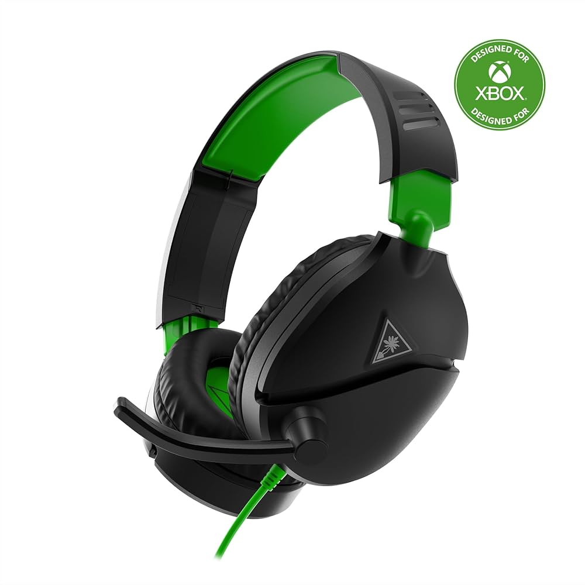
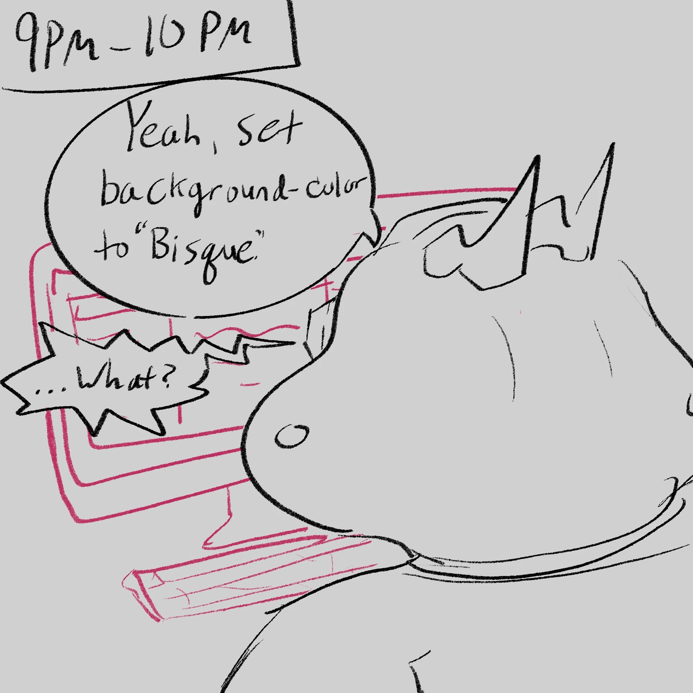
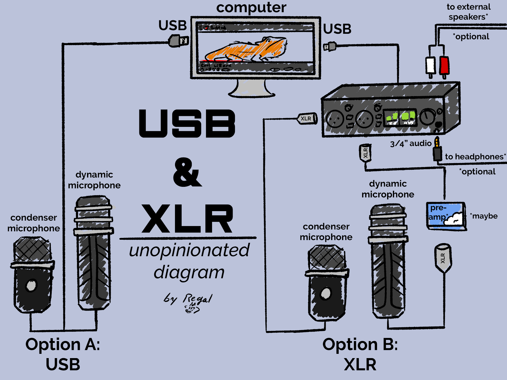
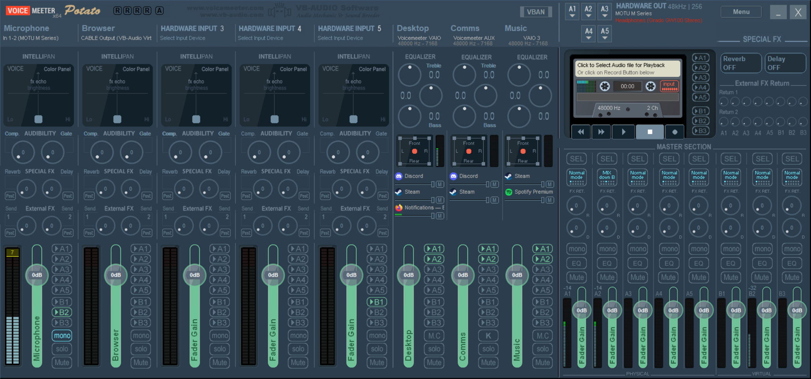
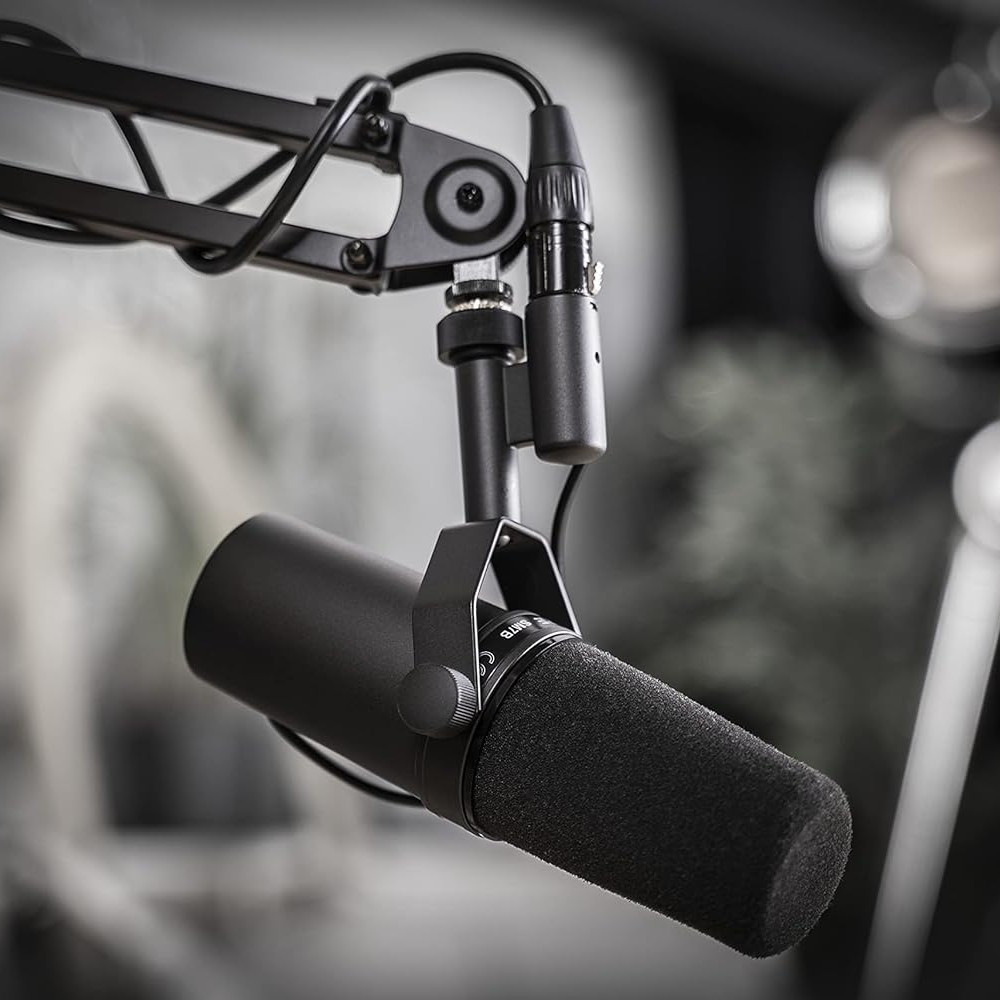
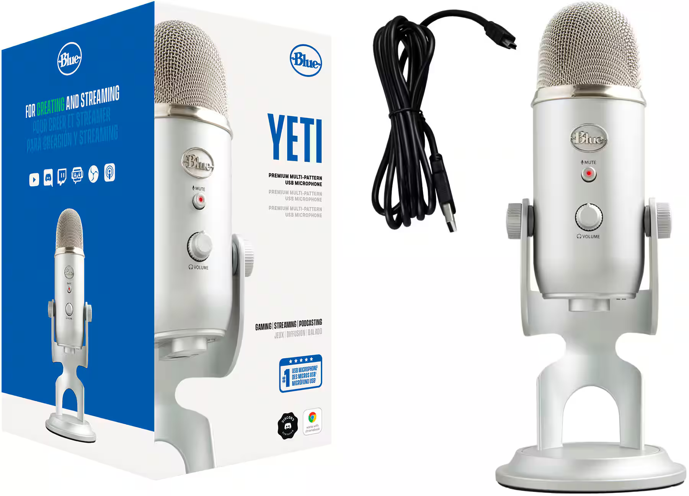
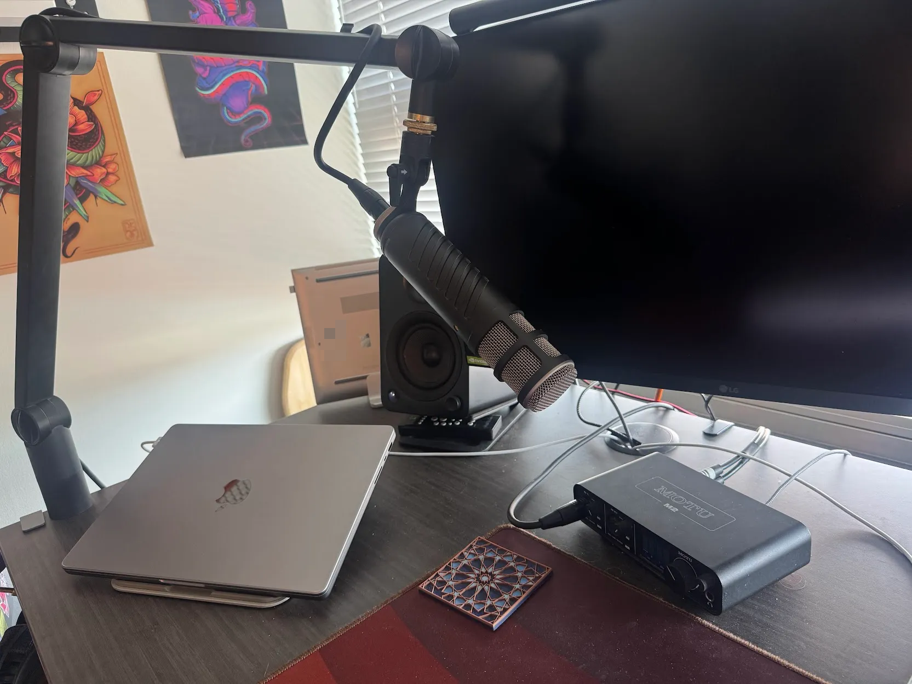

import EmojiBlockquote from "@components/EmojiBlockquote.astro"
import AccordionPhotoTemplate from "@components/Accordion/AccordionPhotoTemplate.astro"
import smile from "@assets/mutantEmoji/argent/smile.png"
import thinking from "@assets/mutantEmoji/argent/thinking.png"
import smirk from "@assets/mutantEmoji/argent/smirk.png"
import uwu from "@assets/argent/stickers/babanasaur/uwu.png"
import eyy from "@assets/argent/stickers/babanasaur/eyy.png"
import shrug from "@assets/argent/stickers/maxadisasta/shrug.png"
import InlineArgentEmoji from "@components/ImageComponents/InlineArgentEmoji.astro"

import { YouTube, LinkPreview } from "astro-embed";

Most people won't be rude about microphone quality, especially when hanging out with friends. I am not most people. But fortunately, I'm also not an asshole, and I know that other folks' money and interest in such things are not without limits.

**Who is this for?** If the extent of your microphone usage is "hanging out in vc with friends", then this is for you! Because this is also me! I use my microphone for playing games in Discord, and (out of convenience) for work meetings.

**Disclaimer:** I am not a microphone or sound equipment expert. I'm just a nerd who did a lot of research into the subject these past 5 years. If you ARE an expert and reading this for some reason, please message me if I made any mistakes :3

<EmojiBlockquote emoji={eyy} size={"sticker"}>
Also I do not do affiliate links so if I link anything here, they're as stripped and naked of links as I can get!
</EmojiBlockquote>

# Why Bother With This?

This is a little tricky actually because unlike a good pair of headphones, a good microphone pretty much only benefits anyone listening to you; you yourself are not much affected. So is this just a magnanimous move to improve your friends' calls with you? Partly yes, but I argue that there are very good personal benefits!

## You Deserve Better Than a Headset

_These fuckers_

You should have a pair of headphones, whichever ones you like, and you should have a microphone. They should be separate devices. [A headset is a worse version of both](https://www.windowscentral.com/gaming/pc-gaming/microphones-on-gaming-headsets-suck-and-that-needs-to-change) sold at a premium.

They're not even good headphones!

### You also deserve to wear a pair of comfy, cool headphones instead

Honestly this is even more important than the microphone. Make sure you like listening to things at your computer. You shouldn't have to give up a good listening experience just to use a microphone. Get yourself your favorite set of headphones, and then a *separate* microphone. That's it.\
This is the "microphone" blog post but take this also as your friendly wake-up call to reevaluate your headphone situation. You don't need to be an audiophile to appreciate good sound!

<EmojiBlockquote emoji={smirk} size={"emoji"}>
Just wait until I get time to do an open-backed vs closed-back headphone blog post >:3
</EmojiBlockquote>

## Your friends deserve to hear your real voice

_From [hourly comics day](https://bsky.app/profile/coffee.cobra.monster/post/3meemk6dufs2i) this year_

They should also *want* to hear your voice. Good friends will overlook microphone quality of course, but a better microphone removes unnecessary friction from a hangout.

If it's within budget, it's great to make an investment into your speaking power, and in allowing your friends to truly hear you and the warmth of your affection for them and the shared moments you're creating.

## Good mics are cool as hell

I picked my microphone because it looks cool as hell and feels great to grab and swing down in front of me. It also sounds great and blocks out [keyboard](/about/mechanicalkeyboards), but genuinely even 5 years since buying it I love grabbing that thang, swinging it down in front of me, and jumping into voice chat.\
Feels cool. Feels intentional. Locked the fuck in to [fun friend time](blog/2025-08-14_these-goofy-games-are-so-good-to-me) <InlineArgentEmoji emoji="triumph"/>

# This is the guide section

Your choice of microphone boils down to two major decisions (then narrowed further by taste and cost):

1. How does your microphone connect to your computer? **XLR** or **USB**?
2. Condenser microphone or Dynamic microphone?

## XLR vs USB

Historically, this has been a very contentious question ~~on reddit~~ online because of quality concerns, but as of 2026 USB mics have gotten very good!

In my opinion, go with a USB mic UNLESS you:
- really like a certain XLR-only mic
- plan on using other recording hardware (instruments etc.) now or in the future
- value fine-control of every aspect of your microphone input and processing
- want the aesthetic of a bunch of stuff plugged into your USB interface (see below)

_Basically everything on the flow on the XLR side is just shipped inside the USB microphones themselves_

XLR adds some complexity, but you also have the benefit of a **USB Interface**, which allows you to plug in speakers, headphones, and other instruments to control all from one set of dials.\
That personally appealed to me strongly enough to warrant the XLR path.

<EmojiBlockquote emoji={shrug} size={"sticker"}>
I will add one extra note from my software dev perspective: this is also a choice between digital and analog. XLR mics are analog technology, and are therefore generally more robust, replaceable, and modular. USB mics rely on a lot of digital technology, and software to make them sound great.\
This isn't necessarily a bad thing, but as a guy who works with software for a living...any reliability that I can pass onto hardware instead of software is a big win for me.
</EmojiBlockquote>

## Dynamic vs. Condenser Microphones

<YouTube id="https://www.youtube.com/watch?v=IDunOMDscOI" title={"Dynamic vs. Condenser Mics: What's the Difference? (PGOA 1.2)"}/>_This mini-series of Bandrew's is honestly all worth a watch_

Two different technological approaches to Microphones. They're both good, but just have certain strengths in different areas.\
In brief:

**Dynamic**:
- Passively powered
- Produce a more traditional "radio sound"
- Very durable/rugged 
- May need a pre-amp
- Naturally pretty good at blocking out other sounds in the area
- Can handle huge swings in signal without blowing out. (If you're prone to excitement/yelling when gaming etc. this is a good type of mic to look into.)

**Condenser**:
- Actively powered (via USB interface or built-in pre-amp)
- Produces a more "natural" voice sound
- More sensitive and produce louder signal (aka needs less gain)
- Tend to pick up more ambient noise/sound (including keyboards)
- Do not need pre-amps to boost signal

For more info there's a great writeup on [Sweetwater](https://www.sweetwater.com/sweetcare/articles/what-difference-between-dynamic-condenser-microphones/) but I also highly recommend the Podcastage video linked above.

## What do I need?

If you choose USB: just the microphone.\
If you choose XLR: at *least* the microphone and a USB interface. If you choose a **Dynamic Microphone**, you might need a pre-amp (also known as a "Line Activator").

## What else should I consider?

Note that aside from #1, these "optionals" are often either unnecessary or built into the mic itself.

1. **A microphone boom arm**. This will get the microphone off of your desk (which helps with avoiding vibration interference) and also allow for easy positioning so that you can speak into it properly.
2. **Anti-vibration microphone mount**--it uses small bungees to absorb vibration. My mic does not have anything like this built in, but I also found through experimentation that having one did not make a difference for me.
3. **A pop filter**. Some microphones have these built in, but if not they're cheap and easy to attach to your setup and will help cut out [plosives](https://en.wikipedia.org/wiki/Plosive).

>For an idea of what "plosives" sound like, one of my favorite microphone experts uses the test phrase: **"Please Bring Pizza Pronto"**. Try saying that into your setup and ask listeners how much 'popping' they hear from you.

### Software

I'd also recommend a virtual audio mixer for fine-tuning your audio inputs and outputs. Especially if you're on Windows which has famously terrible audio software.

<EmojiBlockquote emoji={thinking} size={"emoji"}>
Many USB mics these days come with their own management software, so if you get one of those maybe check if it's any good!
</EmojiBlockquote>

_Right now I have everything at defaults, but I usually have some EQ settings on the right, and for fun I mess with the "Intellipan" above my mic input on the left._

My go-to is [Voicemeeter](https://vb-audio.com/Voicemeeter/). I use Voicemeeter **Potato** specifically, but most of my friends use **Banana** (yeah I know lol).

They look complex because well, they are. I'm sorry. But it's worth trying out if you want to separate volume control for your Browser vs. your Games vs. Discord vs. Spotify or whatever etc.

*But I need to reiterate* the hardware is so much more important than the software here. You don't *need* this.

<YouTube id="https://www.youtube.com/watch?v=52Rs7tqFYm8" title="How-To Setup Voicemeeter Banana & Potato Correctly!!" />_I always send this video to friends when they're setting up Voicemeeter for discord etc. so just know there are great guides out there!_

# So which one do I get?

> Again, not affiliate links.

This is a rabbit hole so I'm going to avoid it by offering just a few as a starting point, and then a great YouTube channel for doing your own research. Because ultimately you should hear what they sound like before buying.

## Microphones

**Dynamic Microphone:** [Samson q2u](https://samsontech.com/products/microphones/usb-microphones/q2u/). It's $100, works and sounds great, and has both USB and XLR connection options. Boom.\
I'd also recommend the [Rode Podmic](https://rode.com/en-us/products/podmic) (~$100) or the [Rode Procaster](https://rode.com/en-us/products/procaster) ($~240). I have the Procaster myself, and on top of personal experience, in general I hear consistently good things about the quality of Rode products.

**Condenser Microphone:** [Elgato Wave 3](https://www.elgato.com/us/en/p/wave-3). It's about $170, USB-only, and was made specifically for spoken word (streaming, voice chat). You can get cheaper if you want, this one is just a tidy package with decent software included.

Overall though, I think you should start with this video and figure out what kind of _sound_ you want from your microphone and then go from there.

<YouTube id="https://www.youtube.com/watch?v=3ubIok6Mutg" title="Different Microphone Tones (PGOA 1.5)" />_I really wish this video had existed during my initial search..._

## USB Interface

I think the [Motu M2](https://motu.com/en-us/products/m-series/m2/) gives the most bang for its buck (~$200). It's the one I have and I really like that it's got all the knobs I want, but also a pleasant little screen to show input and output levels. I know the  [Focusrite 2i2](https://us.focusrite.com/products/scarlett-2i2) was pretty universally recommended for a while. I'm sure it's still good now, but it's one of those "better value options are available now" situations (including the M2).

https://youtu.be/D3ednXYd1pA?si=GSGO8NaOcXK5SjOl

For a better, still-brief writeup I recommend Chris Person's article in Aftermath:

<LinkPreview id="https://aftermath.site/dont-buy-a-yeti-mic-please-logitech/"/>

## Further Research

I love Bandrew from [Podcastage](https://www.youtube.com/@Podcastage) and his reviews. I recommend checking out either his playlists sorted by price range, or just scrolling through reviews until a microphone catches your eyes.\
His reviews are particularly awesome because he does long, well-timestamped sequences comparing the sound of a given mic to multiple, similar mics. Great for figuring out exactly what kind of sound you want!

## Anti-Recommendations

<AccordionPhotoTemplate numImages={2}>

</AccordionPhotoTemplate>

[You probably don't need to get an SM7b](https://www.makeuseof.com/do-streamers-need-shure-sm7b-microphone/). It's a fantastic microphone, and there's a reason why so many streamers use it. But it's very expensive ($400 right now). I wouldn't consider it unless your voice is a major part of your career or hobbies.\
Keep in mind that if you get the Shure SM7b you'll likely need to pony up for a Line Activator as well. Shure offers the **Shure SM7db** as a $100+ alternative with a built-in pre-amp, but I mean c'mon that's a lot of money.

[You should also not get a Blue Yeti](https://aftermath.site/dont-buy-a-yeti-mic-please-logitech/). It has long outgrown its role within its price range. Look around a bit more, or at least look toward the cheaper-wholly-an-upgrade Blue Yeti Nano model.

# My personal setup

_And before you say anything that isn't dust or dirt on my desk mat. It's keyboard solder :D_

- **Microphone**: Rode Procaster (dynamic mic)
- **USB Interface**: Motu M2
- **Microphone Arm**: Blue Microphone Boom Arm

That's it! I did buy a "Fethead" microphone line activator (pre-amp), but it turned out to be unnecessary. If I crank the gain on my M2 up to 100% my mic sounds perfectly fine. 