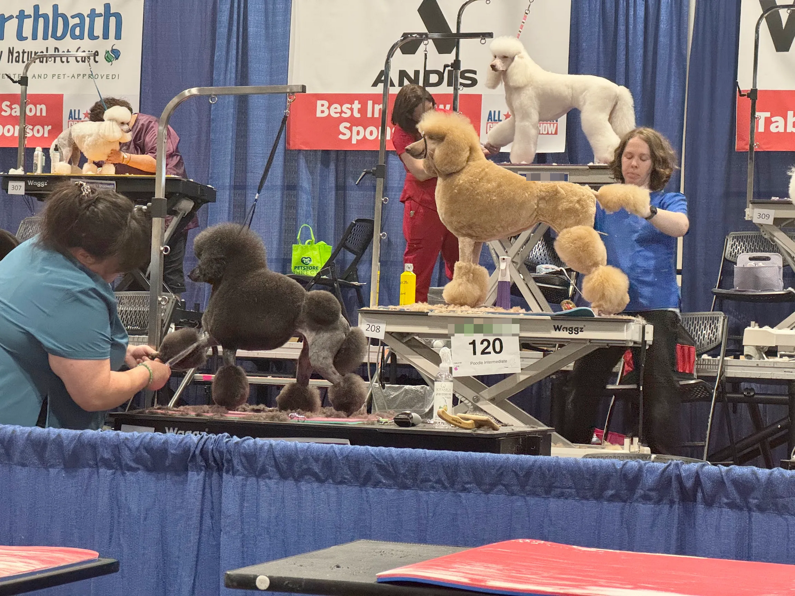
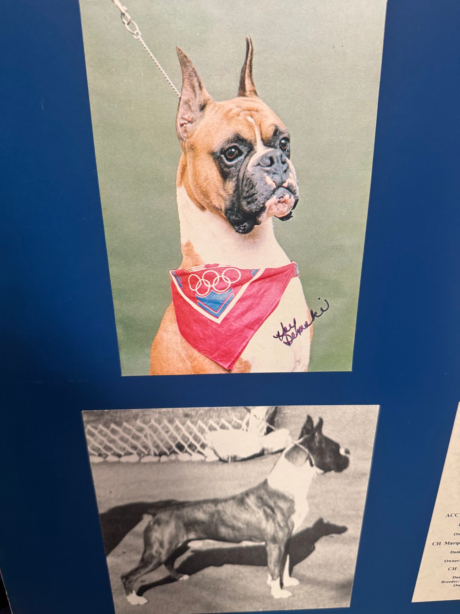
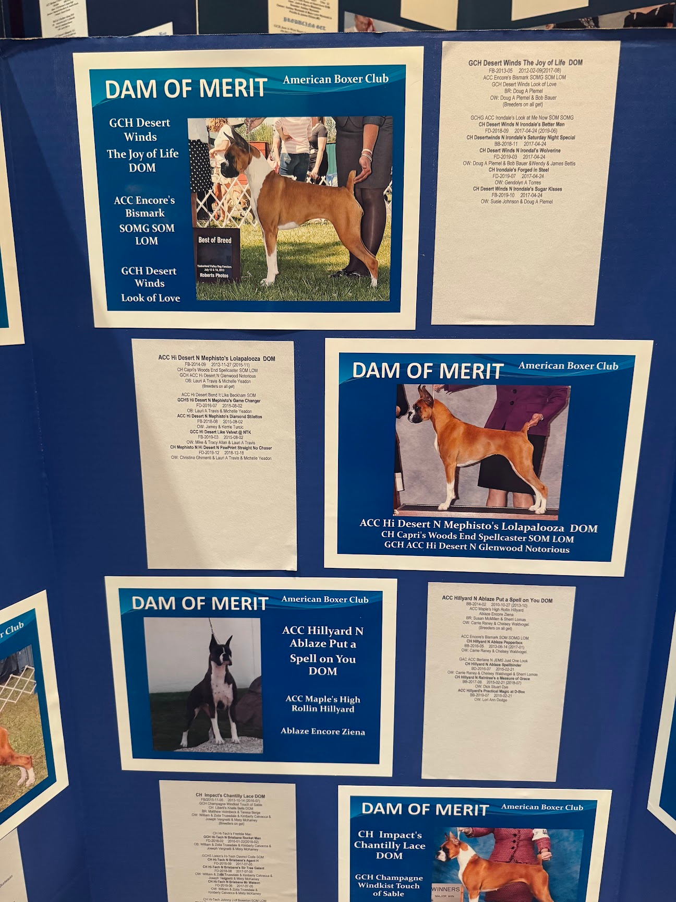

import EmojiBlockquote from "@components/EmojiBlockquote.astro"
import QuoteBlock from "@components/QuoteBlock.astro"
import InlineEmoji from "@components/ImageComponents/InlineEmoji.astro"
import AccordionPhotoTemplate from "@components/Accordion/AccordionPhotoTemplate.astro"

import uwu from "@assets/argent/stickers/babanasaur/uwu.png"
import yikes from "@assets/argent/stickers/babanasaur/yikes.png"
import thumbsUp from "@assets/mutantEmoji/hands/thumbs_up_clw_y2.png"
import smirk from "@assets/mutantEmoji/argent/smirk.png"
import weary from "@assets/mutantEmoji/argent/weary.png"

Via my lovely girlfriend, I've been deeply introduced to the world of professional dog grooming and dog showing. It's pretty cool and interesting!\
I'm putting a lot of effort into engaging with a hobby outside of my circle and direct interests, and it's been more fun than I expected. And not just because I love my girlfriend :3

# Personal Context

The gf is a professional dog groomer, and her favorite breed of dog is Boxers. She's not \*just* a dog groomer, she is deeply passionate about it, and aspires to compete live at shows!

<EmojiBlockquote emoji={uwu} size={"sticker"}>
She explains it as "they're just so goofy!" but I don't get the Boxer love lol. I'm more a Poodle person myself but I certainly love and respect her enthusiasm :3
</EmojiBlockquote>

Since moving to Chicago with me, she has struggled to find a grooming salon that respects both her and her craft at her level. Amidst hopping between different salons as they fail to uphold her standards of care for dogs, grooming standards, or her dignity as a worker, we've also been going to dog shows and grooming expos all across the midwest.

This blog post is going to be a little look at both of these as an outsider looking in.

# Shows and Expos

_Poodles are so cute and funny that little one in the back is killing me how are you so smalllll_

Dog show = "best of breed" etc. style shows. The kind you see on TV. They're usually centered around a single dog breed, and it's pretty crazy seeing dogs and realizing "ohh THIS is what they're supposed to look like". People dress up nice, and it's a more "official" affair. 

Grooming expo = live grooming contests and large vendor floors selling dog grooming equipment and products. Just like any convention, people are wearing comfy clothes and it's a casual hodgepodge of movement and activities.

## Shows

<AccordionPhotoTemplate numImages={2}>

</AccordionPhotoTemplate>

I've only been to PCA (Poodle Club of America) in 2025, and the American Boxer Club (ABC) National Specialty Show this past month so far, and I don't actually have any photos from PCA because we spent the entire time talking to a single poodle breeder (whoops!), so this section will mostly be about the Boxer show :3

I've never seen so many Boxers in my life and especially none that looked as good as these ones. It's not my place to get into it here, but shows (and grooming expos, sometimes) really showcase the gulf between mixed-breed and pure-bred dogs!

As for what happened during the show, it's pretty much what you'd expect: people parade around their fancy, well-bred dogs, and then they're judged against one another.\
It's more exciting than I'm making it sound, but also as a non-dog-world person, I will fully admit it's a little boring at times. I just don't know what to look for to be *truly* impressed.

Me: "Cool Dog!!" <InlineEmoji emoji={thumbsUp}/><InlineEmoji emoji={thumbsUp}/><InlineEmoji emoji={thumbsUp}/>

<EmojiBlockquote emoji={yikes} size={"sticker"}>
Soapbox: 

1. All dogs are good dogs. Every dog deserves love, respect and a comfortable life
2. Modern purebred dogs are extremely healthy; their genetic lineages are meticulously tracked to prevent in-breeding and passing unhealty traits or diseases
3. Adoption is amazing. Buying pure-bred dogs is also amazing. Buying dogs from puppymills is the only incorrect choice
4. No puppymill dog is evil, but the profit-motivated people running puppymills at the expense of dog health are evil
4. Mixed-breed dogs are often great pets, but often have poor genetics leading to poor health outcomes, or poor behavioral foundations
</EmojiBlockquote>

## Expos

Grooming expos are huge, and also only 3 things:

1. Large vending floor with booths set up selling vacuums, shampoos, clippers, smocks, etc.
2. Live grooming stage showcasing grooming competitions (these take ~3hrs each)
3. Various panels/classes

The vendor booths obviously aren't for me, the outsider. I follow the gf around, asking about the things she gets excited about, and cautiously asking "don't you already have that?" every 10 min or so.

I've only been to one panel, and it was really weird. It was state groomers association meeting listed as an informative "how to advocate for yourself as a groomer in our state" but it quickly became clear it was mostly for grooming shop *owners* who wanted to maximize profits amidst changing labor laws.\
Weird vibes!

The grooming competition is the bread and butter of the event though. Participants bring in a dog ready to be groomed, and compete on stage grooming the dog from start to finish within a time limit (limit depends on the dog's size).\
Try as I might, I quickly get bored while watching because unlike the gf, I can't extract significance from every moment of a groomer's cutting/work. I have a dog-grooming-interest refresh rate of about 10 min, upon which she points out something impressive about a specific groom (among the 15-30 happening simultaneously).

It's pretty fun seeing so many impressive dogs though. Especially considering how well they're trained to handle a long, public performance like that. And even without any grooming experience myself, it's obvious how much skill is on display here. Like, it's hard to overstate how impressive it is that someone can make a dog so perfectly, correctly \*shaped*.

# Dog Grooming Business

It's not my place to explain how dog grooming works and why it's important, but I'll sum it up with a pithy truth from the industry:

<QuoteBlock credit={false} size="2xl">
Dog grooming isn't just a haircut, it's healthcare.
</QuoteBlock>

Every dog needs grooming. And if your dog is getting shaved down bald every time you *do* get it groomed, then you're not going often enough.

But anyways, what's the deal with dog grooming shops?

## A Spectrum of Quality and Lack of Regulation

Legally, your dog is pretty much equivalent to a toaster. It's property, and the regulation around managing your property is not very strong. Especially from a federal (US) level.

The bar to groom dogs is surprisingly low. There are certifications and standards, but not only are they not legally required, the average consumer has no idea that they can even ask about those.

<EmojiBlockquote emoji={smirk} size={"emoji"}>
Extremely "United States" moment. But I shouldn't be surprised. I worked as a phlebotomist for 2 years and no certification was needed in my state.
</EmojiBlockquote>

As a result, you have many shops run by incompetent people with wildly varied training experience and overall motives. This results in most dog grooming shops being mediocre due to one of the following: 

- Lack of knowledge re: breed standard grooms
- Low priority placed on dog comfort & limits
- Illegal employment practices (1099 contractors instead of required W2 employment)
- Slow/inefficient bathing & grooming
- Just plain poor grooming technique
- General bad small-business management (HR, payroll, hiring, etc. etc.)

And unfortunately for passionate, well-educated groomers like my gf, the lack of regulation and lack of consumer knowledge means that these shops manage to stay in business.\
People know a good dog groom job, but they really don't seem to know BAD grooms!

_Schnauzer grooms with various quality "skirts": Good (top) and Bad (bottom)._

The "bad" I'm talking about is things like unevenness, or not cutting shorter in certain areas of the dog to accentuate their breed features. Or neglecting to properly groom/cut their sanitary area properly.\
All things I only know about via the gf. And aside from a few exceptions (poodles), every dog breed has a single breed-standard groom, and you evidently just learn them as you go.

---

I suppose in its own way, identifying a good dog grooming shop is similar to how I identify a good [coffee shop](/cafe-reviews) :3 You know what to look for once you know what to look for!

## This Job BARKet Is Hell

While not as bad as perhaps [my job search experience](/blog/2026-03-25_job-search-march-26), the gf has been struggling to find a grooming shop here in Chicago that will provide her the Pay, Respect, and Grooming standards she desires from her passionate career.

_Gotta say I love all the punny salon names_

Next week she'll be starting at yet another new grooming shop since moving here. There are a good many shops in town, many of which are hiring, but most of which are trash for one reason or another. And she really can't tell until she goes in for an interview and test-groom...a time-consuming and soul-crushing experience when bad.

If the dog grooming salon is large, it usually means it's somewhat corporate. This means lower standards for grooms, higher daily dog quotas, and usually poor (if consistent) pay.

If the salon is small, then you're rolling the dice BUT more likely to find higher quality "boutique" quality grooms. At the very least, one can check a single person's Instagram (the owner) to see their quality of work. And that will be 100% indicative of the shop's quality.\
The risk there of course, is personality clash and classic shitty small-business bullshit.

### The Obvious, Difficult Solution

Eventually we're going to have to open her own grooming salon. It's the only way to ensure she can produce the quality she wants to, and avoid terrible bosses.

We have no idea how to do this so that's a Much Later task...

# Conclusion 

In the meantime, I hope she finds stability. I'm grateful for how much I've learned about the professional dog world from her.

It's extremely easy to take dogs for granted. Not just as pets, but also as highly intelligent, trainable creatures. 

I'm not nearly a dog snob (yet) but I have learned to expect more and better from dogs and their owners! It's not hard to train your dog to properly respect boundaries and I think in much the same way that we should expect people on public transit to not fucking smoke or play loud music/videos aloud, we should reasonably expect dog owners to train their dogs to behave in public.

<EmojiBlockquote emoji={weary} size={"emoji"}>
Oh and no, we don't actually have a dog yet. We're on a waitlist for a white mini-poodle from the breeder we met at PCA last year...would love for her litters to stop having black-coated puppies! It's the dominant gene, apparently, so it's probably going to be a bit of a wait :,)
</EmojiBlockquote>