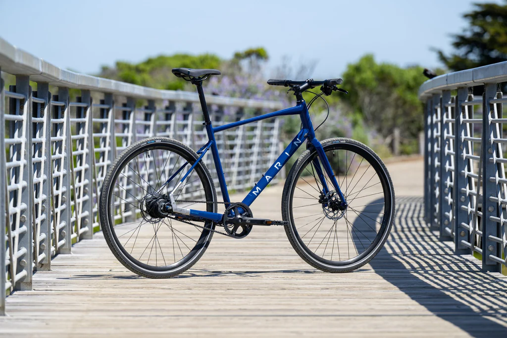
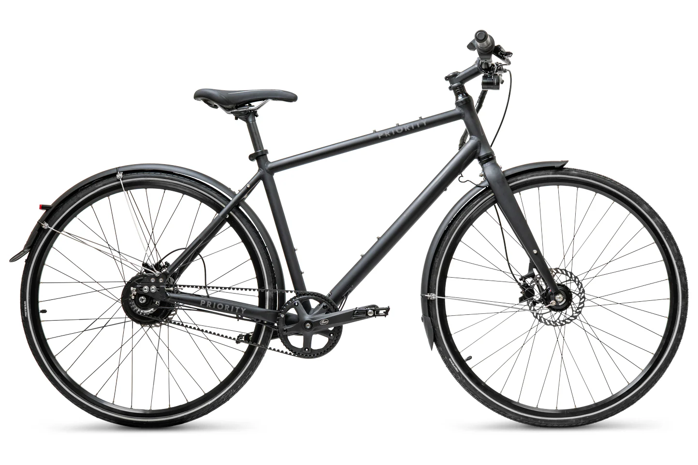
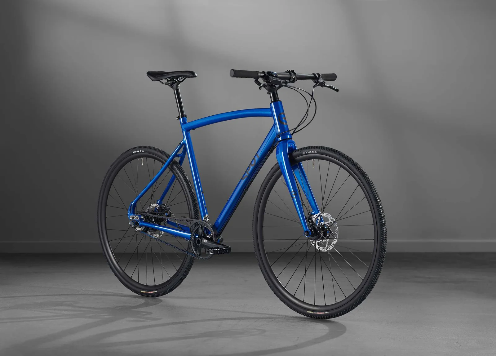
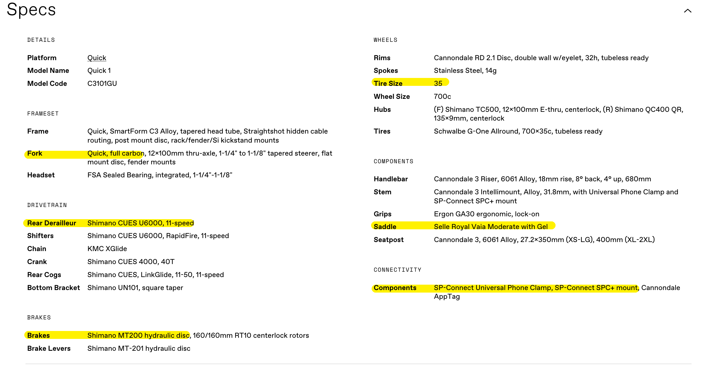

import EmojiBlockquote from "@components/EmojiBlockquote.astro"
import QuoteBlock from "@components/QuoteBlock.astro"
import InlineEmoji from "@components/ImageComponents/InlineEmoji.astro"
import AccordionPhotoTemplate from "@components/Accordion/AccordionPhotoTemplate.astro"
import Chistar from "@components/ImageComponents/ChiStar.astro"
import { YouTube } from 'astro-embed';

import uwu from "@assets/argent/stickers/babanasaur/uwu.png"
import yikes from "@assets/argent/stickers/babanasaur/yikes.png"
import shrug from "@assets/argent/stickers/maxadisasta/shrug.png"
import thumbsUp from "@assets/mutantEmoji/hands/thumbs_up_clw_y2.png"
import smirk from "@assets/mutantEmoji/argent/smirk.png"
import weary from "@assets/mutantEmoji/argent/weary.png"

The fact the company I bought my first bike from has folded is really bolstering the "it's not my fault I don't love my old bike" sentiment. A shame I had to spend so much money (and summers) riding a bad bike to figure out what I needed in a good one but here we are!

# The Old Bike

My old acoustic[^1] bike is a **Fyxation** brand *Pixel 3* bike. I'd say its two main features are its thin 28mm tires and its *Shimano Nexus 3-speed Hub*. The tires are just classic street bike "skinny tires" which I bought right about when the industry as a whole recognized that [fatter tires are significantly more comfortable](https://www.wired.com/story/fat-bike-tires-are-better-than-skinny-bike-tires/) without being appreciably any slower. And now every consumer/commuter/non-racing bike comes with 32mm or fatter.
[^1]: "Acoustic" is my preferred term for non-e-bikes. But there are [plenty of alternatives](https://discerningcyclist.com/acoustic-bikes/).

The 3-speed hub is the real jewel of my old bike. Instead of a derailleur, twisting the twist grip changes gears on an internal gear system, allowing me to change gears at any time and any speed. I liken it a bit to a manual transmission car because the BEST part is that I can ride as fast as I want, stop at a stoplight or whatever, and just immediately shift back down to 1st gear for an easy start.\
Essentially, I'm always in the correct gear. The only very notable downside is that I only have three gears...And as a bike mechanic once told me:

<QuoteBlock credit={false} size="3xl">
With 3 gears you have all the gears you need, but none of the ones you want.
</QuoteBlock>

## The Problems

Even though Chicago is an [astoundingly flat city](https://storymaps.arcgis.com/stories/93b6c503d423499d93731cd5966e620e), I still felt lacking with just 3 gears. Partly because I'm an athletic speedster but especially because this city is very windy!

<EmojiBlockquote emoji={uwu} size={"sticker"}>
Th--thats why...that's why.....THAT'S WHY they Call it the WINDY CITY!!!!!!

YEAHHHHHHH
</EmojiBlockquote>

The main problem is really the frame itself though, and unfortunately that's the ONE thing you can't just replace to fix without just buying a whole new bike.

<EmojiBlockquote emoji={shrug} size={"sticker"}>
Excepting of course those who want to Ship of Theseus their bike and just take every single component and move it to a new frame, I suppose.

Bike frame = "The Bike" to me but I can respect that enough components can give the bike its main vibe.
</EmojiBlockquote>

My bike's frame:
- Does not support fenders
- Does not support tires wider than 28mm
- Does not support a front rack
- Is an aggressive, athletic-position shape

(This is probably why the company went out of business)

The last bit is personal preference, but it's a big part of why I don't like my bike. I want to sit more upright! And I'm athletic enough that I can get up to good speed even with a less efficient bike (especially in a flat city).

Oh and I did make modifications where I could. I replaced the stem to bring my handlebars closer to me, I did manage to install fenders anyways but the clearance was so tight that they were constantly rubbing on the tires, and I replaced the saddle to encourage me to sit a bit more upright...I honestly thought all that was enough until I sat on a better bike and realised what I was missing.

## Its Fate

Honestly unsure. Originally I was going to keep it as a beater[^2] and as a "burrito bike" (aka whip it out to go grab a burrito 3 min away), but my new bike is plenty light and so much fun that I'm actively dreading ever riding the other one again.\
I might sell it! But also my apartment has free, un-tracked bike storage so I also might just keep it to host bike rides with visiting friends.
[^2]: Bike term for a trashier bike you use in "breaks your bike" conditions (e.g. nasty snow)

# The New Bike
# Shopping for a New Bike

I've done this before, so you'd think I'd have some base level of expectations, but honestly all my bike diving research had been for my [e-bike](/about/urbanism#centauri-2), and that didn't help much. I was back to square one and it was a MUCH bigger square one.

There are so many bike companies out there, man. It's crazy.

## Narrowing it Down

So okay. What do I want? I made a mental list of Must-Haves:

- Belt Drive system (as opposed to a chain)
- Blue
- More upright/comfy position
- Wider tires (32mm absolute minimum but ideally 35mm+)
- Hydraulic disc brakes

The discerning reader will see this list and go "that just sounds like you're looking for a blue e-bike" and yeah whoops. My e-bike experience has been so pleasant that it instantly colored my expectations for a good *biking* experience.\
But spoiler alert, I didn't end up sticking to this list completely...

### The One That Got Away

I pretty quickly found my winner, actually. The [Marin Presidio 3](https://marinbikes.com/products/2023-presidio-3-2)! It hits every mark!! Blue, belt drive, 40mm tires, more upright, hydraulic disc brakes. It really is the perfect fit.

_It literally ONLY comes in blue. This was made for me. <Chistar /> [Image Credit](https://bikesonline.com.au/products/2024-marin-presidio-3-carbon-belt-drive-urban-bike)_

But for money-reasons, I had to wait until June to buy...and they're sold out nationwide for **FOUR MONTHS!**

As much as I wanted it, I wasn't going to lose my entire summer waiting. So I reevaluated...

### Why a Belt Drive

And I ended up dropping this requirement first. Belt drives are awesome, especially for city/commuter riding. Truly minimal maintenance, they never fall off, and changing gears is fancy and easy and doesn't require pedaling at speed. Yes, they add $400-600 to the price of a bike but my e-bike belt drive has been a sweet treat so I felt it worthwhile. But in the end I made two realizations:
1. chains and derailleurs are much better than they were last time I used one in (checks notes) 1999.
2. I've fast become "the bike friend" in my friend group, and I think knowing my way around a chain and derailleur system would be pretty useful!

In any case, before I dropped that requirement I was still looking...Here are the 2 final belt drive commuter bike contenders:

_[Priority Bicycles: Oynx Continuum](https://www.prioritybicycles.com/products/continuumonyx)_

_[Spot Bicycles: Acme](https://spotbikes.com/collections/bikes/products/acme-bike)_

Both pretty cool bikes, but they had some issues for me.

Onyx: Only comes in black, some components seemed on the cheap side, 32mm tires, and the gear ratio of the belt drive hub seemed liked it'd mostly be wasted and dissatisfying (in a flat city I'd be riding the top end and feeling slow).\
Acme: Aggressive seating position, carbon fork (no front-mounting), 32mm tires.

The Acme really came close, but the aggressive position is a non-starter. I want something less-aggressive and that is something about the bike I'd never be able to change.

But again, ultimately the belt drive became so much less important to me. Dropping this made it very easy to expand my search in some fun ways.

## You Gotta Try Them Out!

_Kozy's is perfect for exactly the kind of person who doesn't know what flavor of bike they want_

I'm very fortunate to live near an awesome, huge local bike shop, and even more fortunate to have been trusted by my friends [Rainy](https://bsky.app/profile/nyxiemeow.bsky.social) and [Briva](https://bsky.app/profile/briva.bsky.social) to help them find their first city bikes!

We had an excellent day at Kozy's test riding bikes. They found what they wanted, but it also opened my eyes to how comfortable and *high quality* my ideal type of bike can really be.

# The New Bike

{/* TODO: Bike Pic Here */}

I did not expect to end up with a Cannondale bike after all this but I'm so glad I did. This thing rules.

This is a *Cannondale Quick 1* (2026). It's the top of the "Quick" lineup, and it has a good few specs that really caught my attention (highlighted below). It's also a little blue! At the front there! Lol. Not as blue as I'd like but whatever.\
Mostly though I test rode it at the end of a 3-bike tour at the bike shop and this is the one that just made me break out into a big smile when I hopped on the road. It just felt so good so fast.

## The Cool Specs

_After spending so much time on bike maker websites, I gotta say Cannondale's is near the top of my "actually pleasant to use" list. Not bad!_

So the highlights for me:
- **Carbon fork:** Cool!! Very light! But also probably the only regret I have with this bike upon learning how limiting it is re: attaching racks and stuff to it. I have a workaround in progress but /shrug
- **11-speed drivetrain:** 11 speeds AND no derailleur on the front gear? Perfection. As a kid I always hated shifting that big gear, and that's the big upgrade w/ high-end bikes these days--they can fit SO many gears on the back hub now. It shifts like a dream and I have all the gears I could want~
- **Hydraulic disc brakes:** I have them on my e-bike and now I never want to go back. I'm a bit of a speedster, so having top-tier stopping ability when I'm dodging shitty Chicago drivers is very important
- **35mm tires:** This was a HUGE upgrade. I'm surprised how visually subtle the difference is, but the riding feel is completely different. Especially going over potholes haha
- **Saddle:** The only major differences between the lower-spec Quick 2 model and this one were the saddle and drivetrain (9 instead of 11 speed). The saddle was a bonus upgrade so far as I'm concerned, and yeah it's very comfortable. Glad I don't have to swap it out for once
- **SP connect phone clamp:** I just happen to already have these phone clamps on my other 2 bikes, so finding out that Cannondale has started building that system directly into their bikes and offering it as a free perk was just a sweet bonus

## Upgrades/Customization

It's only been a week but I have some very fun plans! Mostly small cosmetic things, but I have 2 big upgrades coming:

1. A bigger crank gear. So far in flat-as-fuck Chicago I've been riding entirely on gears 7-11. Lowest I've ever gone was gear 3 and that was just to see if it was useful for a hill (it was overkill). Turns out by the power of *gear ratios* I can simply shift that window of usefulness down by increasing the size of my crank gear.\
A bike shop friend gave me a tip on where I can do some good research, but I'm probably going to swap my 40-tooth gear out for one with either 42 or 44.

2. Front rack & basket. I have a back rack on my e-bike and red bike, and I might get another one for my new bike but I was really inspired by this beautiful Bike Breath video to try out "Basket Jamming" :3

<YouTube id="qysKx0fE0is" />

Unfortunately my bike's carbon fork makes that a little tricky...You really aren't supposed to mount anything to carbon forks as they're a bit on the fragile side (compared to aluminum or steel). However I'm giving the [Old Man Mountain Elkhorn](https://oldmanmountain.com/product/elkhorn-bike-rack/) rack a try with their axle-mounting solution, just to see! I'm never going to overload the thing, so I feel like this is my best shot at trying out the aesthetic without making any big mistakes.

# Bike Time!

Anyways, just a ~~Regal's idea of~~ short blog post about my new bike! I'll surely post more once I've ridden it a bunch more. I'm finishing up this post at my [favorite bike + coffee shop](https://maps.app.goo.gl/PjFVJt1Wsu96nhnv7) in Lincoln Park, and I'm about to bike home :3\
Keep a lookout for updates and pics here and on [socials](/links#socials) and I hope you go out and bike this summer too!