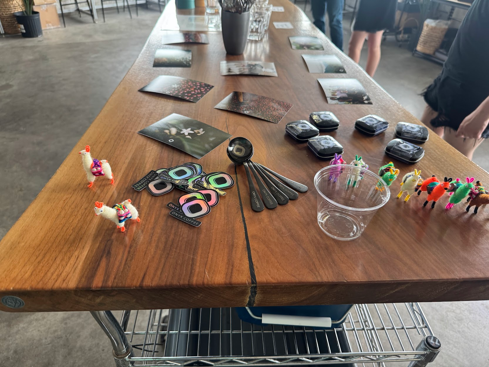
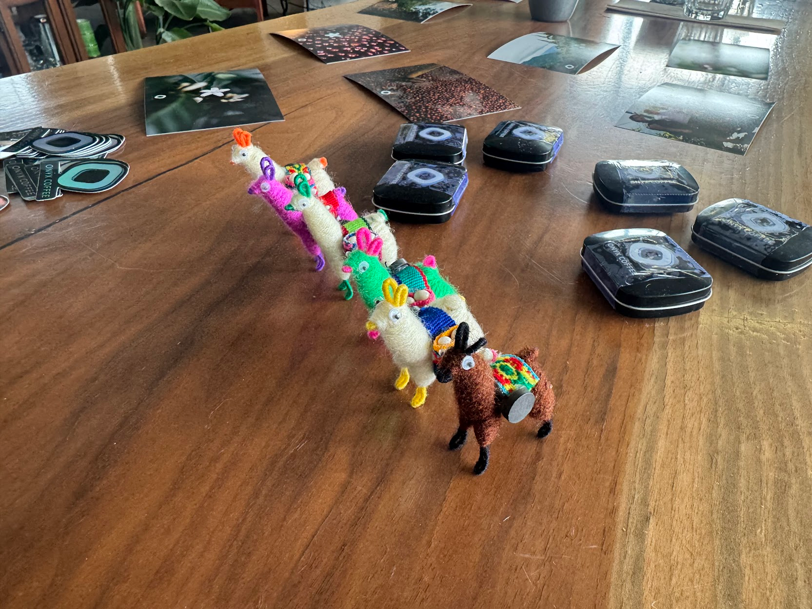
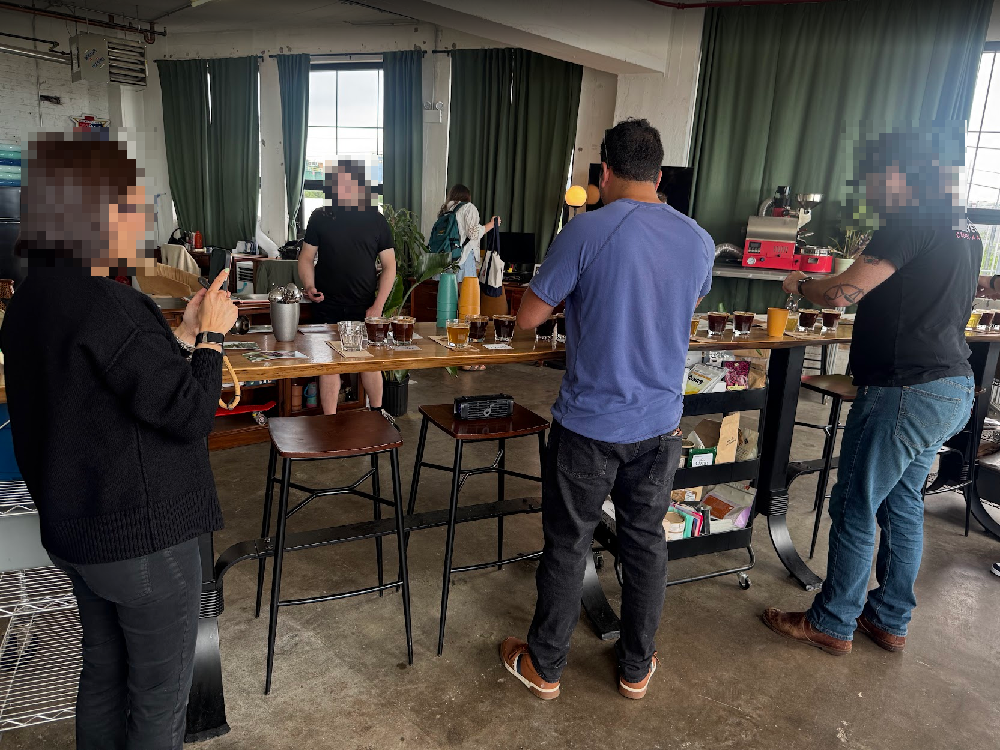
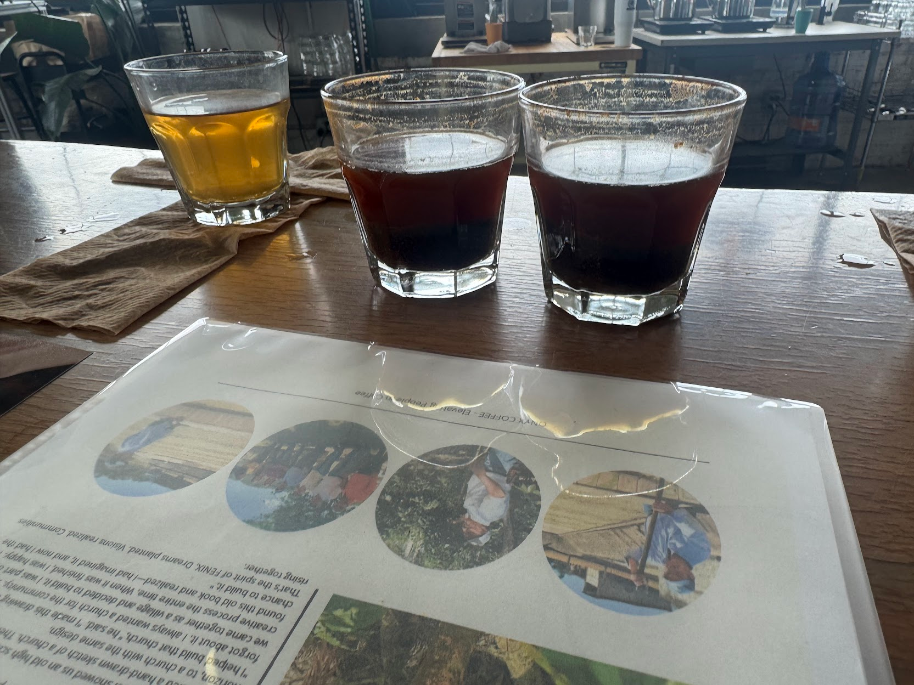
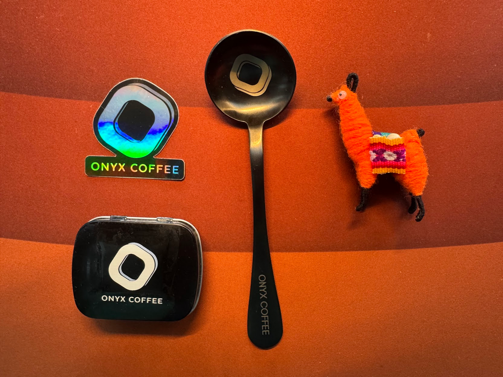
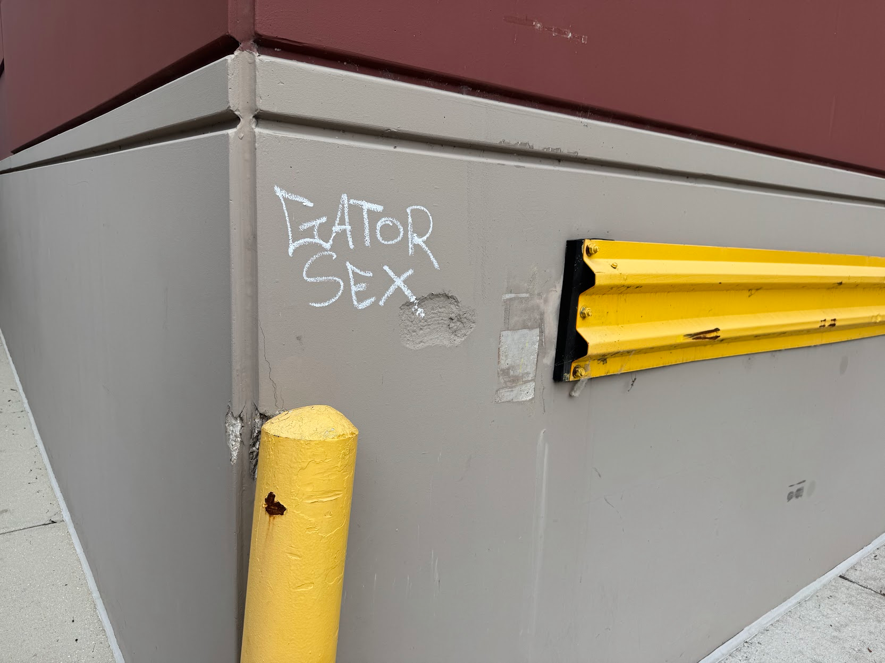
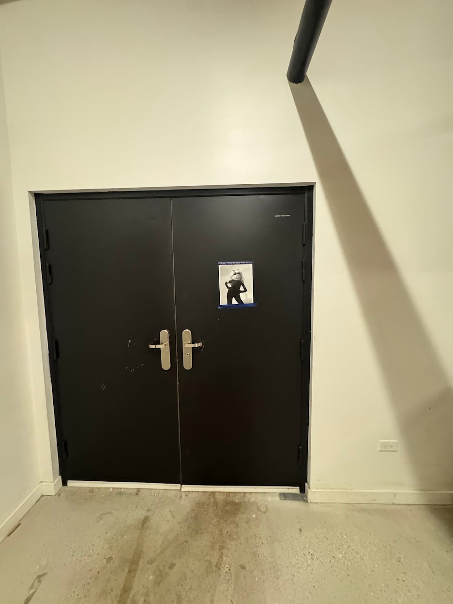
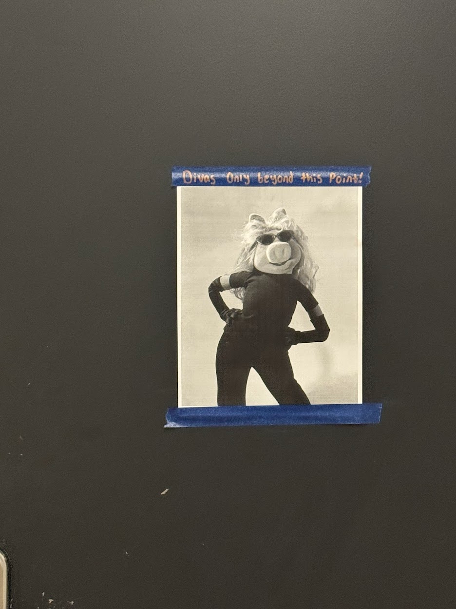

import EmojiBlockquote from "@components/EmojiBlockquote.astro"
import QuoteBlock from "@components/QuoteBlock.astro"
import InlineEmoji from "@components/ImageComponents/InlineEmoji.astro"
import InlineArgentEmoji from "@components/ImageComponents/InlineArgentEmoji.astro"
import AccordionPhotoTemplate from "@components/Accordion/AccordionPhotoTemplate.astro"

import uwu from "@assets/argent/stickers/babanasaur/uwu.png"
import yikes from "@assets/argent/stickers/babanasaur/yikes.png"
import whine from "@assets/argent/stickers/babanasaur/whine.png"
import eyy from "@assets/argent/stickers/babanasaur/eyy.png"
import thumbsUp from "@assets/mutantEmoji/hands/thumbs_up_clw_y2.png"
import smirk from "@assets/mutantEmoji/argent/smirk.png"
import thinking from "@assets/mutantEmoji/argent/thinking.png"
import weary from "@assets/mutantEmoji/argent/weary.png"

Thanks to a new friend, I discovered an [awesome local roaster](https://www.tailwindroasting.com/) that regularly hosts cool coffee events for the public!

This is going to be a quick post mostly sharing photos from the event :3 enjoy!

# Preamble

My barista friend Ryan and I went together without much of an idea what to expect. Fortunately, things were immediately off to a good start when we walked into the roastery and the first person we saw was our friend + Ryan's colleague, Myra! Apparently she is in the process of transitioning to Tailwind Roasting, so she literally works there now. How cool!

Anyways, the roastery has a separate office/tasting room, and in there we saw the Onyx[^1] crew setting up for the cupping event. The front of the table had a magnificent spread of take-home swag for attendees.

_obsessed with these little guys_

[^1]: This is Onyx the [coffee _importer_](https://onyxcoffee.com/) not Onyx the [coffee _roaster_](https://onyxcoffeelab.com/) btw

While the Onyx team finished grinding coffee and boiling water, we mingled--I talked to a coffee guy from Colorado who very kindly shared his industry/cupping/tasting/etc. knowledge with me throughout the event.\

<EmojiBlockquote emoji={eyy} size={"sticker"}>
Shout out to Jay, you're a real one!
</EmojiBlockquote>

# Cupping Event

Before we began, Rachel of Onyx gave us a rundown of what coffees they'd prepared, explained that their company has until recently exclusively imported coffees from Guatemala, and that this is the first year that they've imported from their new Peruvian relationships.

## Smell!

She then gave a brief rundown of the coffees, and encouraged us to go through and smell the grounds before beginning.

I only have 3 big takeaways from the smelling:
1. Wow I fucking love coffee this stuff is so good
2. Hooray I can instantly tell which one of these is decaf!
3. Omg it's so funny that exactly one of these coffees is a natural process (the rest were washed) and it was OBVIOUS

## Taste!

The main event! The first time through we went in a line, testing the 2 Peruvian coffees first, then a series of the Guatemalan, ending with the funky natural process.\
Each coffee had two cups each, and they were set up in front of fantastic detail sheet talking about the farms, the people, and of course the coffee itself.

![Coffee info sheet. It reads: Ella Todos Santos Women Owned Farms
Ella Todos Santos is a beautiful coffee from a beautiful community.
Meet the women of Mujeres Luchando por un Mejor
Futuro ("Women Fighting for a Better Future"). San
Martin, Todos Santos is a remote region in the rugged highlands of Huehuetenango. Because of its geographical isolation and difficult road infrastructure it is a tough four-hour drive from Huehuetenango City and a 12-hour drive from Guatemala City creating and sustaining a business here is an incredible challenge.
To overcome these hurdles and limited resources, a collective of 276 women banded together. To fund their projects, they created a local community bank and launched vital health and agricultural initiatives. The group is continuously growing, constantly seeking education and support to improve their community.
Out of this inspiring collective, we source the majority of this coffee from a dedicated core group of 36 women who focus entirely on coffee production.
While they have long utilized sustainable farming methods, the group officially earned their organic certification in 2025. Your purchase of this lot provides financial predictability for this incredible community of women. Thank you.](women-owned.png)
_This one was one of my favorites. Lovely story too! This is the kind of coffee you want to find and support!_

There isn't a whole lot to say, other than that it was a great time, I enjoyed the coffees, and I was even responsible enough to spit out most of it instead of destroying my body with caffeine at 4pm haha.\
I'm also proud of myself for being able to taste the decaf coffee and identify that it was indeed the same coffee bean as the non-decaf one next to it :3

### Other Cuppings

My helpful guide Jay explained to me that this was a very casual cupping experience. In my past experience, I'd done a tasting where we were told what coffees were there (region, roast, and process), but not which ones were which.\
Apparently Jay has been to cupping where not only was all information withheld, but the lights were also all red so as to prevent folks from visually differentiating the coffees and allowing that to color (heh) their perceptions of the taste.

In this tasting we had full explanation of each coffee, as well as info sheets in front of each one. Fair to say more of an advertisement for Onyx than a "practice cupping/tasting" event, but that was what I expected anyways.

# Future Coffee Stuff...?

I'm probably going to go back to Tailwind Roasters for either a cupping class or a roasting class, because it was a really cool space and I really enjoyed the people I met there. I will say though that for as much fun as I had, I felt a bit out of place being completely outside of the industry.

---

I really love coffee. I love learning about it, brewing it, drinking it, and especially sharing it. And I can't help but feel that I'm not...serious enough about it? I have some casual aspirations for opening my own cafe, but I don't actually know if I'm up to the task. And I don't really know what a good medium would be.

It's a little existential, but today left me feeling both fulfilled and inadequate. Because my life right now is very fulfilling and fun--full of friends and many cool hobbies and interests.\
But at the same time, events like this make me wonder if I'm stretching myself thin here, and not engaging fully _enough_ with any one of my personality-defining hobbies, whether that's coffee, urbanism, weightlifting, or anything else on my [about](/about) page. 

<EmojiBlockquote emoji={whine} size={"sticker"}>
Is this what a midlife crisis is? I'm not even 40 yet! <InlineArgentEmoji emoji={'weary'}/>
</EmojiBlockquote>

---

Or maybe I need to relax a bit, and take some advice from the graffiti and decor I found at [Printers Row Coffee](/cafe-reviews/printers-row-kingsbury) today

_I'm listening. I'm learning._

Much to think about.