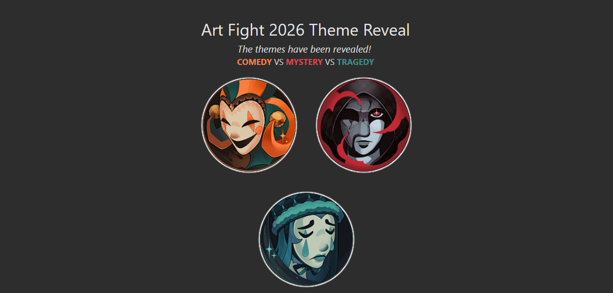

import GalleryGrid from "@components/GalleryGrid.astro"
import EmojiBlockquote from "@components/EmojiBlockquote.astro"
import Accordion from "@components/Accordion/Accordion"
import AccordionPhotoTemplate from "@components/Accordion/AccordionPhotoTemplate.astro"
import InlineArgentEmoji from "@components/ImageComponents/InlineArgentEmoji.astro"

import ArgentWhine from "@assets/argent/stickers/babanasaur/whine.png"

<GalleryGrid galleryGridItems={'Art Fight 2026'}/>

For a primer on what Art Fight is, check out [last year's post](/blog/2025-08-09_art-fight-2025#real-quick-whats-art-fight)

# 2026 Art Fight Season

This year the event was a little different! For the first time it was a 3-team arrangement. Teams **Comedy**, **Tragedy**, and **Mystery**.\
As usually I don't really care that much about the actual competition, it's just fun set-dressing.

I picked Tragedy! I don't think we're gonna win!! So many people picked the *clown* team (comedy) because of course.

## Life Context

This was a tough year for me. My girlfriend and I have been battling the Chicago dog groomer job market for months now, and this was the month that our last ditch effort to land her a stable, dignified job fell through.

Suffice to say we were incredibly stressed until the very end of the month. That, plus Anthrocon in Pittsburgh taking up the weekend of the 4th of July...I had a lot of things taking my time.

That being said I still put out 12 pieces that I'm incredibly proud of.

### 1. Veryn

I was feeling a little rushed trying to get my first attack out for the year, but I'm still proud I found a super cool character! Like most pieces this year, I tried to manage my time (and low energy)...meaning not letting Perfect be the enemy of Good

Proud of:
1. Overall vibe
2. Color textures
3. Foreshortening angles

Room for improvement:
1. Depth/shading on skull
2. Hands
3. Expression

<Accordion client:visible>
    Kyrozon's Revenge! ⚔️
    

    <AccordionPhotoTemplate numImages={1} numCaptions={1}>
        

        

        Just a lovely Argent with delightful muscles. He's got hard shapes and I'm always pleased when folks give him a shot! <a href="https://artfight.net/attack/16146838.18-coffee-time">Artfight Link</a>
    </AccordionPhotoTemplate>
    

</Accordion>

### 2. Rieger

